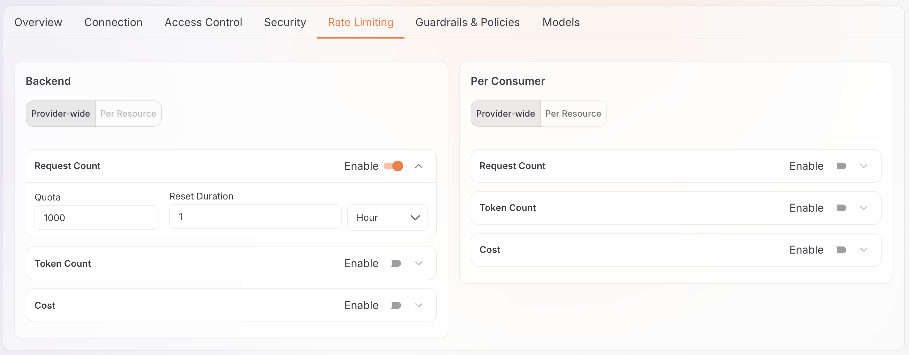

# Manage an LLM provider

After deploying your LLM provider, manage its configuration through the provider details page. This guide covers all management operations organized by tab.

## Access provider details

1. Navigate to **AI Workspace** > **LLM Providers**.

2. Click a provider name to open its details page.

The provider details page shows:

- The provider name, version, and template type
- The creation and last-updated timestamps
- Six management tabs: Connection, Access Control, Security, Rate Limiting, Guardrails, and Models
- The **Deploy to Gateway** button in the top right

## Connection

Manage upstream endpoint configuration and authentication credentials for the LLM provider.

### Provider endpoint

The **Upstream URL** field sets where the gateway forwards API requests:

| Provider type | URL configuration |
|---------------|-------------------|
| OpenAI, Anthropic, Gemini, Mistral AI | Pre-configured (read-only) |
| Azure OpenAI, Azure AI Foundry, AWS Bedrock | Custom URL (editable) |

**To update:**

1. Modify the **Provider Endpoint** field
2. Click **Save**

### Authentication

Configure how the gateway authenticates with the upstream provider:

| Authentication type | Behavior |
|----------------------|----------|
| **api-key** | The gateway attaches an **Authentication Header** and **Credentials** value to every upstream request. For built-in providers, the template sets both. |
| **other** | The workspace stores no credentials for this provider. Use a policy to configure upstream authentication instead. |
| **none** | The gateway sends no upstream authentication. |

**To configure `api-key`:**

- **Authentication Header**: The header name the gateway sends upstream
- **Credentials**: Your provider API key
    - Click the show icon to reveal or hide the value
    - Update and click **Save** to change credentials

Switching to **other** or **none** clears the stored authentication header and credentials for this provider.

### OpenAPI specification

The **Spec URL** field holds the OpenAPI specification the resource list is imported from:

- Supply either a URL or a file upload
- The specification populates the Access Control resources list
- Re-import it to refresh the available endpoints

## Access control

Control which API endpoints are accessible through this provider.

### Mode

Select the access control mode at the top of the tab:

| Mode | Behavior |
|------|----------|
| **Allow all** | All resources are accessible by default. Move specific resources to **Denied Resources** to block them. |
| **Deny all** | All resources are blocked by default. Move specific resources to **Allowed Resources** to permit them. |

Use the arrow buttons between the two panels to move resources:

- **`>>`** — Move all resources to the other panel
- **`>`** — Move the selected resources to the other panel
- **`<`** — Move the selected resources back
- **`<<`** — Move all resources back

### Import resources

Click **Import resources from specification** to load or refresh the resource list from the provider's OpenAPI specification.

## Security

Configure how applications authenticate when accessing this provider through the gateway.

### API key authentication

Set the API key that client applications must provide:

| Field | Description | Example |
|-------|-------------|---------|
| **Authentication Type** | Authentication method | `apiKey` (default) |
| **API Key** | The name of the request header that must carry the API key | `x-api-key`, `apikey`, `Authorization` |
| **Key Location** | Where clients send the key. `header` is the only supported option. | `header` |
| **API Key Value Prefix** | An optional prefix prepended to the value clients must send, so that clients send `Bearer <key>` | `Bearer` |

**To configure:**

1. Select **Authentication Type**: `apiKey`
2. Enter the **API Key** header name your applications use.
3. Optionally set an **API Key Value Prefix**, for example `Bearer`, if clients send the key with a scheme prefix.
4. Click **Save**.

## Rate limiting

Control request and token consumption to prevent cost overruns and keep usage fair across all consumers.

Configure rate limits in the **Backend** section, which controls requests from the gateway to the upstream LLM provider. Limiting that traffic protects your provider API credentials and caps total spend.

The Backend section supports two configuration modes:

- **Provider-wide** — A single limit applied across all API endpoints. The limit maintains **one shared counter**: traffic on any endpoint draws down the same allowance, so exhausting the limit via one endpoint rejects requests on all endpoints.
- **Per Resource** — Individual limits per API endpoint (for example, chat completions vs. embeddings). Each endpoint maintains its **own independent counter**.

The Backend section of the Rate Limiting tab presents both the Provider-wide and Per Resource modes:

!!! note
    Provider-wide and Per Resource modes are mutually exclusive. Clear existing limits before switching modes.

!!! info "Provider-wide limits are a hard ceiling"
    A provider-wide limit is evaluated before any per-resource policy and counts **every request attempt** — including requests that a stricter per-resource policy later rejects. When the shared allowance is exhausted, requests to every endpoint receive `HTTP 429`. See [Policy scope: global or per resource](../policies/overview.md#policy-scope-global-or-per-resource) for details.

### Limit criteria

Configure either of these criteria, or both:

| Criterion | Description |
|-----------|-------------|
| **Request Count** | Maximum number of requests within the reset duration |
| **Token Count** | Maximum number of tokens (prompt plus completion) within the reset duration |

For each enabled criterion, set the **Quota** and **Reset Duration** (`second`, `minute`, or `hour`).

### Provider-wide configuration

1. Select **Provider-wide** in the Backend section.
2. Enable **Request Count**, **Token Count**, or both.
3. Enter the **Quota** and select the **Reset Duration** for each criterion.
4. Click **Save**.

### Per-resource configuration

1. Select **Per Resource** in the Backend section.
2. Expand **Limit per Resource** to set default limits for all endpoints:
    - Enable the criteria and configure **Quota** and **Reset Duration**.
3. To override limits for a specific endpoint, expand that resource row and configure it separately.
4. Click **Save**.

!!! tip "Cost control best practices"
    Set conservative backend limits first to protect your provider credentials. Monitor actual usage via the Insights dashboard before increasing limits. Use Per Resource mode only when endpoints have significantly different usage patterns.

**Learn more:** [Token-based rate limiting](../policies/overview.md#token-based-rate-limit)

## Guardrails

Attach guardrails to enforce content safety, compliance, and quality standards. Attach a guardrail on a provider globally to all endpoints or at the resource level to specific endpoints. Either way, the guardrail affects every proxy that uses this provider.

### View attached guardrails

The tab displays the guardrails attached to the provider:

- **Guardrail name** and type
- **Configuration status** and parameters
- **Enable/disable toggles** to activate or deactivate a guardrail

### Add a guardrail

Attach a guardrail globally to all endpoints or at the resource level to one endpoint. A global guardrail runs on every request, whichever endpoint the request calls. A resource-level guardrail runs only on the endpoint you attach it to. If you configure both, the gateway evaluates the global guardrails first, then the resource-level ones. See [Policy scope: global or per resource](../policies/overview.md#policy-scope-global-or-per-resource).

**To add a global guardrail:**

1. In the **Global Guardrails** section, click **+ Add Guardrail**.
2. A sidebar opens showing available guardrail types.
3. Select a guardrail and configure its settings:
    - Fill in required parameters
    - Expand **Advanced Settings** for additional options
4. Click **Add** to attach it to the provider.

**To add a resource-level guardrail:**

1. Find the resource you want to protect and expand its card.
2. Click **+ Add Guardrail** within that resource.
3. Select and configure the guardrail (same process as global guardrails).
4. Click **Add** to attach it to the resource.

### Configure guardrails

You can't edit guardrail parameters in place. To change a guardrail's configuration, delete it and add it again with the updated settings.

**To update a guardrail:**

1. Delete the existing guardrail.
2. Click **+ Add Guardrail** and re-add it with the updated configuration.
3. Redeploy the provider to apply the changes.

!!! tip "Advanced settings"
    Each guardrail includes advanced configuration options such as custom thresholds, severity levels, and execution phases. Click **Advanced Settings** when adding a guardrail.

!!! warning "Production impact"
    Guardrail changes require a manual redeploy to take effect on deployed gateways. Test thoroughly in a non-production environment before enabling strict guardrails.

**Learn more:** [Policies overview](../policies/overview.md). For the full policy catalog, visit the [Policy Hub](https://wso2.com/api-platform/policy-hub/).

## Models

Configure which AI models are accessible through this provider.

### Add and remove models

The **Models** tab displays a chip list of the models available through this provider. Each chip represents one model ID.

**To add a model:**

1. Click **Add model provider**, select a provider from the list, and click **Add** to import its model catalog.
2. Type or paste individual model IDs into the input field and press <kbd>Enter</kbd> to add them as chips.
3. Click **Save**, then **Deploy to Gateway** to apply the change.

**To remove a model:**

1. Click the remove icon on the model chip you want to remove.
2. Click **Save**, then **Deploy to Gateway** to apply the change.

The gateway blocks any model that isn't in the chip list. An application that requests a removed model receives an error.

## Lifecycle operations

### Redeploy provider

Push configuration changes to deployed gateways.

**When to redeploy:**

- After updating connection settings
- After modifying rate limits or guardrails
- After adding or removing models

**To redeploy:**

1. Click **Deploy to Gateway** (top right corner)
2. Select the gateways to deploy to
3. Review the changes summary
4. Click **Deploy**

!!! info "Deployment status"
    Monitor deployment progress in the notification panel. Changes take effect within seconds of successful deployment.

### Delete provider

Permanently remove the provider and all its configurations.

!!! warning "Prerequisite"
    You can't delete a provider while an App LLM proxy uses it. Delete or reassign all dependent proxies before proceeding.

**To delete:**

1. Navigate to **AI Workspace** > **LLM Providers**
2. Find the provider in the list
3. Click the **Delete** icon
4. Review the warning and confirm deletion

!!! danger "Irreversible action"
    Deleting a provider:

    - Removes it from all deployed gateways **immediately**
    - Breaks applications consuming this provider
    - Deletes all configuration, including guardrails, rate limits, and models
    - **Cannot be undone**

## Next steps

- [Configure an App LLM proxy](../llm-proxies/configure-proxy.md): configure and deploy specialized proxy endpoints for GenAI applications or agents using your provider
- [Policies overview](../policies/overview.md): explore all available guardrails and policies