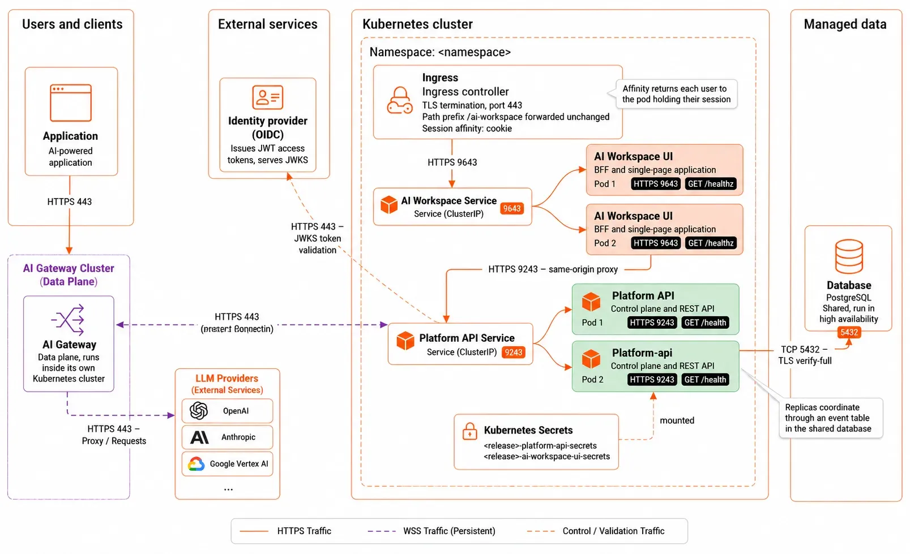

# Run in high availability

A single instance of each service is enough to serve users, but it makes every restart an outage. This page adds redundancy: a shared database, more than one instance of each service, and rules that keep a node or host failure from taking the deployment down.

Work through the steps in order. Adding replicas before moving off SQLite corrupts data.

## What limits each service

| Service | Holds state? | What lets it scale |
|---------|--------------|--------------------|
| Platform API | Yes, in its database | A shared PostgreSQL or SQL Server instance, instead of the SQLite file |
| AI Workspace | Yes, in memory: user sessions | Session affinity, so each user keeps reaching the instance holding their session |

The Platform API coordinates across replicas through an event table in the shared database. Each replica polls it, so a change one replica makes reaches the others without direct communication between them.

The following diagram shows the resulting topology, with both services replicated behind ClusterIP Services, an ingress in front, and the shared database behind:



## Step 1: Move to a shared database

SQLite is a file on one disk. Two instances writing to it corrupt it, so it caps the Platform API at one replica.

Move to a database server before anything else on this page. The examples below use PostgreSQL; Microsoft SQL Server works the same way with its own driver value and connection settings. For the full procedure, covering how to create the database and role, provision the schema, and enable TLS, see [Connect a database to the Platform API](../setting-up/database.md).

Two settings matter for availability once the database server is in place:

- **Run the database itself in high availability.** A single database server leaves the whole control plane dependent on one machine. Use a managed service with automatic failover, or a replicated cluster.
- **Size the connection pool per replica, not per deployment.** `max_open_conns` applies to each Platform API instance. Three replicas at 25 connections each need at least 75 connections on the server, plus headroom for maintenance and other clients.

=== "Virtual machine"
    ```toml
    # configs/config.toml
    [platform_api.database]
    driver            = "postgres"
    host              = "postgres.example.com"
    port              = 5432
    name              = "platform_api"
    user              = "platform_api"
    ssl_mode          = "verify-full"
    ssl_root_cert     = "/etc/platform-api/tls/ca.pem"
    max_open_conns    = 25
    max_idle_conns    = 10
    conn_max_lifetime = 300
    ```

=== "Kubernetes"
    ```yaml
    platform-api:
      config:
        database:
          driver: postgres
          postgres:
            host: postgres.example.com
            port: 5432
            name: platform_api
            user: platform_api
            sslMode: verify-full
            sslRootCert: /etc/platform-api/tls/ca.pem
            maxOpenConns: 25
            maxIdleConns: 10
            connMaxLifetime: 300
    ```

    On Kubernetes the connection keys sit under `config.database.postgres` whatever the driver, so use that block for SQL Server too.

    With a database server in place, you can turn off the persistent volume claim. Do this only when certificates come from cert-manager or a Secret rather than the volume:

    ```yaml
    platform-api:
      persistence:
        enabled: false
    ```

## Step 2: Give every instance the same key material

All instances must use the same at-rest encryption key so they can decrypt data written by other instances. If an instance uses a different key, it cannot read data encrypted by another instance.

- Kubernetes: This is handled automatically when all pods use the same Kubernetes Secret containing the encryption key.
- VM deployments: Copy the same encryption key files to every host and verify that the files are identical before routing traffic to the instances. See [Provision secrets and keys](secrets-and-keys.md).

## Step 3: Add replicas

=== "Virtual machine"
    Run the same Compose stack on two or more hosts, each with:

    - Identical `config.toml` files, apart from anything genuinely host-specific.
    - The same encryption key.
    - The same database connection.
    - A certificate valid for the public hostname, or plain-HTTP listeners behind a TLS-terminating load balancer.

    Put a load balancer in front of the hosts, health-checking `/healthz` on the workspace port and `/health` on the Platform API port. Remove a host from rotation before you upgrade it, then add it back once its health check passes.

    Configure **session affinity** on the workspace pool. The BFF keeps sessions in memory, so a user routed to a different host mid-session is signed out. Most load balancers call this sticky sessions or source affinity; a cookie-based method is more accurate than one based on client IP address.

    The Platform API pool needs no affinity. Any replica serves any request.

=== "Kubernetes"
    Raise the replica counts:

    ```yaml
    platform-api:
      deployment:
        replicaCount: 2      # requires a database server, not sqlite3

    ai-workspace-ui:
      deployment:
        replicaCount: 2      # requires session affinity on the ingress
    ```

    The chart's horizontal pod autoscaler (HPA) is gated on the driver being exactly `postgres`. It refuses to render for `sqlite3`, which can't be shared, and also for `sqlserver` and for the `postgresql` and `pgx` aliases. On those, set `replicaCount` yourself and scale manually.

    Add session affinity to the workspace Ingress so each user keeps reaching the pod that holds their session:

    ```yaml
    metadata:
      annotations:
        nginx.ingress.kubernetes.io/affinity: "cookie"
        nginx.ingress.kubernetes.io/affinity-mode: "persistent"
        nginx.ingress.kubernetes.io/session-cookie-name: "aiw-affinity"
        nginx.ingress.kubernetes.io/session-cookie-max-age: "28800"
    ```

    Match the cookie lifetime to the session cap in `config.session.absoluteTtl`, which defaults to `8h`.

!!! warning "Configure session affinity for multiple replicas"
    When deploying the workspace with multiple replicas, enable session affinity (sticky sessions) on the ingress or load balancer.
    
    Session affinity ensures that requests from the same user are consistently routed to the same workspace instance, providing reliable session handling across replicas.

## Step 4: Autoscale on demand

Set CPU requests first. Without them the autoscaler has no baseline to compute utilization against.

=== "Virtual machine"
    Compose has no autoscaler. Size each host for its peak and add hosts as demand grows.

    Bound what each service can consume, so a burst on one doesn't take the resources the others need. Add resource limits to each service in `docker-compose.yaml`:

    ```yaml
    services:
      platform-api:
        deploy:
          resources:
            limits:
              cpus: "1.0"
              memory: 1G
            reservations:
              cpus: "0.25"
              memory: 256M
    ```

    Watch CPU and memory against those limits, and treat sustained pressure as the signal to add a host.

=== "Kubernetes"
    Set requests and limits, then turn on the autoscaler. These values are a starting point, so measure your own traffic and adjust:

    ```yaml
    platform-api:
      deployment:
        resources:
          requests:
            cpu: 250m
            memory: 256Mi
          limits:
            cpu: 500m
            memory: 512Mi
      hpa:
        enabled: true          # chart requires config.database.driver=postgres exactly
        minReplicas: 2
        maxReplicas: 5
        targetCPUUtilizationPercentage: 70

    ai-workspace-ui:
      deployment:
        resources:
          requests:
            cpu: 100m
            memory: 128Mi
          limits:
            cpu: 500m
            memory: 256Mi
      hpa:
        enabled: true
        minReplicas: 2
        maxReplicas: 4
        targetCPUUtilizationPercentage: 70
    ```

    Scaling the workspace down ends the sessions held by the pod that goes away. Keep `minReplicas` at the level that serves your normal load, and prefer scaling up over scaling down aggressively.

## Step 5: Survive a node or host failure

=== "Virtual machine"
    - Spread hosts across failure domains, such as separate hypervisors, racks, or availability zones.
    - Set `restart: unless-stopped` on every service, which the shipped `docker-compose.yaml` already does, so the runtime restarts a crashed container.
    - Make the container runtime start on boot, so a rebooted host rejoins by itself.
    - Drain one host at a time during maintenance, and wait for its health check before you touch the next.

=== "Kubernetes"
    Add a pod disruption budget (PDB) so a node drain can't take every replica at once. It's meaningful only at two or more replicas. With one replica, `minAvailable: 1` blocks every voluntary eviction and hangs the drain:

    ```yaml
    platform-api:
      podDisruptionBudget:
        enabled: true
        minAvailable: 1

    ai-workspace-ui:
      podDisruptionBudget:
        enabled: true
        minAvailable: 1
    ```

    Spread replicas across zones so one zone failing is less likely to take the deployment down:

    ```yaml
    ai-workspace-ui:
      deployment:
        topologySpreadConstraints:
          - maxSkew: 1
            topologyKey: topology.kubernetes.io/zone
            whenUnsatisfiable: ScheduleAnyway
            labelSelector:
              matchLabels:
                app.kubernetes.io/name: ai-workspace-ui
    ```

    `whenUnsatisfiable: ScheduleAnyway` is a best-effort constraint. The scheduler prefers a spread and still places the pod when it can't achieve one, so replicas can end up sharing a zone. Set `whenUnsatisfiable: DoNotSchedule` for a hard separation, and accept that pods stay `Pending` when no zone can take them.

    Confirm the label selector matches the pods in your release before you rely on it:

    ```bash
    kubectl -n <namespace> get pods --show-labels
    ```

## Step 6: Tune the health probes

Both services answer a health endpoint: `/healthz` for AI Workspace, `/health` for the Platform API. The chart defaults suit a fast start. If your first start is slow, such as during a large schema migration, add a startup probe rather than lengthening the liveness delay. A startup probe gives the process time to come up without weakening the liveness check afterward.

=== "Virtual machine"
    The shipped Compose health checks call each endpoint from inside the container. Point your load balancer at the same endpoints, over the port each service listens on.

=== "Kubernetes"
    ```yaml
    platform-api:
      deployment:
        startupProbe:
          httpGet:
            path: /health
            port: http
            scheme: HTTPS
          periodSeconds: 5
          failureThreshold: 30
    ```

## Verify

Confirm replicas are serving, then confirm a failure doesn't sign users out.

=== "Virtual machine"
    ```bash
    # On each host. -k skips verification because the certificate names the
    # public hostname, not localhost; keep it to on-host checks like this one.
    docker compose ps
    curl -fsk https://localhost:9643/healthz
    ```

    Sign in through the load balancer, then stop the stack on the host that isn't serving your session. The session should survive, and new sign-ins should land on the remaining host.

=== "Kubernetes"
    ```bash
    kubectl -n <namespace> get pods -o wide
    kubectl -n <namespace> get hpa
    kubectl -n <namespace> get pdb
    ```

    Sign in, then delete a workspace pod other than the one serving you. Your session should survive, and the replacement pod should reach `Ready`.

## Related

- [Connect a database to the Platform API](../setting-up/database.md): the shared database this page depends on
- [Expose AI Workspace](expose-the-workspace.md): the ingress that carries the affinity settings
- [Operate the deployment](operate.md): rolling upgrades across replicas