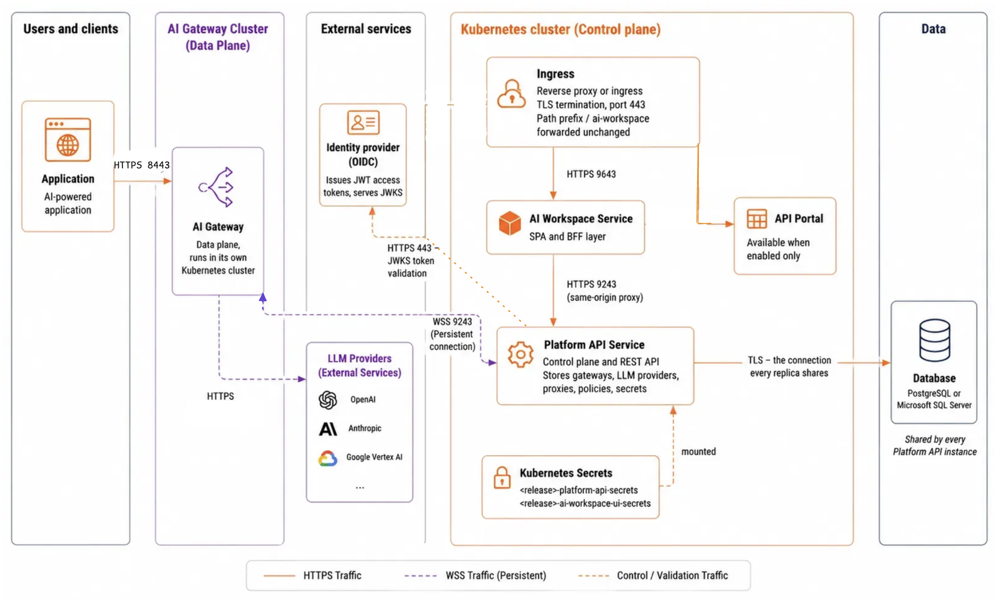

# Production deployment overview

This section is for platform engineers and site reliability engineers who run AI Workspace for an organization. It covers the two supported shapes: a Docker Compose stack on one or more virtual machines, and a Helm release on Kubernetes.

Every page in this section presents its examples in two tabs, **Virtual machine** and **Kubernetes**, so you can follow one path end to end.

!!! note "The database examples use PostgreSQL"
    Examples throughout this section use PostgreSQL, because it's the most common choice. The Platform API also supports Microsoft SQL Server, and the two are interchangeable everywhere this section says "the database". Set the driver and connection settings for the one you run, then follow the rest as written. For the accepted `driver` values and the per-database setup, see [Connect a database to the Platform API](../setting-up/database.md).

## What you deploy

A production deployment has three parts.

| Part | What it does | Where it runs |
|------|--------------|---------------|
| Platform API | The control plane. Stores gateways, large language model (LLM) providers, proxies, policies, and secrets, and serves the representational state transfer (REST) API. | Your cluster or VM |
| AI Workspace | The browser interface. A React single-page application served by a Go backend-for-frontend (BFF) that owns the user session. | Your cluster or VM |
| AI gateways | The data plane. Routes traffic between applications and LLM providers, and registers itself with the Platform API. | Anywhere your applications can reach |

The Platform API and AI Workspace form the control plane and are what this section deploys. Gateways connect to it afterward. See [Connect AI gateways in production](connect-gateways.md).

The distribution also ships the API Portal, a separate product that shares this same control plane. It's off by default, and you can add it later. See [Optional: add the API Portal](#optional-add-the-api-portal).

AI Workspace handles user interactions and communicates with the Platform API. The Platform API manages configuration and data, and validates user tokens through the identity provider. AI Gateways connect to the Platform API to register and receive configuration, then forward application requests to the configured LLM providers.

The following diagram shows that deployment architecture, with browsers and gateways on one side and the database and identity provider on the other:



## Choose a deployment shape

Both shapes run the same container images and read the same configuration keys. They differ in how you supply those keys and how you scale.

=== "Virtual machine"
    Run the Docker Compose stack from the release distribution on a Linux host with a container runtime.

    - **Best for:** a fixed number of hosts, teams without a Kubernetes platform, air-gapped or tightly controlled networks.
    - **You supply configuration through:** `configs/config.toml`, a single file holding both services' tables, plus the `api-platform.env` file that Compose loads.
    - **Scaling:** run the stack on several hosts behind a load balancer, all pointing at one database server.
    - **You operate:** the host, the container runtime, the reverse proxy, certificate renewal, and backups.
    - **Splitting across hosts:** each service sits behind its own Compose profile, so you can run the Platform API on one host and AI Workspace on another.

    Every service names only its own profile, which means enabling one never starts a sibling. `COMPOSE_PROFILES` in the stack's `.env` file decides what comes up on a given host, and `./scripts/setup.sh` writes `ai-workspace,platform-api` there by default.

    To put the control plane on its own host, unpack the distribution on both hosts and set a different profile list on each:

    ```bash
    # In .env on the control plane host.
    COMPOSE_PROFILES=platform-api

    # In .env on the workspace host.
    COMPOSE_PROFILES=ai-workspace
    ```

    Put the value in the stack's `.env` file rather than exporting it in a shell. Compose reads `.env` from the directory it runs in, so the setting survives a new terminal and applies to every `docker compose` command on that host.

    A split like this changes three settings on the workspace host, because the Compose service name `platform-api` no longer resolves across hosts:

    - `[ai_workspace.control_plane] url` becomes the control plane host's address rather than `https://platform-api:9243`.
    - `[ai_workspace.control_plane] ca_file` has to trust the certificate that host presents.
    - `[ai_workspace.gateway] controlplane_host` becomes the address your gateways reach, which is a separate decision from the address AI Workspace uses.

    The encryption key and the database connection belong to the Platform API, so they stay on the control plane host alone. See [Change the ports AI Workspace uses](../setting-up/ports.md) for the difference between those two control plane addresses.

=== "Kubernetes"
    Install the `ai-workspace` Helm chart. It's an umbrella chart with the `platform-api` and `ai-workspace-ui` component charts as dependencies.

    - **Best for:** a cluster you already run, horizontal scaling, and rolling upgrades.
    - **You supply configuration through:** your own values file, layered over the chart defaults with `-f`.
    - **Scaling:** replica counts and a PodDisruptionBudget, backed by a shared database server. The chart renders a HorizontalPodAutoscaler only when the database driver is exactly `postgres`. SQL Server deployments scale by setting `replicaCount` yourself.
    - **You operate:** the cluster, an ingress controller, cert-manager or your own certificate secrets, and backups.

    The charts don't ship an Ingress resource. You write your own, which keeps the ingress class, annotations, and hostnames under your control. See [Expose AI Workspace](expose-the-workspace.md).

## Ports and traffic paths

The services listen on these ports by default. See [Change the ports AI Workspace uses](../setting-up/ports.md) to move them.

| Port | Service | Who connects to it |
|------|---------|--------------------|
| `9643` | AI Workspace HTTPS | Browsers, through your reverse proxy or ingress |
| `9243` | Platform API HTTPS | The AI Workspace BFF, and every AI gateway |
| `9543` | API Portal HTTPS | Browsers, only when you enable that component |

Both services also expose an optional plain-HTTP listener, off by default. Enable it only when a proxy in front of the service terminates TLS. See [Secure traffic with TLS](tls.md).

Health endpoints sit outside the path prefix so probes can reach a container directly:

| Endpoint | Service |
|----------|---------|
| `/healthz` | AI Workspace |
| `/health` | Platform API |

## What production requires that the quickstart doesn't

Neither service has a demo mode. Startup checks always run, and a missing requirement stops the process with a message naming what to supply. The quickstart satisfies those checks with values that `setup.sh` generates; production replaces each one.

| Requirement | Quickstart | Production |
|-------------|-----------|------------|
| At-rest encryption key | Generated by `setup.sh` | A managed 32-byte secret, stable across restarts and replicas |
| User login | File-based admin user | An OpenID Connect (OIDC) identity provider |
| TLS certificates | One self-signed pair | Certificates from your certificate authority (CA), or TLS terminated at a proxy |
| BFF to Platform API trust | The generated self-signed certificate | Your CA bundle, with certificate verification on |
| Database | SQLite file | PostgreSQL or SQL Server |

[Deploy AI Workspace to production](deploy.md) walks through all of it in order, from collecting hostnames to a connected gateway. Start there. These pages go deeper on one topic each, and the walkthrough links to them as it goes:

- [Provision secrets and keys](secrets-and-keys.md)
- [Secure traffic with TLS](tls.md)
- [Expose AI Workspace](expose-the-workspace.md)
- [Run in high availability](high-availability.md)
- [Harden the deployment](harden.md)
- [Connect AI gateways in production](connect-gateways.md)
- [Operate the deployment](operate.md)

## Decide these before you install

Answering these up front avoids reinstalling. Each answer feeds a later page.

- **The public hostname** browsers use for AI Workspace, such as `workspace.example.com`. It goes into the identity provider redirect URLs, so changing it later means updating the provider too.
- **The address gateways use** to reach the Platform API, as `host:port`. It must resolve from the gateway's network, not from AI Workspace.
- **Where TLS terminates**, at the service listeners or at your reverse proxy or ingress.
- **Which database** you run, and who backs it up. A database server, rather than the default SQLite file, is the prerequisite for more than one Platform API replica.
- **Which identity provider** issues tokens, and whether it can mint the platform's `ap:*` scopes. If it can't, use role-based authorization instead.
- **Where secrets live**, in a mounted file, a Kubernetes Secret, or an external secret manager that syncs into one of those.

## Optional: add the API Portal

The API Portal is a separate product that shares this same Platform API control plane. It gives your API consumers a place to discover APIs and MCP servers, create applications, and manage subscriptions and API keys. It's off by default, and you can add it after AI Workspace is running without reinstalling anything.

=== "Virtual machine"
    The distribution ships the API Portal as a Compose profile named `api-portal`. Start that profile alongside the services you already run. It listens on port `9543`:

    ```bash
    docker compose --profile platform-api --profile ai-workspace --profile api-portal up -d
    ```

    To make that the default for every `docker compose up`, set the profile list in `.env`:

    ```bash
    COMPOSE_PROFILES=platform-api,ai-workspace,api-portal
    ```

    The API Portal needs two secrets of its own: an at-rest encryption key and a session secret. `./scripts/setup.sh` generates both into `resources/keys/`. Provision them as managed secrets for production, the same way you handle the [AI Workspace keys](secrets-and-keys.md).

=== "Kubernetes"
    The API Portal isn't a component of the `ai-workspace` chart. It ships as its own product chart, `developer-portal`, installed as a separate Helm release.

    That chart bundles a Platform API of its own. To have both portals share the control plane you already run, disable the bundled copy:

    ```bash
    helm install api-portal oci://ghcr.io/wso2/api-platform/helm-charts/developer-portal \
      --version <chart-version> -n <namespace> \
      --set platform-api.enabled=false \
      -f api-portal-values.yaml
    ```

    Run that chart's own `generate-secrets.sh` first. It provisions the portal's encryption key and session secret. It also reuses the RS256 public key from the Platform API Secret, so the portal can verify the tokens the control plane signs.

Everything else about running the API Portal in production, including its database, its identity provider setup, and its configuration reference, is documented with the product itself. See the [API Portal overview](../../../api-portal/next/overview.md) and its [Setting Up](../../../api-portal/next/setting-up/database.md) section. The rest of this section covers AI Workspace only.

## Related

- [AI Workspace overview](../overview.md): what the product does and how the control plane and data plane divide
- [AI Workspace configuration and environment interpolation](../setting-up/configuration.md): how `config.toml` pulls values from the environment and from mounted files
- [Get started with AI Workspace](../getting-started.md): the local quickstart these defaults come from