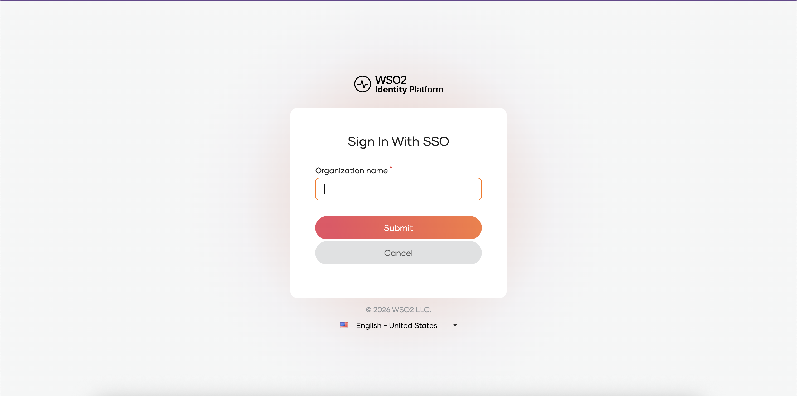

# Set up Asgardeo as your identity provider

This guide walks you through configuring Asgardeo as the identity provider for a production AI Workspace deployment. For background on how identity provider authentication works, see [Authentication in AI Workspace](overview.md).

## Prerequisites

- An Asgardeo account at [console.asgardeo.io](https://console.asgardeo.io)
- AI Workspace and Platform API accessible at known hostnames
- The [`register_asgardeo_scopes.sh`](https://github.com/wso2/api-platform/blob/main/portals/ai-workspace/production/scripts/register_asgardeo_scopes.sh) helper script, downloaded from a pinned release tag of the WSO2 API Platform GitHub repository and verified before you run it, as [Step 4](#step-4-register-a-system-application-for-scope-registration) describes

## Step 1: Set up your organization

1. Log in to [console.asgardeo.io](https://console.asgardeo.io).
2. Create or select your root organization, for example `default`.
3. If you need multiple tenants, create sub-organizations at `https://console.asgardeo.io/t/<root-org>/app/organizations`.

## Step 2: Register the AI Workspace application

AI Workspace runs a backend-for-frontend (BFF) that acts as a confidential OpenID Connect (OIDC) client. The BFF holds the client secret and completes the authorization-code and Proof Key for Code Exchange (PKCE) exchange on the back channel. Register it as a confidential web application, not a single-page application. A single-page application is a public client. The token endpoint rejects the BFF's exchange with this error: "The authenticated client is not authorized to use the requested grant type."

1. In the root organization, go to **Applications > New Application**.
2. Choose **Standard-Based Application > OpenID Connect** (Traditional Web Application) and name it `AI Workspace`.
3. Add the authorized redirect URL, which is the BFF callback rather than `/signin`: `https://<your-domain>/api/auth/callback`.
4. Enable **Share with all organizations** so users in sub-organizations can log in.
5. Under the **Protocol** tab, set:
      - **Allowed grant types**: Authorization Code and Refresh Token
      - **PKCE**: enabled
      - **Access Token Type**: JWT
6. Under the **Login Flow** tab, configure authentication as needed, for example SSO authentication.
7. Under the **User Attributes** tab, add these attributes to the token: `username`, `given_name`, `family_name`, `roles`, `email`, and `scope`. You create the `scope` attribute in the next step.

Note the client ID and client secret from the **Protocol** tab. The BFF needs both, and the client ID is also used as the audience in the Platform API configuration.

## Step 3: Add a custom scope attribute

1. Create a custom attribute at `https://console.asgardeo.io/t/<root-org>/app/attributes` named `scope`, used to carry OAuth2 scopes granted to the user.
2. Add OIDC scope mappings at `https://console.asgardeo.io/t/<root-org>/app/oidc-scopes` and map the `scope` OIDC claim to the custom `scope` attribute.

## Step 4: Register a system application for scope registration

AI Workspace and the Platform API communicate using `ap:*` scopes. Register these scopes in Asgardeo before assigning them to users, using a dedicated system application.

1. Create a new OIDC application, for example named `AI Platform System`.
2. Under **API Authorization**, add **API Resource Management API** and **Application Management API**.
3. Note the client ID and client secret.
4. Download the scope registration script from a pinned release tag rather than the `main` branch, so the content can't change between the checksum you verify and the code you run. Replace `<release-tag>` with the tag you're deploying:

    ```bash
    RELEASE_TAG=<release-tag>
    curl -fsSLO "https://raw.githubusercontent.com/wso2/api-platform/${RELEASE_TAG}/portals/ai-workspace/production/scripts/register_asgardeo_scopes.sh"
    ```

    `--fail` makes `curl` exit non-zero on an HTTP error, so a 404 from a mistyped tag doesn't leave an error page saved as the script.

5. Verify the download against the checksum published with that release, and read the script before you run it:

    ```bash
    shasum -a 256 register_asgardeo_scopes.sh
    ```

6. Run the script only after the checksum matches:

    ```bash
    chmod +x register_asgardeo_scopes.sh

    ASGARDEO_TENANT=<your-tenant> \
    ASGARDEO_CLIENT_ID=<system-app-client-id> \
    ASGARDEO_CLIENT_SECRET=<system-app-client-secret> \
    ASGARDEO_RESOURCE_IDENTIFIER=https://<platform-api-host> \
    ./register_asgardeo_scopes.sh
    ```

This registers an API resource in Asgardeo that represents the Platform API, with all `ap:*` scopes registered under it. For local testing, the default `ASGARDEO_RESOURCE_IDENTIFIER=https://localhost:9243` works without changes.

## Step 5: Link scopes to the AI Workspace application

1. Open the AI Workspace application you registered in Step 2.
2. Under **API Authorization**, add the API resource you created in Step 4.
3. Create an application role, for example `ap_admin`.
4. Assign all `ap:*` scopes to that role.

## Step 6: Add sub-organization users

For each sub-organization that needs access:

1. Register users under the sub-organization.
2. Assign the shared `ap_admin` role to each user.

## Step 7: Configure the Platform API

AI Workspace and the Platform API share a single `configs/config.toml` file. The Platform API reads its own `[platform_api.*]` tables from it and ignores the `[ai_workspace.*]` tables, and AI Workspace does the reverse. Update the `[platform_api.auth]` section:

```toml
[platform_api.auth]
mode = "idp"

[platform_api.auth.idp]
name     = "asgardeo"
jwks_url = "https://api.asgardeo.io/t/<your-tenant>/oauth2/jwks"
issuer   = ["https://api.asgardeo.io/t/<your-tenant>/oauth2/token"]
audience = ["<ai-workspace-client-id>"]

[platform_api.auth.claim_mappings]
organization = "org_id"
org_name     = "org_name"
org_handle   = "org_handle"
```

`mode` selects exactly one Platform API auth mode, so setting it to `"idp"` stops the file-based login endpoint from being used. Asgardeo uses `org_id` as the claim for the organization UUID, while the Platform API defaults to `organization`. The claim name override above is required to bridge the two.

## Step 8: Configure AI Workspace

In the same `configs/config.toml`, update the `[ai_workspace.auth]` tables:


```toml
[ai_workspace]
domain             = "<your-domain>"
default_org_region = "us"

[ai_workspace.control_plane]
url = "https://<platform-api-host>"

[ai_workspace.gateway]
controlplane_host = "<platform-api-host>"

[ai_workspace.auth]
mode = "oidc"

[ai_workspace.auth.oidc]
authority                = "https://api.asgardeo.io/t/<your-tenant>/oauth2/token"
client_id                = "<ai-workspace-client-id>"
client_secret            = '{{ env "APIP_AIW_AUTH_OIDC_CLIENT_SECRET" }}'
redirect_url             = "https://<your-domain>/api/auth/callback"
post_logout_redirect_url = "https://<your-domain>/login"

# A sibling of [ai_workspace.auth.oidc], not nested in it — applies to both auth modes.
[ai_workspace.auth.claim_mappings]
organization = "org_id"
org_name     = "org_name"
org_handle   = "org_handle"
```


`redirect_url` must exactly match the authorized redirect URL you registered in Step 2.

Never write the client secret as a literal in `config.toml`. The `{{ env }}` placeholder above reads it from an environment variable instead, so it never has to be committed to source control:

```bash
read -rs -p "AI Workspace client secret: " APIP_AIW_AUTH_OIDC_CLIENT_SECRET
export APIP_AIW_AUTH_OIDC_CLIENT_SECRET
```

Reading the value from a prompt keeps the secret out of your shell history and out of the process list.

In production, supply the secret from a mounted secret file. Swap the token in `config.toml` for `'{{ file "/secrets/ai-workspace/oidc_client_secret" }}'`, then mount the secret at that path on the AI Workspace service only. That path is one of the BFF's allowed file sources, and the Platform API can't read it. Resolution fails closed, so a missing or unreadable file aborts startup rather than falling back to an empty credential.

Don't put the client secret in `api-platform.env`. Compose loads that file into every service, so the Platform API and the API Portal would receive a credential only the BFF needs. For local testing, set the variable in the shell you start the stack from, or in an environment file mounted on the `ai-workspace` service alone.

Once configured, opening AI Workspace redirects you to the Asgardeo-hosted login page instead of the file-based login form:



## Claim flow summary

The Asgardeo token carries these claims through to the Platform API:

| Claim | Purpose | Configured as |
|-------|---------|----------------|
| `sub` | User identity | N/A |
| `org_id` | Organization UUID | `organization` in both `[ai_workspace.auth.claim_mappings]` (AI Workspace) and `[platform_api.auth.claim_mappings]` (Platform API) |
| `org_name` | Organization display name | `org_name` in both |
| `org_handle` | Organization slug | `org_handle` in both |
| `scope` | Space-separated `ap:*` scopes | Validated by the Platform API |

Keep these claim names consistent across three places: the Asgardeo token mapper output, and the `[ai_workspace.auth.claim_mappings]` and `[platform_api.auth.claim_mappings]` tables. Only the latter two are defined in `config.toml` — the token mapper output is configured in Asgardeo.