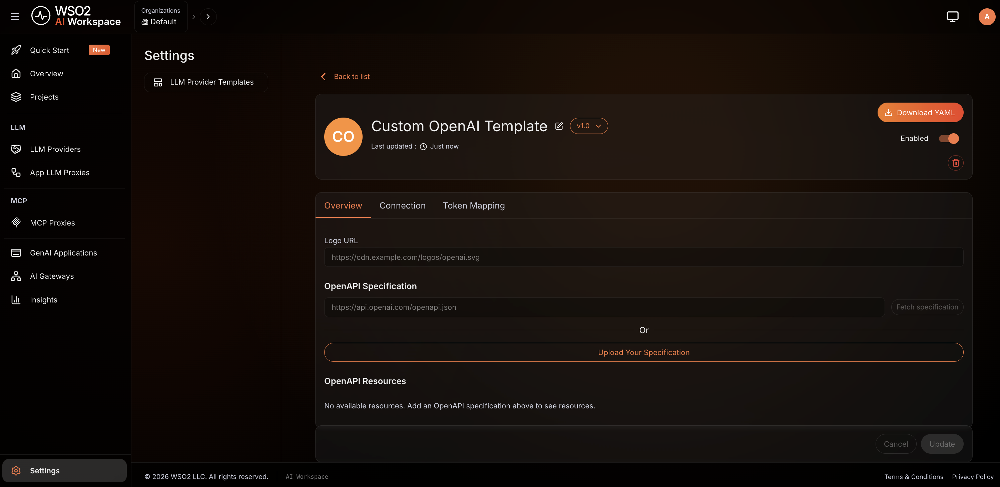
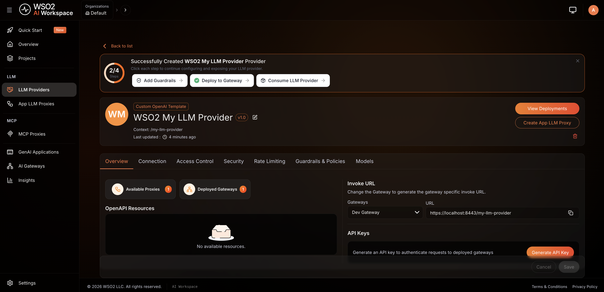
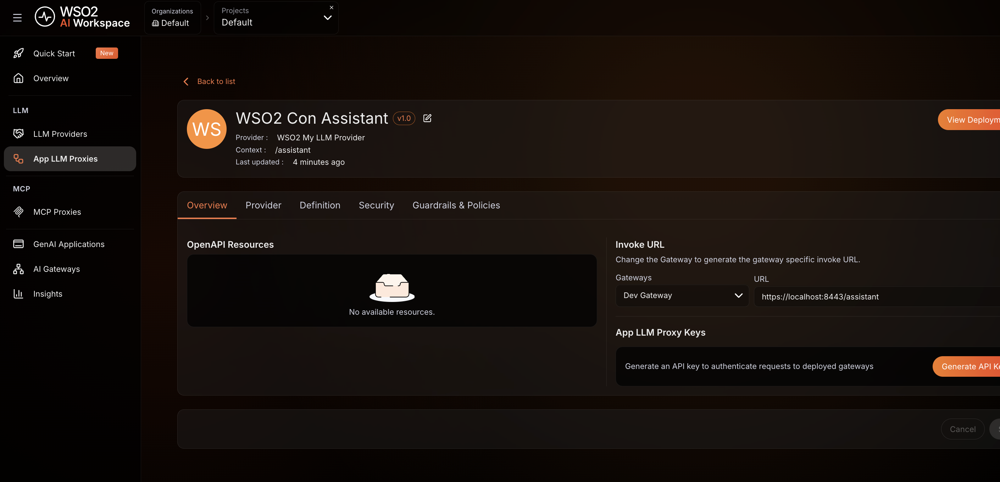
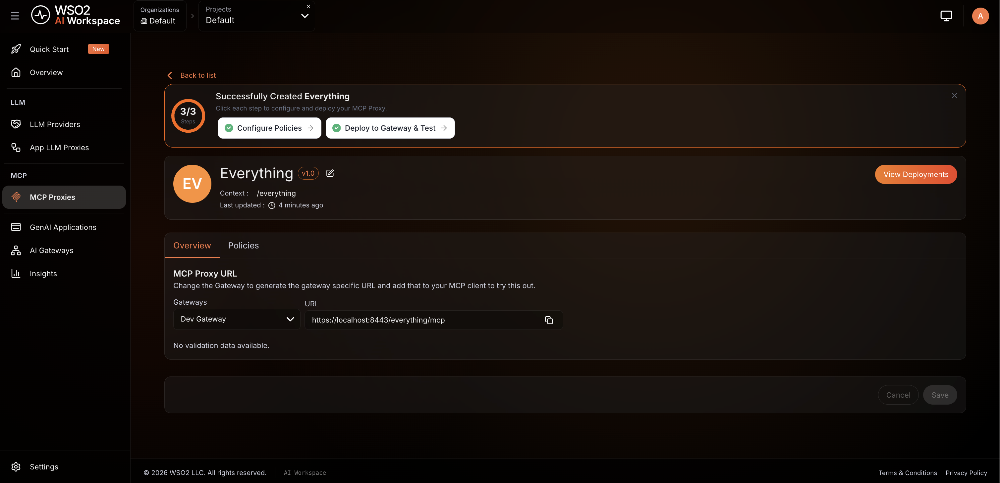
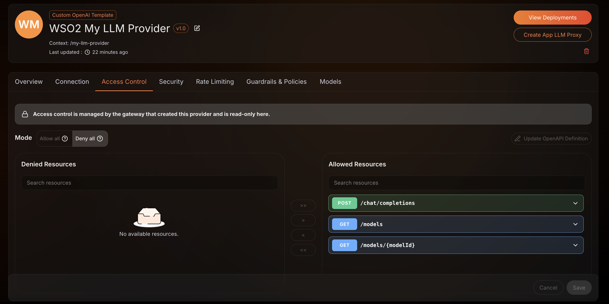
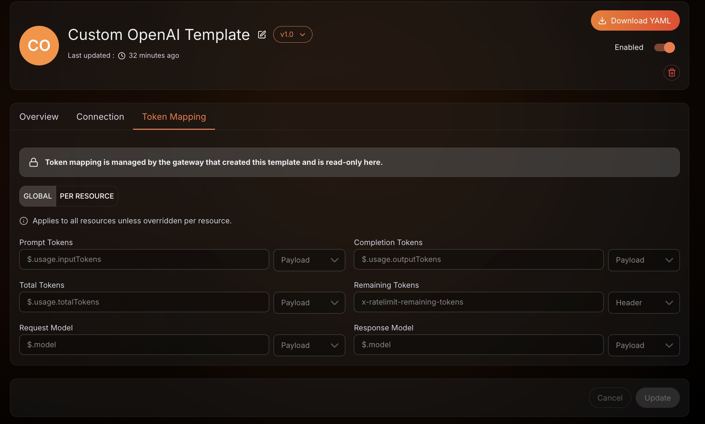
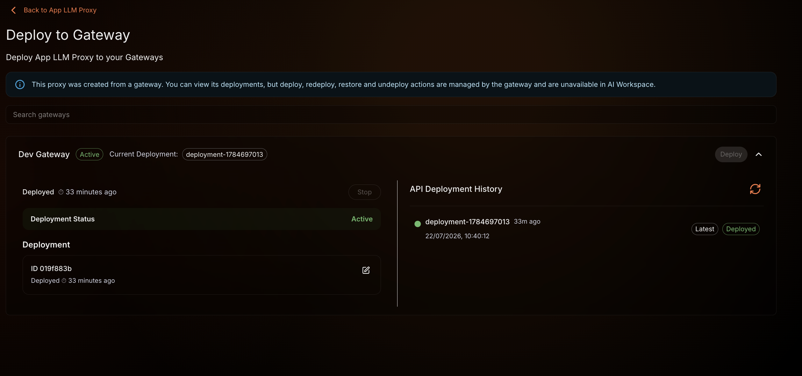

# Manage gateway-deployed AI artifacts in AI Workspace

You can create four kinds of AI artifact directly on the AI Gateway:

- **Large language model (LLM) Provider Template**
- **LLM Provider**
- **LLM Proxy**
- **Model Context Protocol (MCP) Proxy**

Each one syncs up to **AI Workspace** automatically, where it appears as a copy the gateway owns. The deployment fields the gateway runs the artifact from are **read-only**. Runtime-neutral details stay editable, such as the description, documentation, OpenAPI definitions, and template connection details. For the full breakdown, see [What you can and can't change in AI Workspace](#what-you-can-and-cant-change-in-ai-workspace).

This is the reverse of the usual top-down flow:

| | You create it in… | The AI Workspace copy is… |
|---|---|---|
| **Top-down** | AI Workspace, then it's pushed to the gateway | editable—you own it |
| **This guide (bottom-up)** | the gateway, then it's synced up to AI Workspace | read-only for deployment fields—the gateway owns them; runtime-neutral details stay editable |

Because the gateway owns these artifacts, they keep serving traffic even if AI Workspace is temporarily unavailable, and any change you make on the gateway is synced up automatically.

## Prerequisites

- A gateway that's registered with, and can reach, your AI Workspace.
- Syncing enabled on the gateway. See [Enable the sync](#enable-the-sync); it's on by default.
- For **LLM Proxies** and **MCP Proxies**, which belong to a project: the project they reference must already exist in your organization in AI Workspace.

## Enable the sync

Syncing is controlled by a single gateway setting, `deployment_sync_enabled`, which is **on by default**. It controls syncing in both directions between the gateway and AI Workspace.

**File:** `config.toml`

```toml
[controller.controlplane]
gateway_name = "default"
insecure_skip_verify = false

# Sync artifacts with AI Workspace (on by default).
deployment_sync_enabled = true
```

Set `insecure_skip_verify = true` only for local development against a known self-signed certificate. It disables verification of the AI Workspace TLS certificate, so never enable it in production.

Restart the gateway after changing the setting. When it's turned off, the gateway neither syncs its artifacts up nor receives artifacts from AI Workspace.

## How the sync works

When you create or update an artifact on the gateway:

```text
Create on the gateway ─┬─▶ takes effect immediately (starts serving traffic)
                       └─▶ synced to AI Workspace ─▶ appears as a read-only copy
```

The sync happens automatically in the background—you don't trigger it. A few things to know:

- **Matched by name.** Each artifact is identified by the name you give it (`metadata.name`). Re-creating an artifact with the same name on the gateway updates the same AI Workspace copy instead of creating a duplicate.
- **References use names.** An LLM provider names its template, and an LLM proxy names its provider. Create them in order — the template, then the provider, then the proxy — so each reference resolves. MCP proxies stand on their own.
- **Most recent deployment wins.** If the same artifact is deployed on more than one gateway, AI Workspace shows the version from the most recent deployment.

## Supported artifacts

Four AI artifact kinds sync from the gateway to AI Workspace. You create them through the gateway's management API, under the base path `/api/management/v1` (default port `9090`):

| Kind | Management API endpoint | Belongs to a project? |
|------|-------------------------|-----------------------|
| `LlmProviderTemplate` | `/api/management/v1/llm-provider-templates` | No (organization level) |
| `LlmProvider` | `/api/management/v1/llm-providers` | No (organization level) |
| `LlmProxy` | `/api/management/v1/llm-proxies` | Yes |
| `Mcp` | `/api/management/v1/mcp-proxies` | Yes |

All manifests use `apiVersion: gateway.api-platform.wso2.com/v1`. Project-scoped kinds name their project in an annotation using the project handle:

```yaml
metadata:
  annotations:
    "gateway.api-platform.wso2.com/project-id": "default"
```

### Call the management API

The examples below use these conventions:

- **Base URL:** `http://localhost:9090/api/management/v1`
- **Content type:** `Content-Type: text/yaml` (the API also accepts JSON)
- **Auth:** HTTP Basic, using a user configured under `[[controller.auth.basic.users]]` in `config.toml`. Pass your own credentials rather than hard-coding them:

    ```bash
    export GW_USER='<username>' GW_PASSWORD='<password>'
    ```

- **Body:** `--data-binary '@<file>.yaml'` uploads a manifest file as-is. `--data-binary '@-'` reads the manifest from standard input instead, which lets you substitute placeholder values as you upload.

## Create the artifacts on the gateway

This walkthrough builds a complete **LLM Proxy** together with the two artifacts it depends on: an **LLM Provider Template** and an **LLM Provider**. It then adds a standalone **MCP Proxy**. Each `curl` creates the artifact on the gateway. The artifact starts serving immediately and syncs to AI Workspace.

Create them in dependency order so each reference resolves:

```text
LlmProviderTemplate ──(spec.template)──▶ LlmProvider ──(spec.provider.id)──▶ LlmProxy
```

!!! note
    The LLM proxy and MCP proxy reference the project `default`. Make sure that project exists in your organization in AI Workspace first.

### Step 1: Create the LLM provider template

The provider references a template by name, so create the template first. `llm-provider-template.yaml`:

```yaml
apiVersion: gateway.api-platform.wso2.com/v1
kind: LlmProviderTemplate
metadata:
  name: my-llm-provider-template
spec:
  displayName: Custom OpenAI Template
  promptTokens:     { location: payload, identifier: $.usage.inputTokens }
  completionTokens: { location: payload, identifier: $.usage.outputTokens }
  totalTokens:      { location: payload, identifier: $.usage.totalTokens }
  # ... see gateway/examples/llm-provider-template.yaml for the full manifest
```

```bash
curl --location 'http://localhost:9090/api/management/v1/llm-provider-templates' \
  --header 'Content-Type: text/yaml' \
  --user "$GW_USER:$GW_PASSWORD" \
  --data-binary '@llm-provider-template.yaml'
```

### Step 2: Create the LLM provider

The provider links to the LLM provider template above via `spec.template`. `llm-provider.yaml`:

```yaml
apiVersion: gateway.api-platform.wso2.com/v1
kind: LlmProvider
metadata:
  name: my-llm-provider
spec:
  displayName: WSO2 My LLM Provider
  version: v1.0
  context: /openai-dp-1
  template: my-llm-provider-template   # ← must match the template's metadata.name
  vhost: api.my-llm-provider.local
  upstream:
    url: <upstream-url>
    auth: { type: api-key, header: Authorization, value: <upstream-api-key> }
  # ... accessControl + policies omitted; see gateway/examples/llm-provider.yaml
```

!!! warning "Substitute the placeholders, and keep credentials out of the file"
    The manifests in this guide carry placeholders such as `<upstream-api-key>`. The gateway stores whatever you send, so substitute your own values before each request. The commands below pipe the manifest through [`yq`](https://github.com/mikefarah/yq) and post the result. The placeholders stay in the file on disk, which keeps real credentials out of source control. To avoid holding the value in your shell as well, reference a secret. See [Secrets management](./secrets-management.md).

    `yq` edits the manifest as YAML, and its `strenv` function assigns each value as a string. A URL or API key that contains `:`, `#`, `{`, or a quotation mark is preserved as a literal value.

Set your upstream values, then substitute them as you post the manifest:

```bash
export UPSTREAM_URL='<your-upstream-url>' UPSTREAM_API_KEY='<your-upstream-api-key>'

yq '.spec.upstream.url = strenv(UPSTREAM_URL) |
    .spec.upstream.auth.value = strenv(UPSTREAM_API_KEY)' llm-provider.yaml |
  curl --location 'http://localhost:9090/api/management/v1/llm-providers' \
    --header 'Content-Type: text/yaml' \
    --user "$GW_USER:$GW_PASSWORD" \
    --data-binary '@-'
```

### Step 3: Create the LLM proxy

The proxy belongs to a project (the `project-id` annotation) and links to the LLM provider via `spec.provider.id`. `llm-proxy.yaml`:

```yaml
apiVersion: gateway.api-platform.wso2.com/v1
kind: LlmProxy
metadata:
  name: wso2con-assistant
  annotations:
    "gateway.api-platform.wso2.com/project-id": "default"   # ← must be an existing project
spec:
  displayName: WSO2 Con Assistant
  version: v1.0
  context: "/project-1/assistant"
  provider:
    id: my-llm-provider   # ← must match the provider's metadata.name
    auth: { header: X-API-Key, type: api-key, value: <provider-api-key> }
  # ... policies omitted; see gateway/examples/llm-proxy.yaml
```

```bash
export PROVIDER_API_KEY='<your-provider-api-key>'

yq '.spec.provider.auth.value = strenv(PROVIDER_API_KEY)' llm-proxy.yaml |
  curl --location 'http://localhost:9090/api/management/v1/llm-proxies' \
    --header 'Content-Type: text/yaml' \
    --user "$GW_USER:$GW_PASSWORD" \
    --data-binary '@-'
```

### Step 4: Create an MCP proxy

An MCP proxy also belongs to a project but stands on its own (no template or provider prerequisite). `mcp-proxy.yaml`:

```yaml
apiVersion: gateway.api-platform.wso2.com/v1
kind: Mcp
metadata:
  name: everything-mcp-v1.0
  annotations:
    "gateway.api-platform.wso2.com/project-id": "default"
spec:
  displayName: Everything
  version: v1.0
  context: "/project-1/everything"
  specVersion: "2025-06-18"
  upstream:
    url: <mcp-server-url>
    auth: { header: X-Api-Key, type: header, value: <mcp-server-api-key> }
  # ... policies omitted; see gateway/examples/mcp-proxy.yaml
```

```bash
export MCP_SERVER_URL='<your-mcp-server-url>' MCP_SERVER_API_KEY='<your-mcp-server-api-key>'

yq '.spec.upstream.url = strenv(MCP_SERVER_URL) |
    .spec.upstream.auth.value = strenv(MCP_SERVER_API_KEY)' mcp-proxy.yaml |
  curl --location 'http://localhost:9090/api/management/v1/mcp-proxies' \
    --header 'Content-Type: text/yaml' \
    --user "$GW_USER:$GW_PASSWORD" \
    --data-binary '@-'
```

## View them in AI Workspace

The gateway syncs each artifact up automatically. Shortly after you create them, all four appear in AI Workspace as **read-only** copies, each keeping the name you gave it on the gateway.

Open **AI Workspace** for the organization your gateway is registered with, then find each artifact in its section of the sidebar.

### LLM provider template

The template appears under **Settings** > **LLM Provider Templates**:



### LLM provider

The provider appears under **LLM** > **LLM Providers**:



### LLM proxy

The proxy appears under **LLM** > **App LLM Proxies**, in the **Default** project:



### MCP proxy

The MCP proxy appears under **MCP** > **MCP Proxies**, in the **Default** project:



Open any of them to browse the full configuration. It opens in a read-only view — the edit and deploy actions are unavailable because the gateway owns the artifact.

If an artifact hasn't appeared after a short wait, see [Troubleshooting](#troubleshooting).

## What you can and can't change in AI Workspace

A gateway-created artifact is **read-only** in AI Workspace because the gateway owns it. "Read-only" applies to anything the gateway uses to run the artifact — everything else stays editable.

**You _can_ change things that don't affect how the gateway runs the artifact** (these stay in AI Workspace only):

- Its description and display name
- Documentation and API (OpenAPI) definitions
- For an **LLM Provider Template**: its connection details (endpoint URL, auth type/header), logo, and OpenAPI spec

**You _can't_ change what the gateway uses to run the artifact.** Make those changes on the gateway instead — they sync up automatically. This includes:

- Upstreams, the auth/routing used to serve traffic, and policies

    

- An LLM provider template's token-tracking settings

    

- Deploying, redeploying, or undeploying the artifact

    

- Deleting it while it's still deployed on a gateway (undeploy it from all gateways first)

AI Workspace doesn't offer the actions it can't perform, and it declines an edit that would change how the gateway runs the artifact.

## Update and delete artifacts

| On the gateway you… | In AI Workspace… |
|---------------------|----------------------|
| **Update** the artifact | the read-only copy refreshes automatically |
| **Delete** the artifact | the copy is kept (not removed) and shown as no longer deployed on that gateway, preserving a record of it |

To re-sync an artifact after a hiccup, re-apply it on the gateway with the same definition.

## If AI Workspace is temporarily unavailable

Syncing is resilient. If AI Workspace can't be reached when you create or change an artifact:

- The artifact still takes effect on the gateway and keeps serving traffic.
- The gateway retries the sync automatically.
- When the connection is restored, everything that hasn't synced yet is pushed up — no manual action needed.

You can create artifacts on a gateway while it's disconnected, and they reconcile up on their own once it reconnects. This applies to all four artifact kinds.

## Immutable gateways

Some gateways run in **immutable** mode, where artifacts are loaded from on-disk configuration at startup rather than created through the management API (see [Immutable Gateway](../../ai-gateway/1.0.0/deployment/deployment-modes/immutable-gateway.md)).

The sync behaves exactly the same for these gateways: artifacts loaded from files are synced up to AI Workspace just like ones created through the management API, with the same read-only copies and the same automatic reconciliation — no extra configuration. An immutable, file-driven gateway is still fully visible in AI Workspace.

## Troubleshooting

### An artifact I created on the gateway doesn't appear in AI Workspace

- **Syncing is turned off.** Set `deployment_sync_enabled = true` in the gateway's `config.toml` and restart the gateway.
- **The AI Workspace can't be reached.** The artifact still works on the gateway; the sync retries automatically and catches up once the connection is restored. Check that the gateway is connected to AI Workspace.
- **The project doesn't exist** (LLM proxy or MCP proxy). These belong to a project. Create the project named in the artifact's `project-id` annotation in your organization, then re-apply the artifact on the gateway:

    ```yaml
    metadata:
      annotations:
        "gateway.api-platform.wso2.com/project-id": "default"
    ```

- **A referenced artifact isn't there yet.** An LLM provider needs its template, and an LLM proxy needs its provider. Create them in order: the template, then the provider, then the proxy. The dependent artifact catches up on its own once the artifact it references has synced.

### I can't edit, deploy, or delete a gateway-created artifact in AI Workspace

This is expected—the gateway owns the artifact, so its deployment fields are read-only in AI Workspace.

- Make configuration and deployment changes on the **gateway**; they sync up automatically.
- You can still edit runtime-neutral details: the description, display name, documentation, OpenAPI definitions, and, for an LLM provider template, its connection details and logo.
- To delete it from AI Workspace, first undeploy it from **all** gateways it was deployed to, then delete.

See [What you can and can't change](#what-you-can-and-cant-change-in-ai-workspace) for the full list.