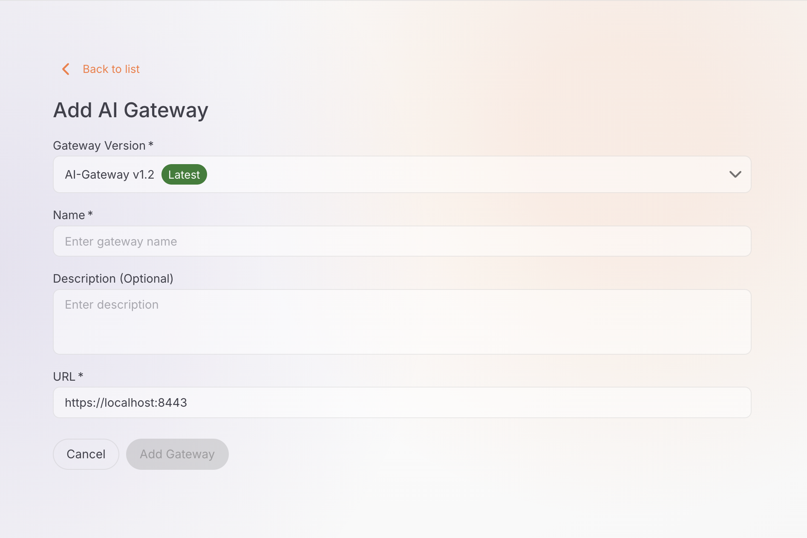

# Set up an AI Gateway

An AI Gateway is the runtime component that processes and routes requests between your applications and large language model (LLM) providers. Create and manage AI gateways in AI Workspace, then deploy your LLM providers and proxies to them.

## Prerequisites

- A user whose token carries the scopes these steps need:

    - `ap:gateway:read` to view gateways.
    - `ap:gateway:manage` to add, edit, or delete a gateway.
    - `ap:gateway:token:manage` to issue a registration token. `ap:gateway:manage` covers the token operations on its own.

    The built-in [role-to-scope mapping](../setting-up/authentication/overview.md) assigns these scopes as follows:

    - `ap_admin` and `ap_operator` grant all three scopes.
    - `ap_viewer` and `ap_publisher` grant `ap:gateway:read` only, so they can view gateways but not change them.

## View AI gateways

1. Navigate to **AI Gateways** in the left navigation menu.

The AI Gateways page displays a list of all configured gateways with the following details:

| Column | Description |
|--------|-------------|
| **Name** | The gateway name |
| **Description** | A brief description of the gateway |
| **Status** | The gateway status, either Active or Not Active |
| **Last Updated** | Timestamp of the most recent change |
| **Actions** | Edit and delete options |

## Add an AI gateway

1. Navigate to **AI Gateways** in the left navigation menu.

2. Click **+ Add AI Gateway**.

3. Fill in the gateway details:

    - **Name** (required): a unique name for the gateway, for example `production-gateway` or `dev-gateway`.
    - **Description** (optional): a brief description that identifies the gateway's purpose.
    - **URL** (required): the gateway URL, for example `https://localhost:8443`. This is the endpoint where the gateway runtime is accessible.

    The Add AI Gateway form collects the name, description, and URL:

    

4. Click **Add Gateway** to create the gateway.

5. The gateway detail page opens showing the gateway name, status (**Not Active** initially), vhost, and creation timestamp.

## Set up the gateway runtime

After creating an AI gateway, you need to set up the gateway runtime. The detail page provides a **Get Started** section with setup instructions.

### Gateway registration token

A **Gateway Registration Token** is displayed at the top of the Get Started section. This token is required to connect your gateway runtime to the control plane.

!!! danger "Important"
    The token is shown only once. Save it securely before you leave this page.

!!! tip "Lost your token?"
    The registration token is single-use. If you need to reconfigure the gateway, click the **Reconfigure** button to generate a new token. The new token revokes the old one and disconnects the gateway from the control plane.

### Installation methods

The Get Started section provides setup instructions for multiple deployment options.

!!! note "Where the control plane address comes from"
    Every method below needs two values from the **Get Started** section: the control plane address the gateway connects to, and this gateway's registration token.

    Self-hosted AI Workspace fills that address into the commands it shows from `[ai_workspace.gateway] controlplane_host` in its own `config.toml`. The key is display-only, and AI Workspace never connects to it. The address has to be reachable from the machine running the gateway, not from the workspace. If the commands carry an address your gateway can't reach, correct that key and reload the page rather than editing the value into the gateway. For the Helm method, put the hostname in `controlPlane.host` and any port in `controlPlane.port`. See [Two keys that aren't interchangeable](../setting-up/ports.md#two-keys-that-arent-interchangeable).

!!! note "Gateway version"
    AI Workspace works with **gateway v1.2 and above**. Those gateways provision their keys and certificates with `./scripts/setup.sh` and take their configuration from `api-platform.env`, which Compose loads through the `env_file:` directive. The **Get Started** section offers the gateway versions AI Workspace supports and shows the commands for the version you register.

=== "Quick start"
    **Prerequisites:**

    - cURL installed
    - unzip installed
    - Docker installed and running

    **Step 1: Download the gateway**

    Run this command in your terminal to download the gateway:

    ```bash
    curl -sLO https://github.com/wso2/api-platform/releases/download/ai-gateway/v1.2.0-rc/wso2apip-ai-gateway-1.2.0-rc.zip && \
    unzip wso2apip-ai-gateway-1.2.0.zip
    ```

    **Step 2: Set up the gateway**

    Run the one-time setup script. It provisions the AES-256 at-rest encryption key, the router HTTPS listener certificate, the gateway-controller admin credentials, and `api-platform.env` — all required before the first start (the gateway has no demo mode and fails closed if a required key, certificate, or credential is missing). The admin password is printed once — copy it:

    ```bash
    cd wso2apip-ai-gateway-1.2.0 && ./scripts/setup.sh
    ```

    On Windows, use the PowerShell setup script instead — it takes the same flags and provisions the same files:

    ```powershell
    cd wso2apip-ai-gateway-1.2.0
    powershell -ExecutionPolicy Bypass -File .\scripts\setup.ps1
    ```

    **Step 3: Configure the gateway**

    Append the control plane host and your registration token to `api-platform.env`:

    ```bash
    cat >> api-platform.env << 'ENVFILE'
    APIP_GW_CONTROLLER_CONTROLPLANE_HOST=<control-plane-host>
    APIP_GW_CONTROLLER_CONTROLPLANE_TOKEN=<your-gateway-token>
    ENVFILE
    ```

    Replace both placeholders with the values the Get Started section shows: the control plane address, as `host:port` with no scheme, and this gateway's registration token.

    **Step 4: Start the gateway**

    Start the gateway. `api-platform.env` is loaded automatically via the Compose `env_file:` directive:

    ```bash
    docker compose up
    ```

=== "Virtual machine"
    **Prerequisites:**

    - cURL installed
    - unzip installed
    - A Docker-compatible container runtime such as:
        - Docker Desktop (Windows / macOS)
        - Rancher Desktop (Windows / macOS)
        - Colima (macOS)
        - Docker Engine + Compose plugin (Linux)

    Ensure docker and docker compose commands are available:

    ```bash
    docker --version
    docker compose version
    ```

    **Step 1: Download the gateway**

    Run this command in your terminal to download the gateway:

    ```bash
    curl -sLO https://github.com/wso2/api-platform/releases/download/ai-gateway/v1.2.0-rc/wso2apip-ai-gateway-1.2.0-rc.zip && \
    unzip wso2apip-ai-gateway-1.2.0.zip
    ```

    **Step 2: Set up the gateway**

    Run the one-time setup script. It provisions the AES-256 at-rest encryption key, the router HTTPS listener certificate, the gateway-controller admin credentials, and `api-platform.env` — all required before the first start (the gateway has no demo mode and fails closed if a required key, certificate, or credential is missing). The admin password is printed once — copy it:

    ```bash
    cd wso2apip-ai-gateway-1.2.0 && ./scripts/setup.sh
    ```

    On Windows, use the PowerShell setup script instead — it takes the same flags and provisions the same files:

    ```powershell
    cd wso2apip-ai-gateway-1.2.0
    powershell -ExecutionPolicy Bypass -File .\scripts\setup.ps1
    ```

    **Step 3: Configure the gateway**

    Append the control plane host and your registration token to `api-platform.env`:

    ```bash
    cat >> api-platform.env << 'ENVFILE'
    APIP_GW_CONTROLLER_CONTROLPLANE_HOST=<control-plane-host>
    APIP_GW_CONTROLLER_CONTROLPLANE_TOKEN=<your-gateway-token>
    ENVFILE
    ```

    Replace both placeholders with the values the Get Started section shows: the control plane address, as `host:port` with no scheme, and this gateway's registration token. The token is single-use — if you need to reconfigure, click **Reconfigure** to generate a new token (this revokes the old token and disconnects the gateway).

    **Step 4: Start the gateway**

    Start the gateway. `api-platform.env` is loaded automatically via the Compose `env_file:` directive:

    ```bash
    docker compose up
    ```

=== "Docker"
    **Prerequisites:**

    - cURL installed
    - unzip installed

    **Step 1: Download the gateway**

    Run this command in your terminal to download the gateway:

    ```bash
    curl -sLO https://github.com/wso2/api-platform/releases/download/ai-gateway/v1.2.0-rc2/wso2apip-ai-gateway-1.2.0-rc2.zip && \
    unzip wso2apip-ai-gateway-1.2.0-rc2.zip
    ```

    **Step 2: Set up the gateway**

    Run the one-time setup script. It provisions the AES-256 at-rest encryption key, the router HTTPS listener certificate, the gateway-controller admin credentials, and `api-platform.env` — all required before the first start (the gateway has no demo mode and fails closed if a required key, certificate, or credential is missing). The admin password is printed once — copy it:

    ```bash
    cd wso2apip-ai-gateway-1.2.0 && ./scripts/setup.sh
    ```

    On Windows, use the PowerShell setup script instead — it takes the same flags and provisions the same files:

    ```powershell
    cd wso2apip-ai-gateway-1.2.0
    powershell -ExecutionPolicy Bypass -File .\scripts\setup.ps1
    ```

    **Step 3: Configure the gateway**

    Append the control plane host and your registration token to `api-platform.env`:

    ```bash
    cat >> api-platform.env << 'ENVFILE'
    APIP_GW_CONTROLLER_CONTROLPLANE_HOST=<control-plane-host>
    APIP_GW_CONTROLLER_CONTROLPLANE_TOKEN=<your-gateway-token>
    ENVFILE
    ```

    Replace both placeholders with the values the Get Started section shows: the control plane address, as `host:port` with no scheme, and this gateway's registration token. The token is single-use — if you need to reconfigure, click **Reconfigure** to generate a new token (this revokes the old token and disconnects the gateway).

    **Step 4: Start the gateway**

    Start the gateway. `api-platform.env` is loaded automatically via the Compose `env_file:` directive:

    ```bash
    docker compose up
    ```

=== "Kubernetes"
    **Prerequisites:**

    - cURL installed
    - unzip installed
    - Kubernetes 1.32+
    - Helm 3.18+

    The registration token is a one-time generated token for this gateway. If you need to install or update the gateway chart again, first reconfigure this gateway to generate a new registration token. Reconfiguring revokes the previous token.

    **Create the encryption key secret**

    At-rest encryption is mandatory and fail-closed — nothing is auto-generated, and the chart doesn't render without an AES-256 key Secret. Create it in the install namespace before installing the chart:

    ```bash
    openssl rand 32 > default-aesgcm256-v1.bin
    kubectl create secret generic gateway-encryption-keys \
      --from-file=default-aesgcm256-v1.bin=default-aesgcm256-v1.bin
    rm default-aesgcm256-v1.bin   # don't leave the plaintext key on disk
    ```

    **Install the chart**

    Run this command to install the gateway chart with the encryption key and control plane configurations:

    ```bash
    helm install gateway oci://ghcr.io/wso2/api-platform/helm-charts/gateway --version 1.2.0 \
    --set gateway.controller.encryptionKeys.enabled=true \
    --set gateway.controller.encryptionKeys.secretName=gateway-encryption-keys \
    --set gateway.controller.controlPlane.host="<control-plane-host>" \
    --set gateway.controller.controlPlane.port=<control-plane-port> \
    --set gateway.controller.controlPlane.token.value="<your-gateway-token>"
    ```

    Use the Helm chart version that matches the gateway version shown on this page's **Get Started** section, not necessarily `1.2.0`.

    Replace the placeholders with the values the Get Started section shows. Split the control plane address across the two flags: the hostname in `controlPlane.host`, its port in `controlPlane.port`. `<your-gateway-token>` is this gateway's registration token.

Once the gateway runtime is running and connected, the gateway status changes from **Not Active** to **Active**.

## Manage AI gateways

### Edit a gateway

1. In the AI Gateways list, click the edit icon next to the gateway you want to modify.

2. Update the gateway details as needed.

3. Click **Save** to apply the changes.

### Delete a gateway

1. In the AI Gateways list, click the delete icon next to the gateway you want to remove.

2. Confirm the deletion when prompted.

!!! danger "Irreversible action"
    Deleting a gateway is permanent, and it undeploys every provider and proxy on that gateway immediately.

## Next steps

- [Configure an LLM provider](../llm-providers/configure-provider.md): set up an LLM provider and deploy it to your gateway
- [Configure an App LLM proxy](../llm-proxies/configure-proxy.md): create a specialized proxy for a GenAI application or agent and deploy it to your gateway