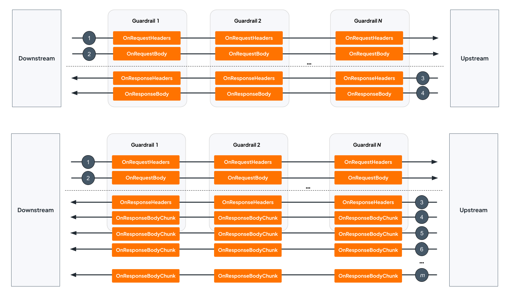

# Policy execution order

When multiple policies are attached to an API or operation, they form an ordered **policy chain**. The gateway calls each policy in the chain for the phases it implements, passing the output of each policy as the input to the next.

## Execution phases

Every request and response passes through four phases. A policy only participates in the phases it declares support for.

| Phase | Hook | When it runs |
|-------|------|-------------|
| Request headers | `OnRequestHeaders` | After request headers arrive from the client, before the body is read |
| Request body | `OnRequestBody` | After the full request body is buffered |
| Response headers | `OnResponseHeaders` | After the upstream responds, before the response body is read |
| Response body | `OnResponseBody` | After the full response body is buffered |

For streaming bodies (chunked transfer encoding or SSE), body chunks are processed individually rather than buffered:

| Streaming phase | Hook | When it runs |
|-----------------|------|-------------|
| Request body chunk | `OnRequestBodyChunk` | Once per incoming request body chunk |
| Response body chunk | `OnResponseBodyChunk` | Once per outgoing response body chunk |

## Execution order with multiple policies

Request and response phases execute in opposite directions.

### Request path — forward order

Policies execute in the order they are listed in the API definition — Policy 1 first, Policy N last. Each policy's output (modified headers or body) is the input for the next. The last policy's output is what the upstream receives.

```
Client ──► [Policy 1] ──► [Policy 2] ──► ... ──► [Policy N] ──► Upstream
              │                │                        │
       OnRequestHeaders  OnRequestHeaders         OnRequestHeaders
       OnRequestBody     OnRequestBody            OnRequestBody
```

### Response path — reverse order

Policies execute in reverse — Policy N first, Policy 1 last. This mirrors the request wrapping: the policy that was outermost on the way in is the outermost unwrapper on the way back. Policy 1's output is what the client receives.

```
Client ◄── [Policy 1] ◄── [Policy 2] ◄── ... ◄── [Policy N] ◄── Upstream
              │                │                        │
       OnResponseHeaders OnResponseHeaders        OnResponseHeaders
       OnResponseBody    OnResponseBody           OnResponseBody
```

The following diagram shows how a request passes through the policy chain in forward order and the response returns in reverse order:


<!-- image source: https://docs.google.com/drawings/d/1EJhRx9bNtAGmJ9jI2ay1WZaLgNKMLKoF8AkVKHcE6_s/edit?usp=sharing -->

## Short-circuit behavior

Any policy can return an `ImmediateResponse` at any phase. When this happens:

- The remaining policies in the chain for that phase are skipped.
- For request phases, the request is not forwarded to the upstream.
- The response is sent directly to the client.

This is how authentication and guardrail policies block requests as early as possible — without invoking downstream policies or reaching the upstream.

## Streaming mode

In streaming mode, `OnRequestBodyChunk` and `OnResponseBodyChunk` replace the buffered body hooks. The same forward and reverse ordering applies — each chunk passes through the chain in policy order before being forwarded.

**Requirement:** Every policy in the chain must declare streaming support for the gateway to activate streaming mode. If any policy in the chain doesn't implement the streaming interface, the gateway falls back to buffered mode for that entire chain, collecting the full body before running the policies.

The following diagram shows how each body chunk flows through the policy chain when streaming mode is active:


<!-- image source: https://docs.google.com/drawings/d/1HyceTR0htslHoBm3xintrMkZo0jqKfHhnhAcctGgUDs/edit?usp=sharing -->

## Related topics

- [API Platform Policies Overview](overview.md)
- [Write a Custom Policy](custom-policies/writing-a-custom-policy.md)