# Creating and Uploading using WSO2 Integration Studio

From API-M-3.0.0 onwards you can design all custom mediation policies using a tool such as the WSO2 Integration Studio and then store the policy in the registry which can be later deployed to the Gateway.

Let's see how to create a custom mediation policy using the WSO2 Integration Studio and then deploy and use it in your APIs.
This custom policy adds a full trace log which is getting printed when you invoke a particular API deployed in the Gateway.

1.  Navigate to the Integration Studio page - <https://wso2.com/integration/integration-studio/>
2.  Click **Download** button according to your preferred platform (i.e., Mac, Windows, Linux).  
*For example if you are using ubuntu 64 bit computer you need to download, WSO2-Integration-Studio-7.0.0-linux-gtk-x86_64.tar.gz.*
3.  Extract the downloaded archive of the Integration Studio to the desired location and run the **IntegrationStudio** application to start the tool.

    [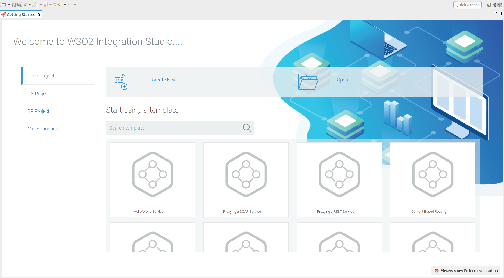](../../../assets/img/learn/api-gateway/message-mediation/integration-studio.png)


    !!! tip
        To learn more about using WSO2 Integration Studio, visit [here](https://ei.docs.wso2.com/en/latest/micro-integrator/develop/WSO2-Integration-Studio/).

4.  Click **ESB Project -> Create New** to create a new ESB Solution Project.
  
    [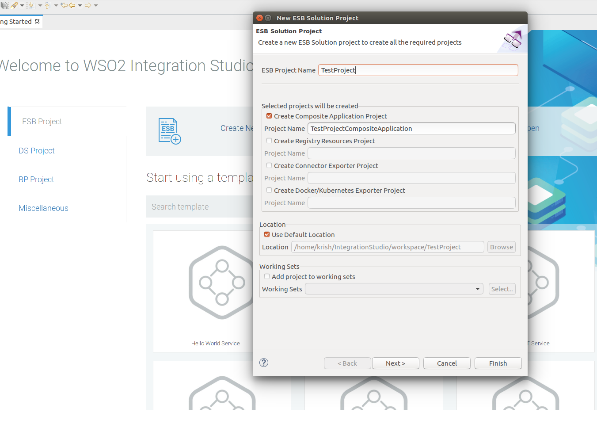](../../../assets/img/learn/api-gateway/message-mediation/esb-solution-project.png)

5.  Provide **Project Name** as `TestProject` and click **Finish**. Then you will be redirected to the following page.
  
    [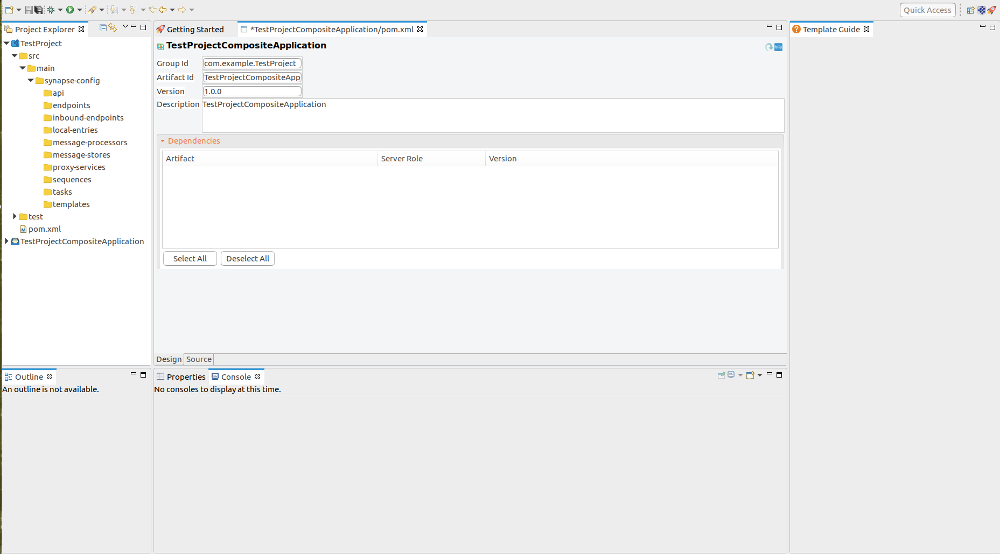](../../../assets/img/learn/api-gateway/message-mediation/composite-app-pom.png)

6.  Navigate to the directory path **TestProject -> src -> main -> synapse-config -> sequences** in **Project Explorer** 
window.
  
    [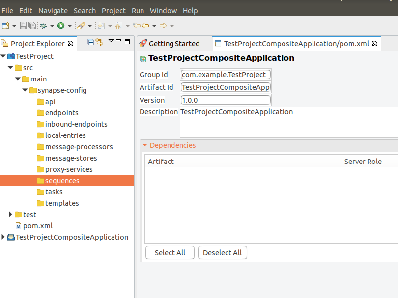](../../../assets/img/learn/api-gateway/message-mediation/sequences.png)

7.  Right-Click on **sequences** directory and go to **New -> Sequence** to create a new sequence.  
    If you want to import existing sequence proceed with **Import Sequence** option.
  
    [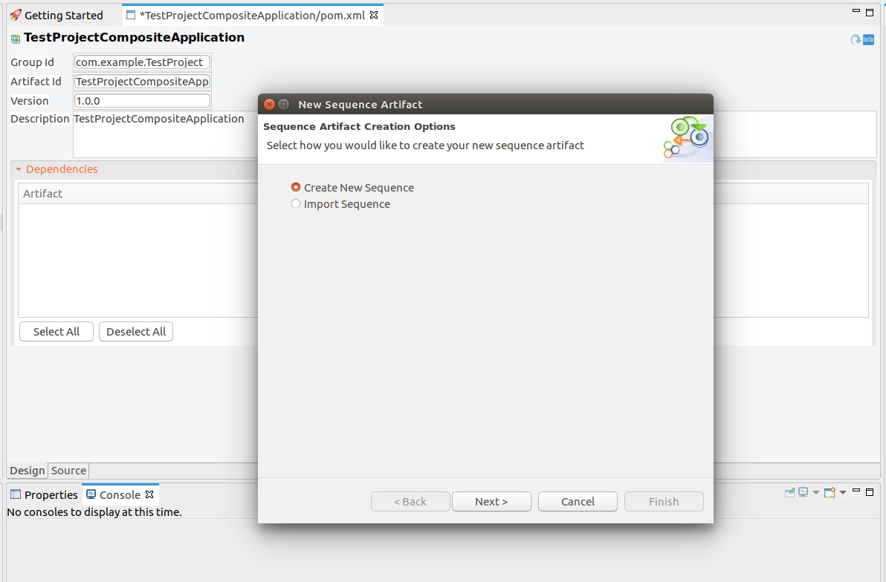](../../../assets/img/learn/api-gateway/message-mediation/create-new-sequence.png)

8.  Create new sequence and provide sequence name `newSequence` and click **Finish**.
  
    [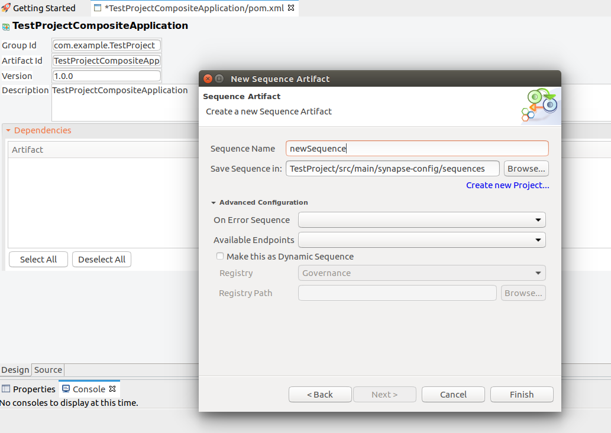](../../../assets/img/learn/api-gateway/message-mediation/create-new-sequence-2.png)

9.  Your sequence now appears on the Integration Studio console.   
    Drag and drop a **Log Mediator** from under the **Mediators** section, to your sequence and give the following values 
    to the **Log Mediator** and **Save** the file `newSequence.xml`.

    `Log Level:  Full`   
  
    [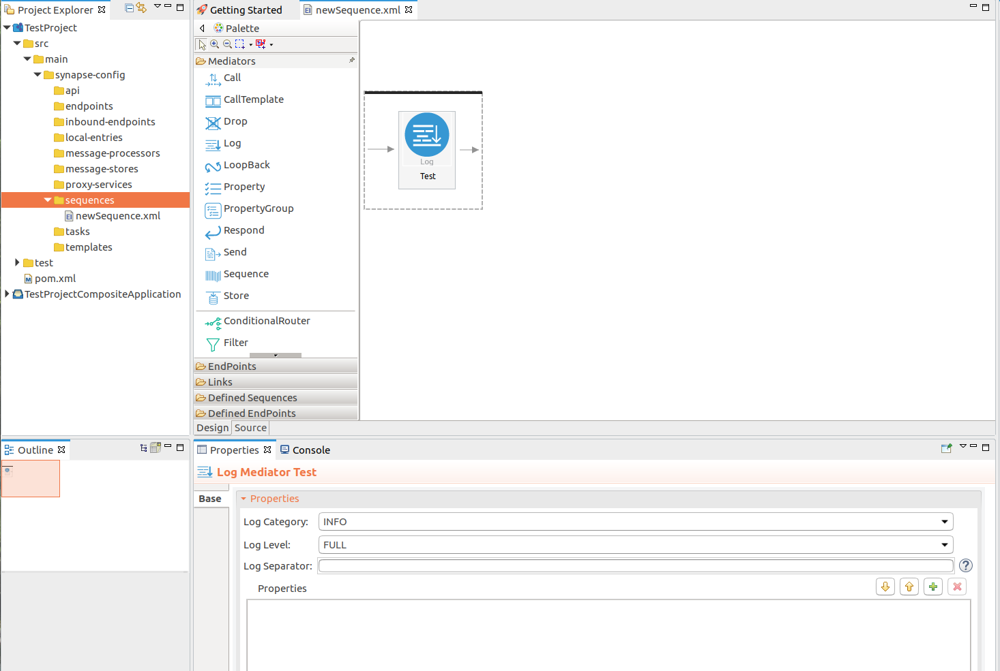](../../../assets/img/learn/api-gateway/message-mediation/newsequence-xml.png)

10. Right click the sequence file `newSequence.xml`, and goto **WSO2 registry -> Check in to WSO2 Registry**. You will be
prompted with the following dialog box.
  
    [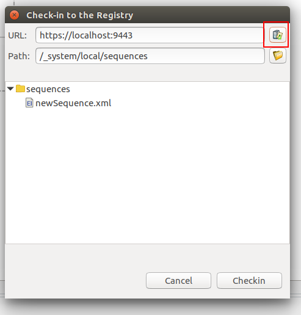](../../../assets/img/learn/api-gateway/message-mediation/check-in-to-reg.png)

11. On the dialog box that appears, enter the URL of the `WSO2 Publisher Portal` and click the Right top icon to open the **Registry Tree Browser**. 

12. From **Registry Tree Browser**, locate the path where the sequence is needed to be added `(IN/OUT/FAULT)`.  
  
    [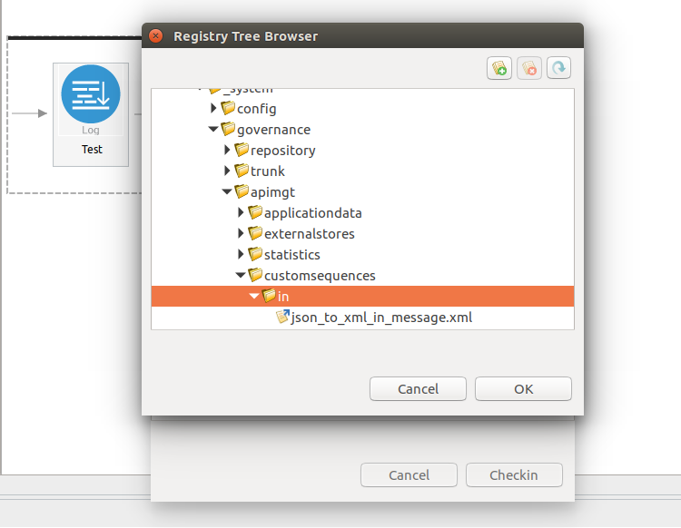](../../../assets/img/learn/api-gateway/message-mediation/reg-browser.png)

13. Then click **OK** and **Checkin**.

14. After that you can check **Registry Browser** in **WSO2 Management Console** to verify whether the sequence is successfully added.
    
    [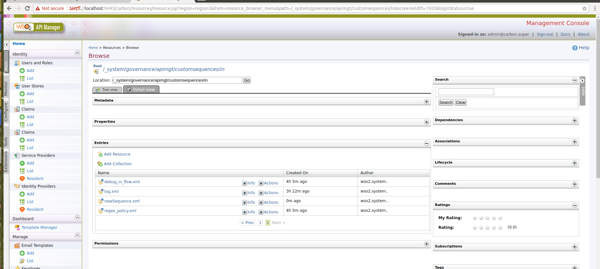](../../../assets/img/learn/api-gateway/message-mediation/mgt-console-reg-browser.png)
    
15. Log in to the **API Publisher Portal**. 

16. Click **CREATE API** and then design a new REST API to create an API by following the steps in [Create a REST API](../../design-api/create-api/create-a-rest-api).

17. Go to the created API and from the Left Menu, go to **Runtime Configurations**.

18. Click [](../../../assets/img/learn/api-gateway/message-mediation/edit-button.png) button in the **Message Mediation** section under **Request** sub-menu.  

19. In the Select a Mediation Policy popup, select **Common Policies** and select the newly added `newSequence` from the 
sequence list. Then, click **Select**.

    [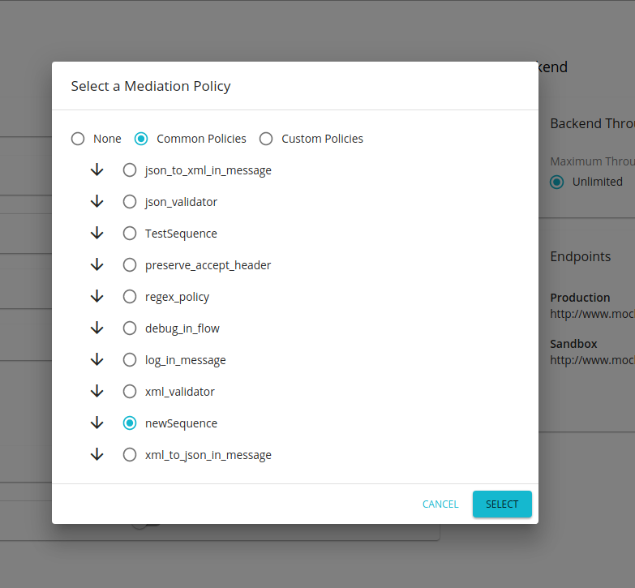](../../../assets/img/learn/api-gateway/message-mediation/select-mediation-policy.png)

20. If the API is not in `PUBLISHED` state, go to **Lifecycle** tab, click `REDPLOY` to re-publish the API. 

21. When you invoke the API using a valid subscription, you can see the following trace log in the server logs.

    ``` bash
    [2019-12-19 15:27:30,770]  INFO - LogMediator To: /test/1.0, MessageID: urn:uuid:042a64ab-590a-4128-bd99-ef6974893610, Direction: request, Envelope: <?xml version='1.0' encoding='utf-8'?><soapenv:Envelope xmlns:soapenv="http://www.w3.org/2003/05/soap-envelope"><soapenv:Body/></soapenv:Envelope
    ```