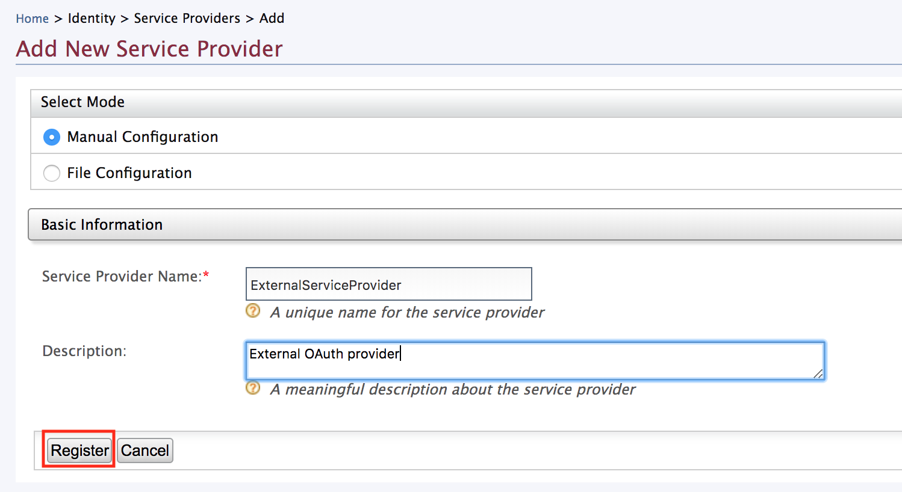
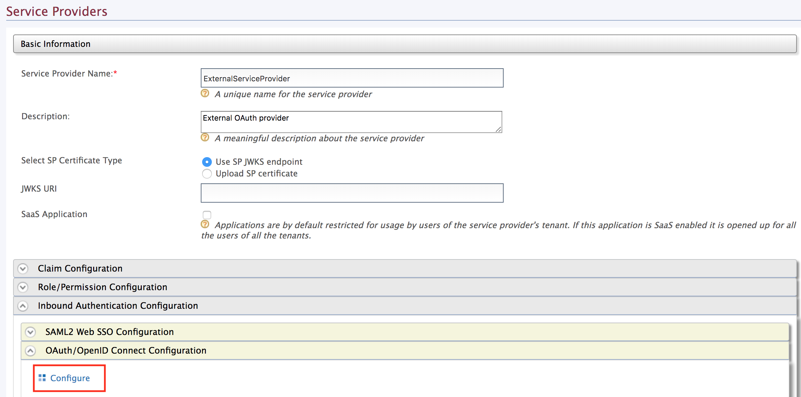
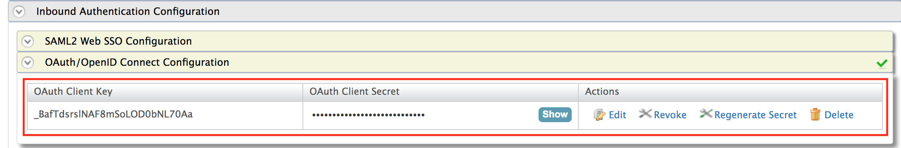
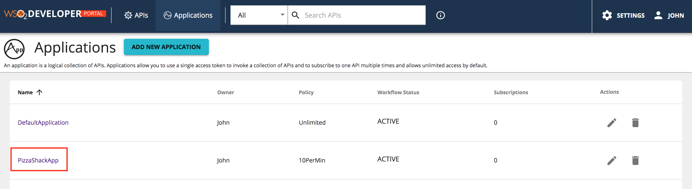
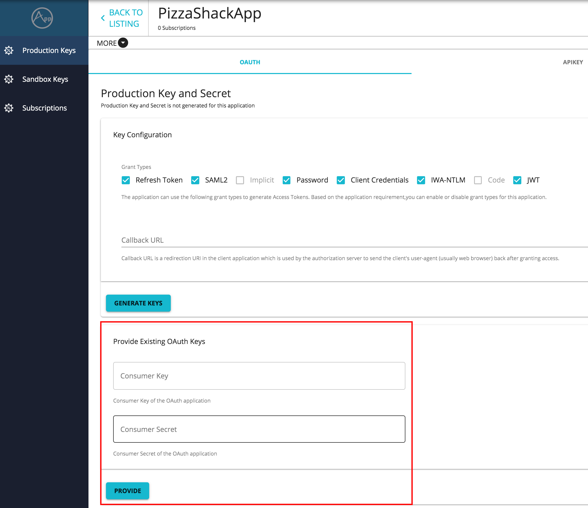

# Provisioning Out-of-Band OAuth2 Clients

When application keys are generated, an OAuth2 client is created underneath. The consumer key and consumer secret that appears under a key type belong to the OAuth2 client. There can be situations where an OAuth2 client is created elsewhere but needs to be associated with an application in the Developer Portal. These types of OAuth2 clients are referred to as **Out-of-Band OAuth2 Clients**. 

For instance, in an organization where WSO2 Identity Server is used as the authoritative server, OAuth2 clients may only be created through the Identity Server. Similarly, when you use a third-party OAuth2 provider, you may also want to use the previously created OAuth2 clients with WSO2 API Manager. In such a scenario, you need to provision the OAuth2 clients that you created outside the Developer Portal into WSO2 API Manager (WSO2 API-M) by associating the OAuth2 client with an application in the Developer Portal. After the mapping is completed, the third-party OAuth2 client will work in a similar manner to an OAuth2 client that was created via the Developer Portal.


Follow the instructions below to provision an OAuth2 client that was created outside the Developer Portal into the WSO2 API-M.

In this example, let's use a standalone API Manager instance and carry out this task via the WSO2 API-M Management Console.

## Step 1 - Create an external OAuth2 client

1.  Sign in to the WSO2 API-M Management Console (`https://<Server Host>:9443/carbon`) 

2. Click **Main** --> **Service Providers** --> **Add**.

     <a href="../../../../assets/img/learn/add-service-provider-menu.png" ></a>

3.  Enter the name of the service provider and click **Register**.

     [](../../../assets/img/learn/create-external-sp.png)
             
4.  Click **OAuth/OpenId Connect Configuration** --> **Inbound Authentication Configuration** --> **Configure** to add a new OAuth2 client.

     [](../../../assets/img/learn/add-oauth-app.png)

     <a name="step5"></a>

5.  Provide a callback URL and click **Add**.
    
     If you do not have a callback URL, you can clear the **Code** and **Implicit** authorization grant types and add the OAuth2 client.
    
     <a href="../../../../assets/img/learn/register-oauth-app.png" ></a>  
    
    Now you have successfully created an OAuth2 client and generated a consumer key and consumer secret for it. 
   
    [](../../../assets/img/learn/external-oauthapp-credentials.png)
    
## Step 2 - Provision the out-of-band OAuth2 client

Follow the instructions below to provision the out-of-band OAuth2 client that you created in the previous step in WSO2 API Manager.

1.  Stop the WSO2 API Manager server if it is already running.

2.  Enable the option to provide out-of-band keys. 

     Open `<API-M_HOME>/repository/conf/deployment.toml` file and add the following config under the `apim.devportal` configuration.

    ``` java
     [apim.devportal]
     enable_key_provisioning=true
    ```

    !!! Note
        Note that the ability to provision Out-of-Band Auth client will only be available for the applications that you created **after** applying this configuration.


3.  [Start the server](../../../install-and-setup/installation-guide/running-the-product#starting-the-server).

4.  Sign in to the Developer Portal.

      `https://<Server Host>:9443/devportal`

5.  Create an application. 
     
     For more information, see [Create Application](../../consume-api/manage-application/create-application).
    
6.  Click on the respective application to view the credential details.
    
     [](../../../assets/img/learn/application-select.png)   
    
7.  Click **Production Keys**.

      The **Provide Existing OAuth Keys** section appears below the Production Key and Secret section.

    !!! Note
        Out-of-band OAuth2 client can be provisioned either for production or sandbox environment. If you wish to generate keys for your sandbox, you can follow the same instructions in the **Sandbox Keys** tab.

     [](../../../assets/img/learn/provide-keys-section.png)

8.  Paste the consumer key and consumer secret pair, which you derived in [Step 5 in Creating an external OAuth client](#step5).

     <a href="../../../../assets/img/learn/update-keys.png" ></a>

9. Click **Provide**.

Now you have successfully mapped an out-of-band OAuth client to an application. Thereafter, you can [subscribe to an API](../../consume-api/manage-subscription/subscribe-to-an-api) via this application, [obtain an access token](../../consume-api/manage-application/generate-keys/obtain-access-token/overview-of-access-tokens) for it, and [invoke the API](../../consume-api/invoke-apis/invoke-apis-using-tools/invoke-an-api-using-the-integrated-api-console).