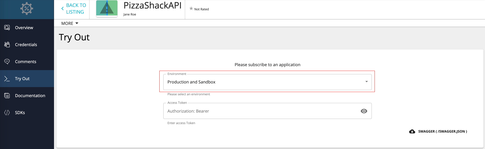
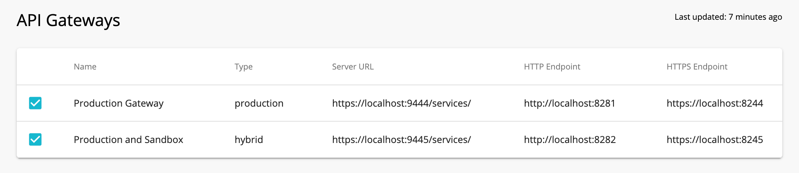
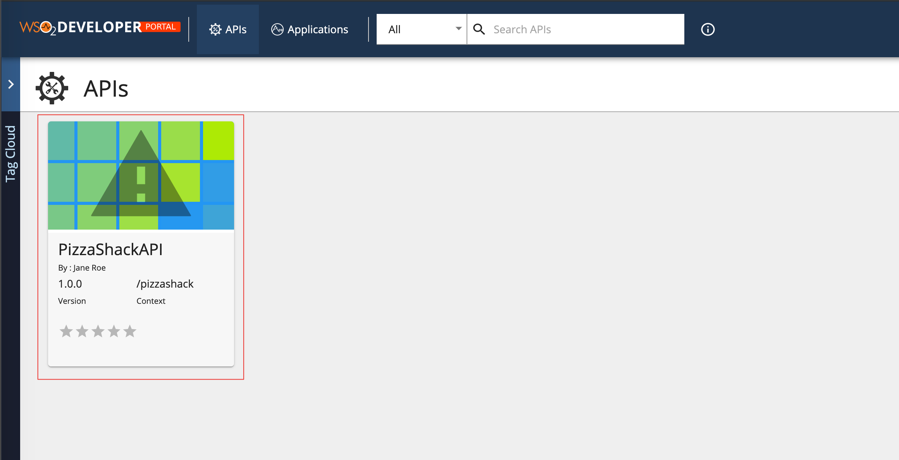
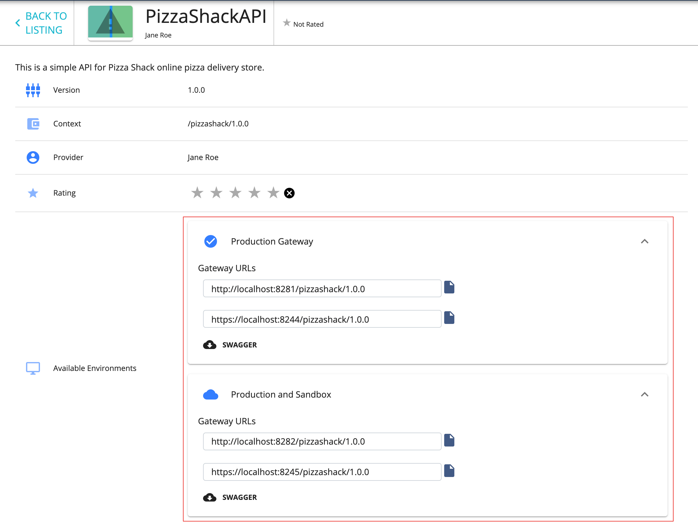
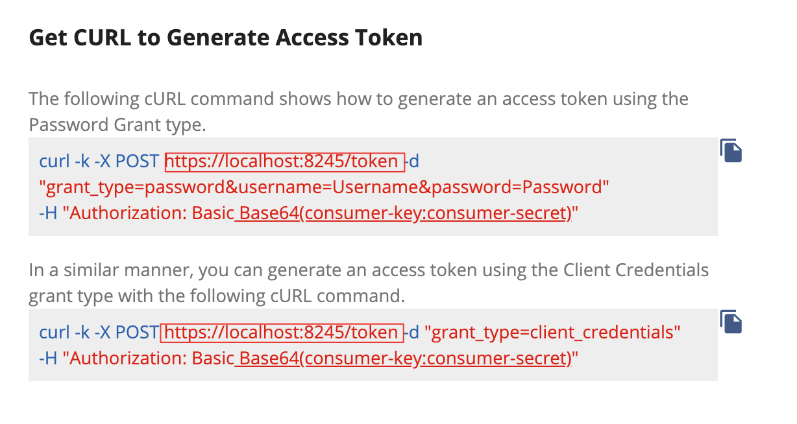

# Publish Through Multiple API Gateways

If you need to distribute the Gateway load that comes in, you can configure multiple API Gateway environments in WSO2 API Manager to publish to a single Developer Portal. This helps you to distribute the API Gateway load to multiple nodes and also gives you some logical separation (e.g., production vs. sandbox) between the APIs in the Developer Portal. When you publish an API through multiple Gateway environments, the APIs in the API Developer Portal will have different server hosts and ports.

## Step 1 - Publish an API via Multiple API Gateways

Follow the instructions below to configure and publish to multiple Gateways. 

In this guide, let's set up three (3) WSO2 API Manager (WSO2 API-M) instances on the same server. 

-   **Instance 1** : Acts as the node that provides the Publisher, Developer Portal, and the Key Manager functionality.
-   **Instance 2** : Acts as a production Gateway node.
-   **Instance 3** : Acts as a sandbox Gateway node.

!!! note

    In a typical production environment, the Gateways will ideally be in separate servers.

1. Copy the WSO2 API Manager (WSO2 API-M) product pack into three (3) separate folders.

     Let's add offsets to the default ports of the two Gateway instances. A port offset ensures that there are no port conflicts when more than one WSO2 product runs on the same server.

2.  Open the `<API-M_HOME>/repository/conf/deployment.toml` file in the **second** API Manager instance, and add an offset of 1 to its default port. 
     This increments its default server port, which is 9443, by 1.

    ``` toml
    [server]
    offset=1
    ```

3.  Open the `<API-M_HOME>/repository/conf/deployment.toml` file in the **third** API Manager instance and add an offset of 2 to its default port. 

     This increments its default server port, which is 9443, by 2.

    ``` toml
    [server]
    offset=2
    ```

4.  Open the `<API-M_HOME>/repository/conf/deployment.toml` files in the **second and the third** Gateway instances and change the following.

     This is done for the two Gateway instances to be able to communicate with the Key Manager that is in the first API Manager instance.

    ``` toml
    [apim.key_manager]
    service_url = "https://localhost:9443/services/"
    username = "admin"
    password = "admin"

    [apim.throttling] 
    service_url = "https://localhost:9443/services/"
    throttle_decision_endpoints = ["tcp://localhost:5672"]
    ```

    You are done configuring the two API Gateway instances.

5.  Open the `<API-M_HOME>/repository/conf/deployment.toml` file in the **first** API Manager instance, add two API Gateway environments by adding two `[[apim.gateway.environment]]` sections and comment out the `[[apim.gateway.environment]]` section that comes by default.
     
     This is done to point to the two API Gateway instances from the first instance.

    !!! note

        -   There can be different types of environments, and the allowed values are `hybrid`,`production`, and `sandbox`.

        -   An API deployed on a `production` type Gateway will only support production keys.
        -   An API deployed on a `sandbox` type Gateway will only support sandbox keys.
        -   An API deployed on a `hybrid` type Gateway will support both production and sandbox keys.
        -   The `api-console` element specifies whether the environment should be listed in API Console or not.
        -   The Gateway environment names must be unique.


    **Example**

    ```toml
    [[apim.gateway.environment]]
    name = "Production Gateway"
    type = "production"
    display_in_api_console = true
    description = "Production Gateway Environment"
    show_as_token_endpoint_url = true
    service_url = "https://localhost:9444/services/"
    username= "admin"
    password= "admin"
    http_endpoint = "http://localhost:8281"
    https_endpoint = "https://localhost:8244"

    [[apim.gateway.environment]]
    name = "Production and Sandbox"
    type = "hybrid"
    display_in_api_console = true
    description = "Hybrid Gateway Environment"
    show_as_token_endpoint_url = true
    service_url = "https://localhost:9445/services/"
    username= "admin"
    password= "admin"
    http_endpoint = "http://localhost:8282"
    https_endpoint = "https://localhost:8245"

    ```

    !!! tip
            If you have multiple Gateways that support one type of key (e.g., when there are two Gateways that support the production keys, as seen in the above code snippet.), the environments you add via the `<API-M_HOME>/repository/conf/deployment.toml` file will be visible in a drop-down list of the API **Try Out** tab, which is in the Developer Portal of instance 1. This allows subscribers to send API requests to any selected Gateway.

    [](../../../assets/img/learn/api-tryout-tab.png)

    !!! note
        To stop a given Gateway environment from being displayed in the API Try Out tab, you can set the `display_in_api_console` attribute to `false` in the `apim.gateway.environment` element, which is in the `deployment.toml` file.

        **Example**

        ``` toml
        [[apim.gateway.environment]]
        display_in_api_console = false
        ```

6.  Start all the WSO2 API-M instances.

     Make sure to start instance 1 first before starting the other two instances.

7.  Sign in to the API Publisher in the **first** WSO2 API-M instance and click to edit an API.

     
     <a name="step8"> </a>
     
8.  Click **Manage**, and expand the **API Gateways** section.

     Note that the two Gateway environments are listed there.

     [](../../../assets/img/learn/api-gateways.png)

9.  Select both Gateways and click **Save and Publish** in order to be able to publish to both the Gateways that correspond to the API.

10. Sign in to the Developer Portal (of the **first** instance) and click on the respective API to open it.
    [](../../../assets/img/learn/dev-portal-apis.png)

     In the **Overview** tab that corresponds to the API, note that it has two sets of URLs for the two Gateway instances:

     [](../../../assets/img/learn/api-overview-tab.png)

You have successfully published an API to the API Developer Portals through multiple Gateway environments.

## Step 2 - Generated the keys for the applications

Use the following sample cURL command to generate an access token for the Gateway URL of the initially published Gateway Environments, which was listed in API Publisher in [step 8](#step8), using the Password Grant type. 

[](../../../assets/img/learn/generate-access-tokens.png)

Change the Gateway URL based on the Gateway that you need to publish the API.

!!! note
    If you wish to use the API-M pack that you used as the first instance to try-out other tutorials, please ensure to delete the API Gateway configurations that you added in step 5, and uncomment the default `[[apim.gateway.environment]]` configurations in the `<API-M_HOME>/repository/conf/deployment.toml` file.


