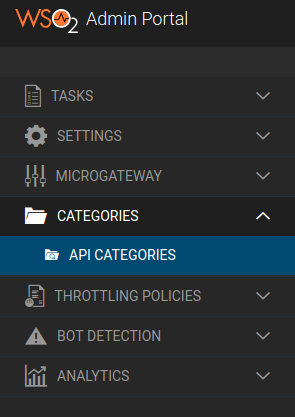
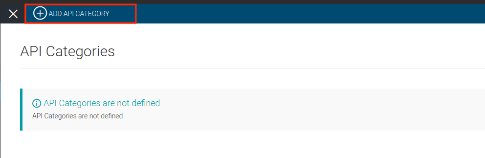
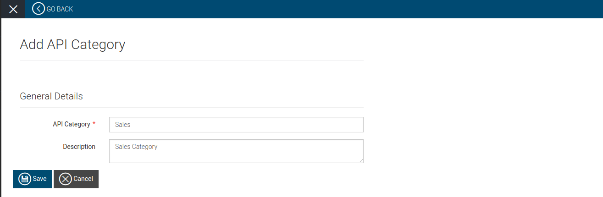
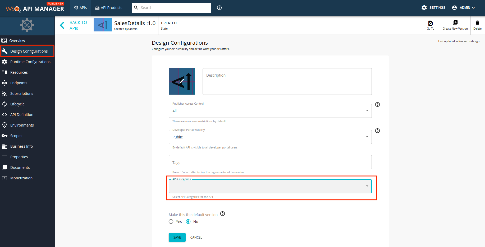
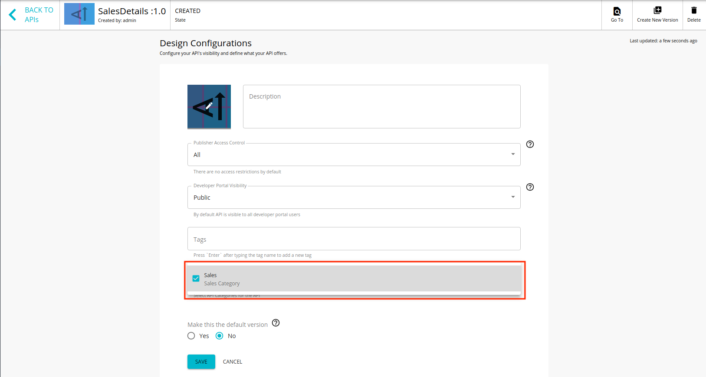
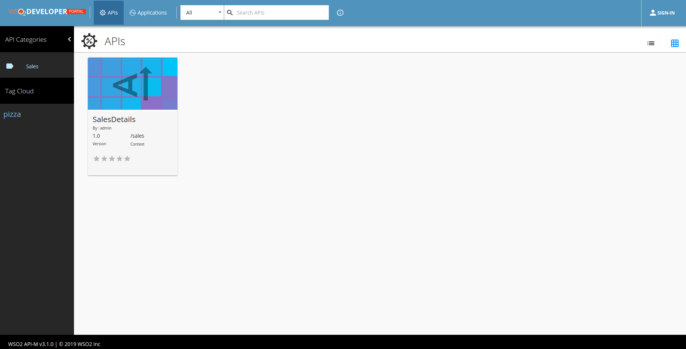

# API Category based Grouping

You can use API categories to group APIs. In previous versions of WSO2 API Manager, the process of grouping APIs was carried out by using tag wise groups. Unlike tag wise grouping API categories do not use a naming convention. Therefore, the admin does not need to take into consideration any naming conventions when using API category based grouping.

!!! note

    The [tag wise grouping feature](tagwise-based-grouping.md) has been deprecated with the introduction of the API categories feature in WSO2 API Manager 3.1.0. Therfore, WSO2 recommends all users to use API categories instead of tag wise grouping.

Initially, the Admins will define API categories. Thereafter, API providers will add API categories to APIs when designing them via the API Publisher. API categories allow API providers to categorize APIs that have similar attributes. When a categorized API gets published to the Developer Portal, its categories appear as clickable links to the API consumers. The API consumers can use the available API categories to quickly jump to a category of interest.

## Step 1 - Add an API Category

You can add an API category using any of the following methods:

- [Add an API Category using the Admin Portal UI](#add-an-api-category-using-the-admin-portal-ui)
- [Add an API Category using the Admin REST API](#add-an-api-category-using-the-admin-rest-api)

### Add an API Category using the Admin Portal UI

1. Sign in to the Admin Portal.
   
    [https://localhost:9443/admin](https://localhost:9443/admin) 

2. Click **API Category** and then click **API Categories**.
    
    [](../../../../../assets/img/learn/api_category_left_tag.png)

2. Click **Add New Category**.

    [](../../../../../assets/img/learn/click_add_category.png)

3. Enter a name and a description for the category.

    [](../../../../../assets/img/learn/add_category.png)

4. Click **Save**.

### Add an API Category using the Admin REST API

```
curl -k -X POST -H "Authorization: Bearer <ACCESS_TOKEN>" -H "Content-Type: application/json" https://localhost:9443/api/am/admin/v0.16/api-categories -d @category-data.json
```

NOTE : ACCESS_TOKEN should have admin_operations scope

**Sample payload**

```
{
"name": "Sales",
"description": "Sales category"
}
```

## Step 2 - Attach the API Category to an API

1. Sign in to the Publisher.

    [https://localhost:9443/publisher](https://localhost:9443/publisher) 

2. Click on an API.

3. Click **Design Configurations**. 

     [](../../../../../assets/img/learn/api_categories_dropdown.png)

4. Select the API category.

     [](../../../../../assets/img/learn/attach_category.png)

5. Click **Save**.

## Step 3 - List APIs in Developer Portal

1. Sign in to the Developer Portal.

     [https://localhost:9443/devportal](https://localhost:9443/devportal) 

2. Expand the **Tag Cloud** menu. 

3. Click on the specific API category under **API Categories**. 

     All APIs that belong to the selected category appear.

     [](../../../../../assets/img/learn/devportal_listing.png)