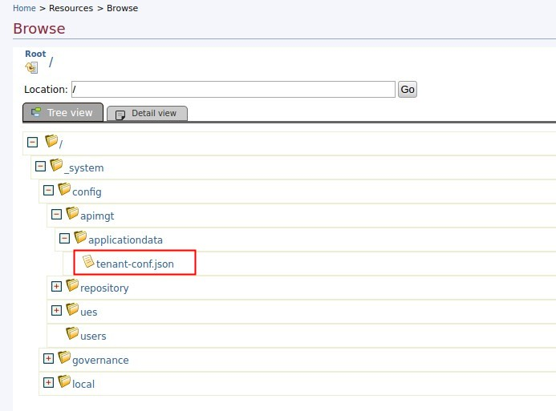

# Configuring the REST API

This section explains how to configure the API Manager REST APIs:

Changing Default Roles
Certain resources of the REST API are protected using OAuth 2.0 scopes. Each tenant has a `tenant-conf.json` configuration file with a section for RESTAPIScopes that contains a mapping between all the scopes that are available with API Manager REST APIs, and a set of roles. The `tenant-conf.json` file for each tenant can be accessed by logging into the Management Console and browsing the registry, as shown below.



When a user requires access to a resource protected by an OAuth 2.0 scope, an access token needs to be provided. The access token must be associated with that particular scope as the Bearer token in the Authorization header. In order to retrieve it, the user needs to invoke the Token API and request for that scope. For more information, see the Getting Started section. When providing such an access token, the Token API validates the eligibility of the user for that particular scope using the RESTAPIScopes configuration. An access token with the particular scope is issued for the user only if that user has been assigned one or more of the roles specified in the RESTAPIScopes configuration for that scope.

You can modify the default roles defined in RESTAPIScopes configuration according to your requirements. However, make sure you do not modify any of the scope names.

**Sample REST API Scopes configuration**

```
{
   "RESTAPIScopes":{
      "Scope":[
         {
            "Name":"apim:api_publish",
            "Roles":"admin"
         },
         {
            "Name":"apim:api_create",
            "Roles":"admin"
         },
         {
            "Name":"apim:api_view",
            "Roles":"admin"
         },
         {
            "Name":"apim:subscribe",
            "Roles":"Internal/subscriber"
         },
         {
            "Name":"apim:tier_view",
            "Roles":"admin"
         },
         {
            "Name":"apim:tier_manage",
            "Roles":"admin"
         },
         {
            "Name":"apim:subscription_view",
            "Roles":"admin"
         },
         {
            "Name":"apim:subscription_block",
            "Roles":"admin"
         }
      ]
   }
}
```

!!! note
    Restart the server for the RESTAPIScopes configuration changes to take effect.

You can specify multiple roles for a scope by separating the roles using commas, as shown in the example below.

```
{
   "Name":"apim:tier_view",
   "Roles":"admin,portal-admin"
}
```