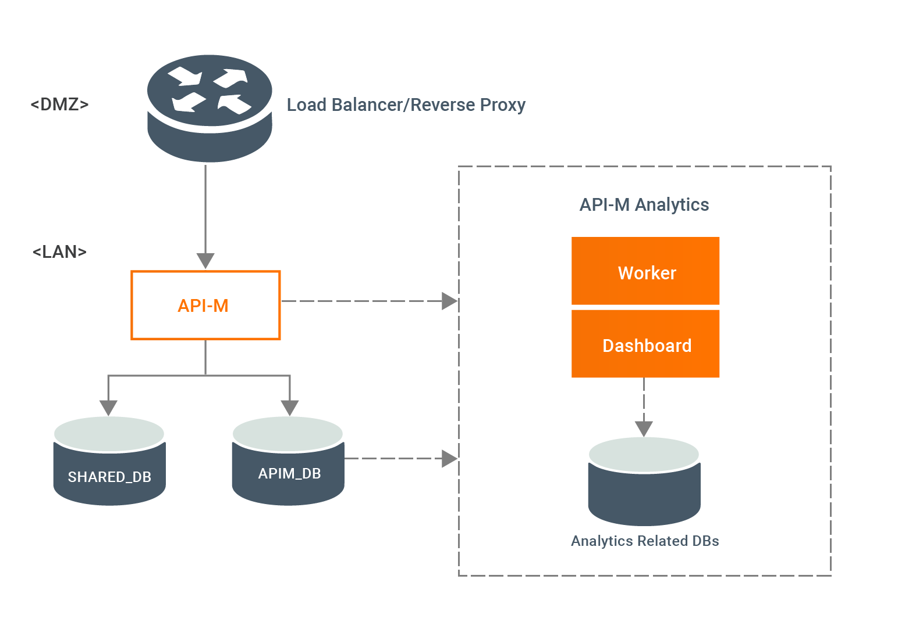
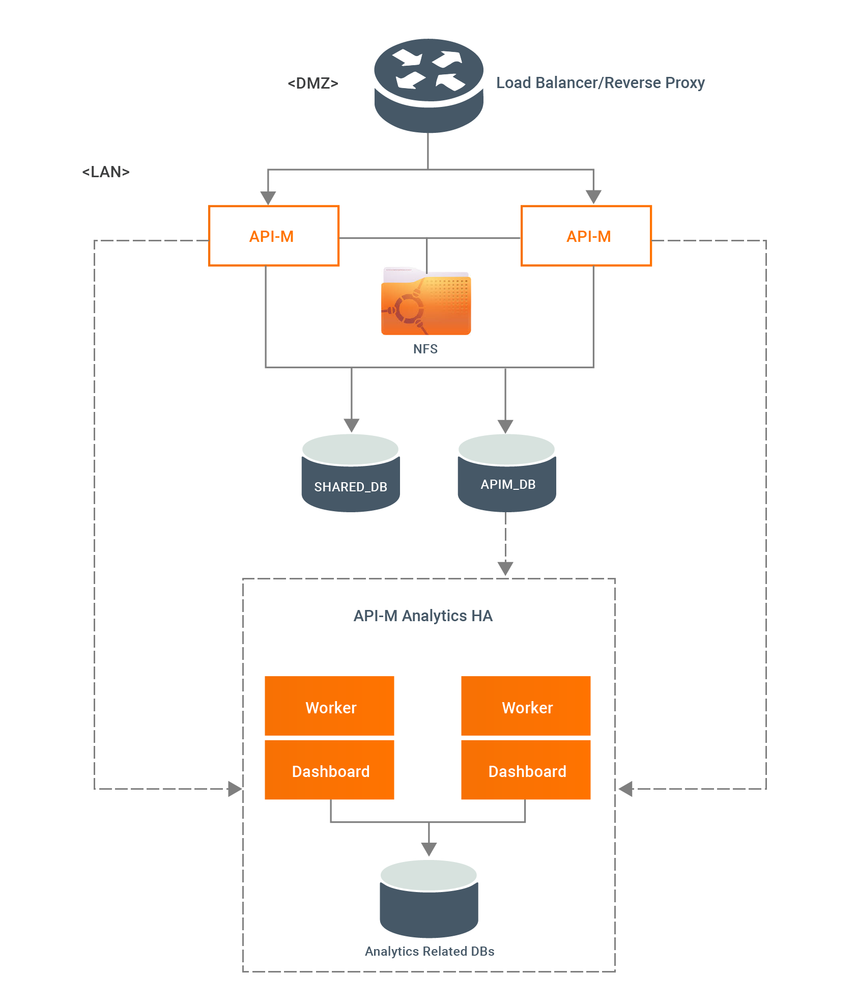

# All-in-One Deployment Overview

In a typical production deployment, API Manager is deployed as components (Publisher, Developer Portal, Gateway, 
Key Manager, and Traffic Manager). While this provides very high performance and a high-level of scalability, it may be too 
complex if you want to run API Manager as a small to medium scale API Management solution. A WSO2 API-M single node 
deployment, which has all the API-M components in one instance, would be simple to set up and requires less resources
 when compared with a distributed deployment. It is ideal for any organization that wants to start small and 
 iteratively build up a robust API Management Platform.

-   [Single Node Deployment](#single-node-deployment)
-   [Active - Active Deployment](#active-active-deployment)

## Single Node Deployment

In this setup, API traffic is served by one all-in-one instance of WSO2 API Manager.

| Pros                                                                                                               | Cons                                                                                             |
|--------------------------------------------------------------------------------------------------------------------|--------------------------------------------------------------------------------------------------|
|    Production support is required only for a single API Manager node (you receive 24\*7 WSO2 production support). 
    Deployment is up and running within hours.                                                                      
    Can handle up to 43 million API calls a day (up to 500 API calls a second)                                      
    Minimum hardware/cloud infrastructure requirements (only one node).                                             
    Suitable for anyone new to API Management.                                                                      |    Deployment does not provide High Availability.                                               
     Not network friendly. Deploying on a demilitarized zone (DMZ) would require a Reverse Proxy.  |

!!! info
    For more information on manually configuring a single node API-M production server, see [Configuring a Single Node](configuring-a-single-node.md).

## Active - Active Deployment

In this setup, API traffic is served by two single node (all-in-one) instances of WSO2 API Manager.

| Pros                                                                                                    | Cons                                                                        |
|---------------------------------------------------------------------------------------------------------|-----------------------------------------------------------------------------|
|    The system is highly available.                                                                     
    Production support is required for 2 API Manager nodes (you receive 24\*7 WSO2 production support).  
    Can handle up to 86 million API calls a day ( up to 1000 API calls a second)                         
    Deployment is up and running within hours.                                                           |    Not network friendly. Deploying on a DMZ would require a Reverse Proxy. |

!!! info
    For more information on manually configuring active-active API-M production servers, see [Configuring an Active-Active Deployment](configuring-an-active-active-deployment.md).