In the following document we will explain how to connect OKTA as a third party Identity provier to WSO2 API-Manager. Before we start first make sure you have all the pre-requisites mentioned below.

### Pre-requisites

1. Create an account in [https://developer.okta.com/](https://developer.okta.com/)
2. [Download WSO2 API Manager 3.1.0 distribution from](https://wso2.com/api-management/previous-releases/)
3. Unzip the distribution and open the `deployment.toml` file located in `<APIM_HOME>/repository/conf/` and add the following configuration
    ```
    [tenant_mgt]
    enable_email_domain= true
    ```
    This is needed since OKTA uses the email as the username by default,  therefore to  use the email as the username in WSO2 API-Manager we have to enable it since it not enabled by default. Once enabled both email as username and normal usernames can be used.
4. Start the Server.

### Setup OKTA

1. Go to the OKTA admin portal and navigate to Applications -> Add Application
[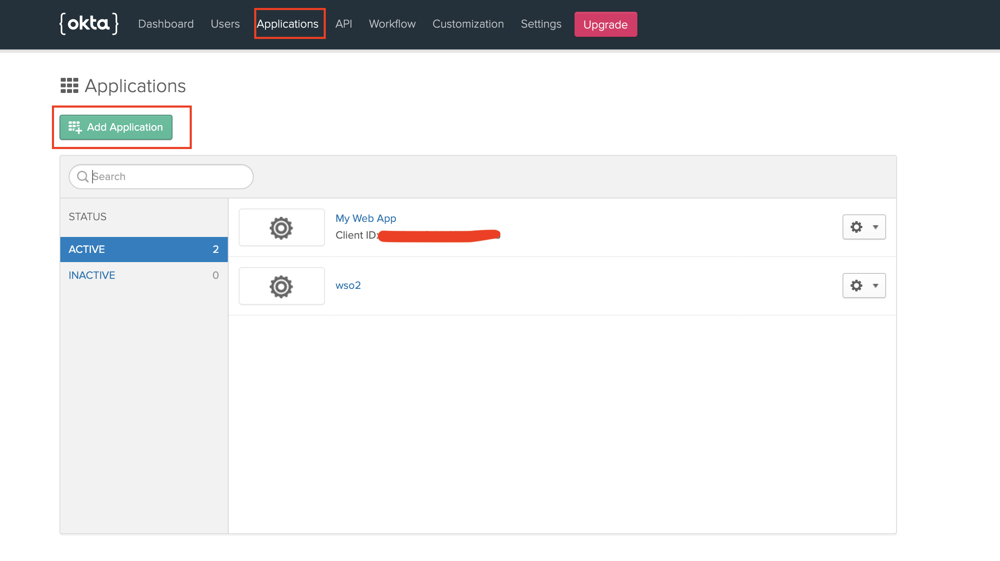](../../../assets/img/learn/okta-add-new-application.png)

2. Select type web and use the following details

    [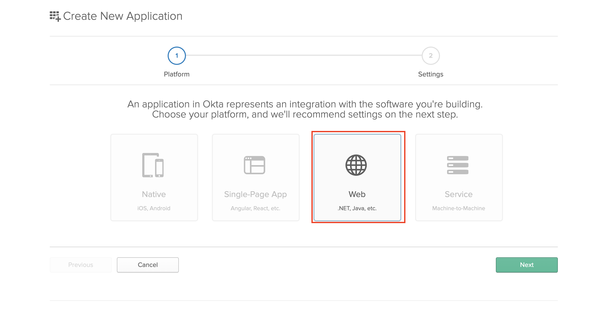](../../../assets/img/learn/okta-add-new-application-web.png)

    [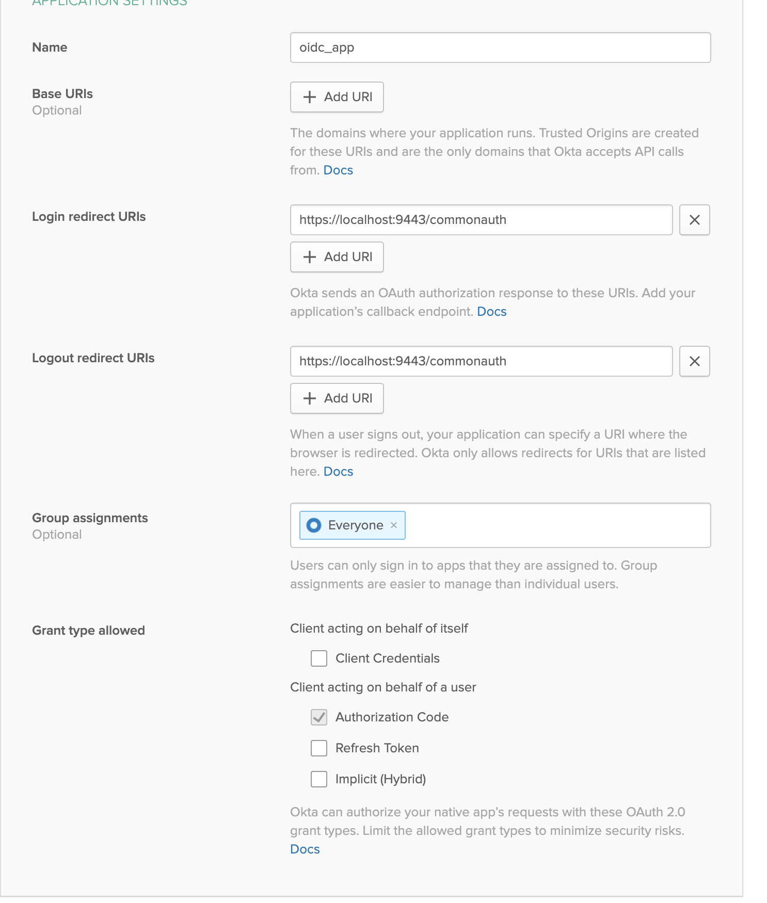](../../../assets/img/learn/okta-add-new-application-details.png)
3. Next we need to add a new attribute to the default user profile of OKTA to epresent the user role. Navigate to Users -> Profile Editor and click on the pencil icon to edit the default profile

    [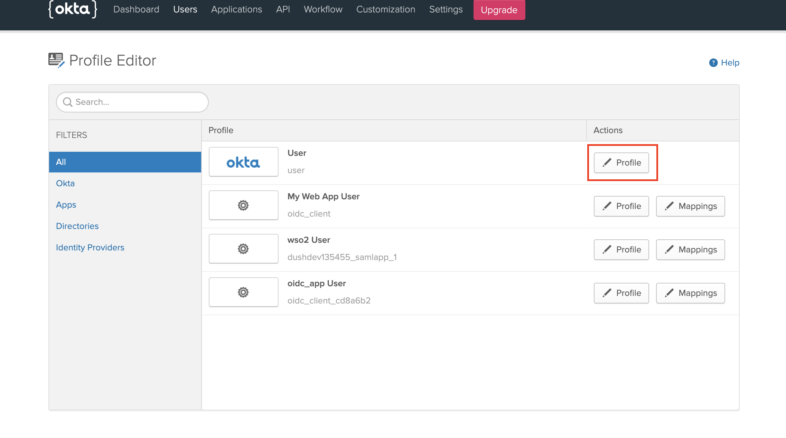](../../../assets/img/learn/okta-add-new-attribute.png)

    [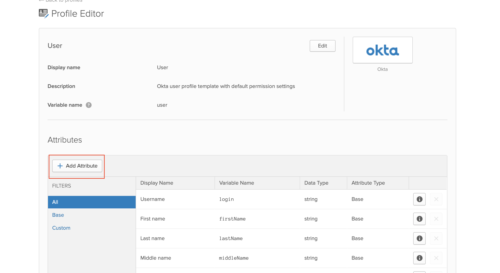](../../../assets/img/learn/okta-add-new-attribute-add.png) 

4. Enter the following details and click save

    [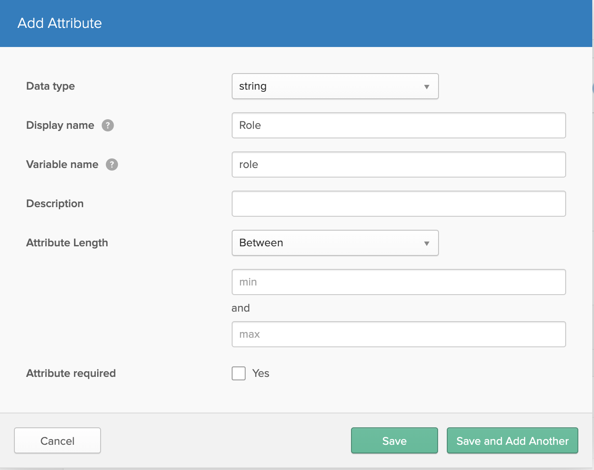](../../../assets/img/learn/okta-add-new-attribute-details.png) 

5. Next we need to add the claims that needs to be returned from the ID Token in okta. These are the claims we will be used to map the user details to WSO2 API-Manager side. Navigate to API -> Authorization Servers and select the default server

    [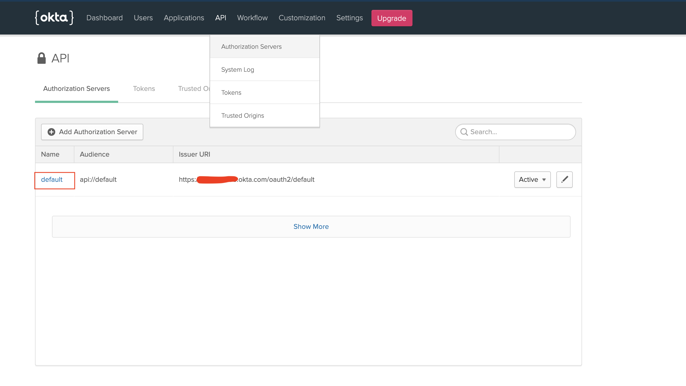](../../../assets/img/learn/okta-add-new-claims.png) 

6. Add the following two claims

    [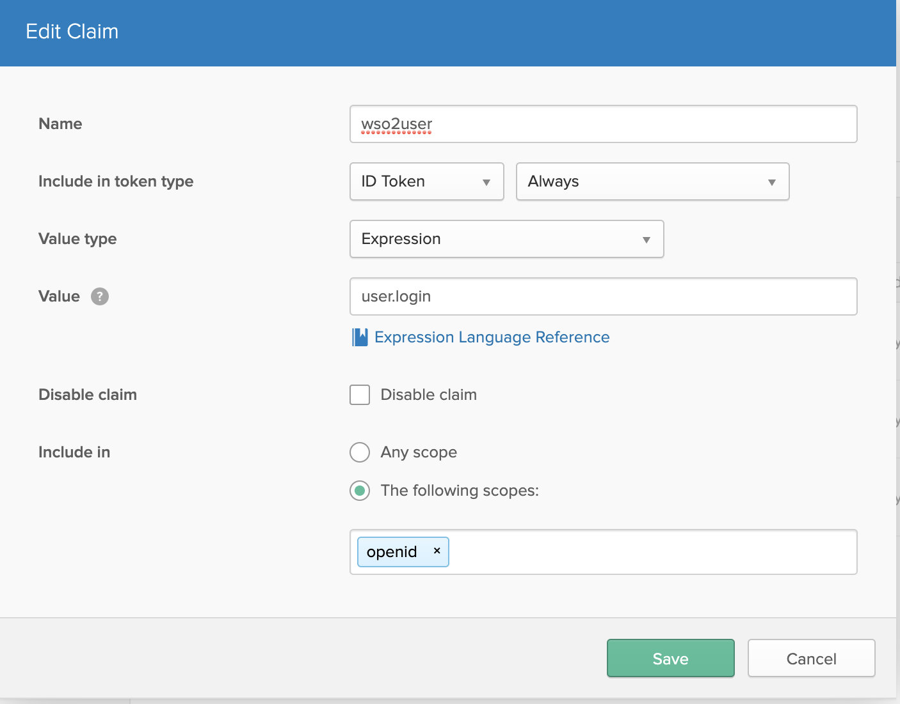](../../../assets/img/learn/okta-add-new-claims-user.png) 

    [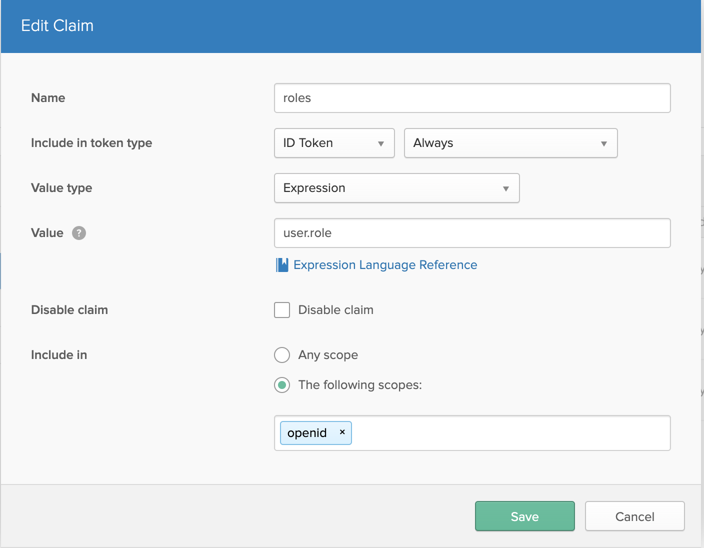](../../../assets/img/learn/okta-add-new-claims-role.png) 

7. Go to Users -> People and click on your profile name. And navigate to the profile edit page as shown below

    
    <br/>
    <br/>
    
    <br/>
    <br/>

    add the following role value. This will be used in the API-Manager to map an internal role to user that will be provisioned.
    


### Setup API-Manager

1. Login in to `https://localhost:9443/carbon`.

2. First we need to create a role that needs to be assinged to users that will be provisioned from okta. click on add in Users and Roles section and add a new role.
    

    

    Assign the following permissions to the role and save

    
    <br/>
    <br/>
    
    <br/>
    <br/>
    

3. Login to `https://localhost:9443/admin` expand settings & click on scope mapping

    

    Update the following scopes with the okta_role

    [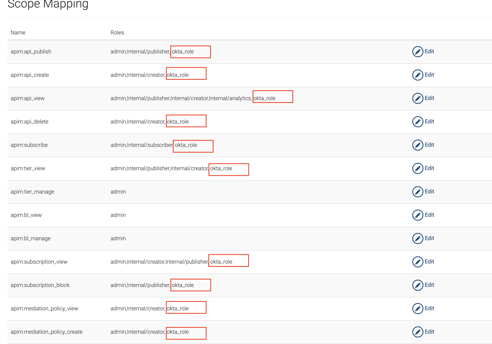](../../../assets/img/learn/okta-apim-role-scope-mapping-edit1.png) 
    <br/>
    <br/>
    [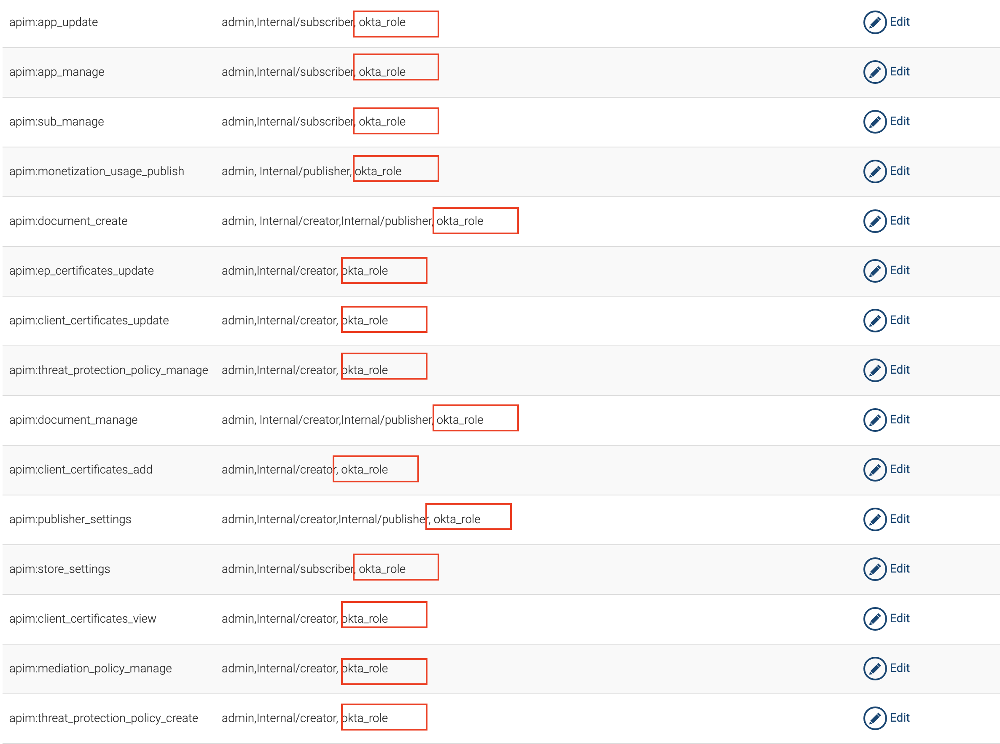](../../../assets/img/learn/okta-apim-role-scope-mapping-edit2.png) 
    <br/>
    <br/>
    [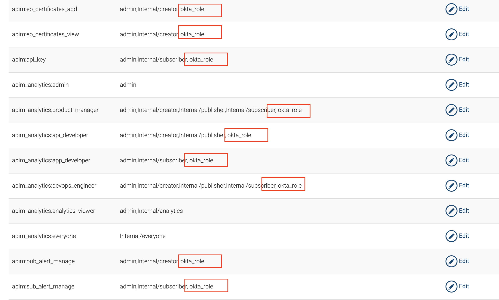](../../../assets/img/learn/okta-apim-role-scope-mapping-edit3.png) 

    This will allow the user a user having the okta_role to login to Publisher and Developer Portal

4. Login in to `https://localhost:9443/carbon` & Click on add in identity providers section. Enter Identity Provider Name.  

    [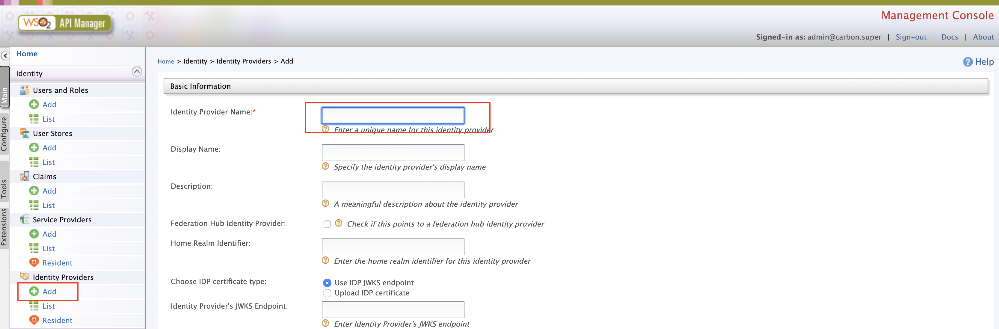](../../../assets/img/learn/okta-saml-add-idp.png) 
    <br/>
    <br/>

    Expand Federated authenticators -> OAuth2/OpenID connect configuration add the following details.
    [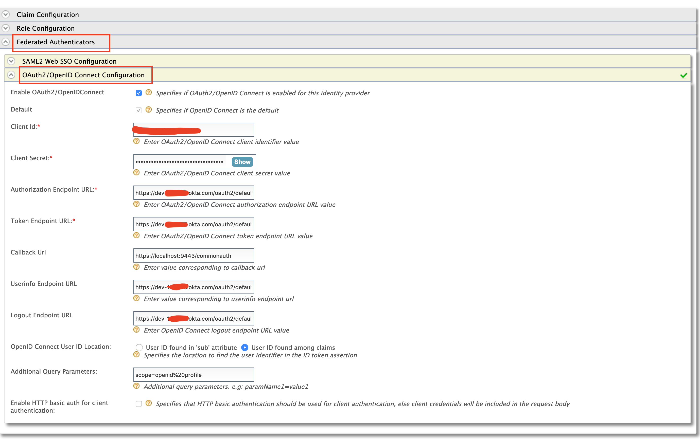](../../../assets/img/learn/okta-apim-idp-odic-details.png) 
<table>
    <colgroup>
        <col />
        <col />
        <col />
    </colgroup>
    <tbody>
        <tr>
            <th colspan="2">Field</th>
            <th>Sample value</th>
        </tr>
        <tr>
            <td colspan="2" class="confluenceTd">Enable OAuth2/OpenIDConnect</td>
            <td class="confluenceTd">True</td>
        </tr>
        <tr>
            <td colspan="2" class="confluenceTd">Client id</td>
            <td class="confluenceTd">Can be found in the okta application you created</td>
        </tr>
        <tr>
            <td colspan="2" class="confluenceTd">Client secret</td>
            <td class="confluenceTd">Can be found in the okta application you created</td>
        </tr>
        <tr>
            <td colspan="2" class="confluenceTd">Authorization Endpoint URL</td>
            <td class="confluenceTd">https://your_okta_url/oauth2/default/v1/authorize</td>
        </tr>
        <tr>
            <td colspan="2" class="confluenceTd">Token Endpoint URL</td>
            <td colspan="1" class="confluenceTd">https://your_okta_url/oauth2/default/v1/token</td>
        </tr>
        <tr>
            <td colspan="2" class="confluenceTd">callback url</td>
            <td class="confluenceTd">
                https://localhost:9443/commonauth
            </td>
        </tr>
        <tr>
            <td colspan="2" class="confluenceTd">Userinfo Endpoint URL</td>
            <td colspan="1" class="confluenceTd">
                https://your_okta_url/oauth2/default/v1/userinfo
            </td>
        </tr>
        <tr>
            <td colspan="2" class="confluenceTd">Logout Endpoint URL</td>
            <td colspan="1" class="confluenceTd">
                https://your_okta_url/oauth2/default/v1/logout
            </td>
        </tr>
        <tr>
            <td colspan="2" class="confluenceTd">Additional Query Parameters</td>
            <td colspan="1" class="confluenceTd">
                scope=openid%20profile
            </td>
        </tr>
    </tbody>
</table>

5. Expand Claim configuration -> Basic claim configuration and add the following claim configurations
    [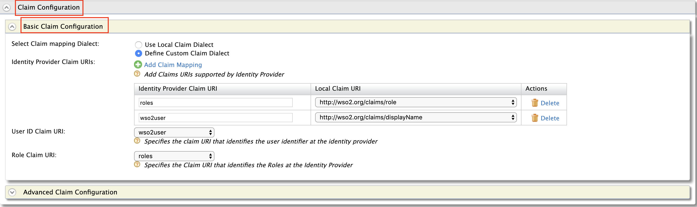](../../../assets/img/learn/okta-apim-idp-claims-details.png) 

6. Expand Role configuration and add the following role. Here we check if the user that is being logged in has the role `any` and assign him the local role okta_role

    

7. Enable Just in time provisioning so that the user will be saved in the API-Manager user store

    

8. Navigate to Service providers -> list as shown below. There are two service providers created apim_publisher, apim_devportal. Click on edit on apim_publisher.

    !!!warning
        You will have to logged into the Developer Portal and Publisher at least once for the two service providers to appear as it is created during first login.

    

    Expand local and outbound authentication configuration and under federated authentication select the name of the identity provider you created.

    
    
    Repeat the same for apim_devportal service provider.

Now you are able to login to the Publisher & Developer Portal using OKTA.