In the following document we will explain how to connect OKTA as a third party Identity provier to WSO2 API-Manager. Before we start first make sure you have all the pre-requisites mentioned below.

### Pre-requisites

1. Create an account in [https://developer.okta.com/](https://developer.okta.com/)
2. [Download WSO2 API Manager 3.1.0 distribution from](https://wso2.com/api-management/previous-releases/)
3. Unzip the distribution and open the `deployment.toml` file located in `<APIM_HOME>/repository/conf/` and add the following configuration
    ```
    [tenant_mgt]
    enable_email_domain= true
    ```
    This is needed since OKTA uses the email as the username by default,  therefore to  use the email as the username in WSO2 API-Manager we have to enable it since it not enabled by default.
4. Start the Server.

### Setup OKTA

1. Login to the okta developer console and switch to the classic UI. 
    [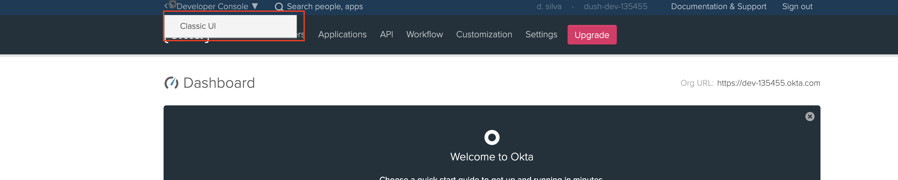](../../../assets/img/learn/okta-classic-ui.png)

2. Go to Applications -> add application -> create new application and follow the details below
    [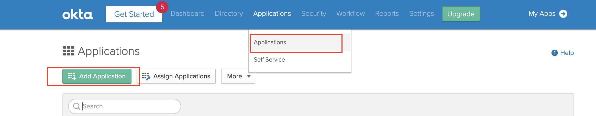](../../../assets/img/learn/okta-saml-add-app.png)
    <br/>
    <br/>
    <br/>
    [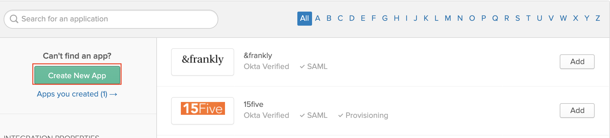](../../../assets/img/learn/okta-saml-create-new-app.png)
    <br/>
    <br/>
    <br/>
    Select web type and saml 2.0
    [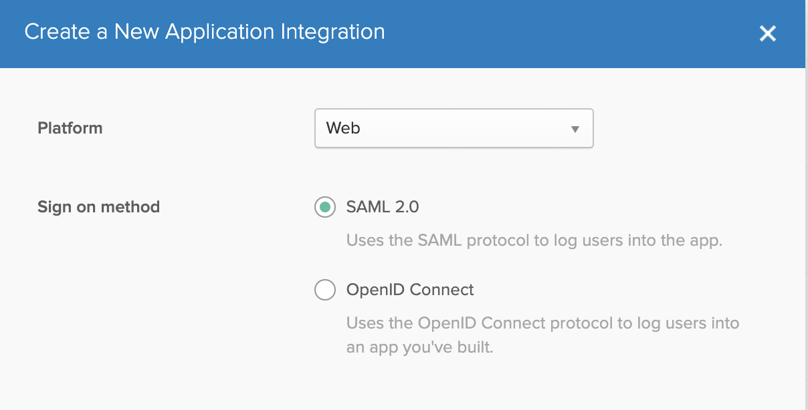](../../../assets/img/learn/okta-saml-create-saml-app.png)

    Enter the following details
    [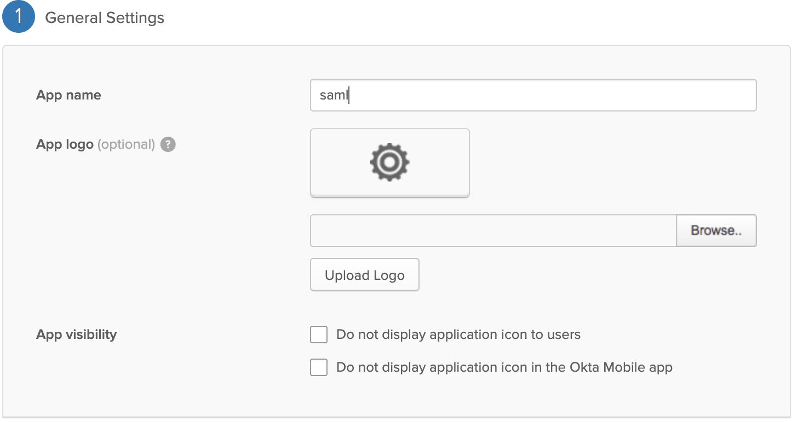](../../../assets/img/learn/okta-saml-create-saml-app-name.png)
    <br/>
    <br/>
    <br/>
    [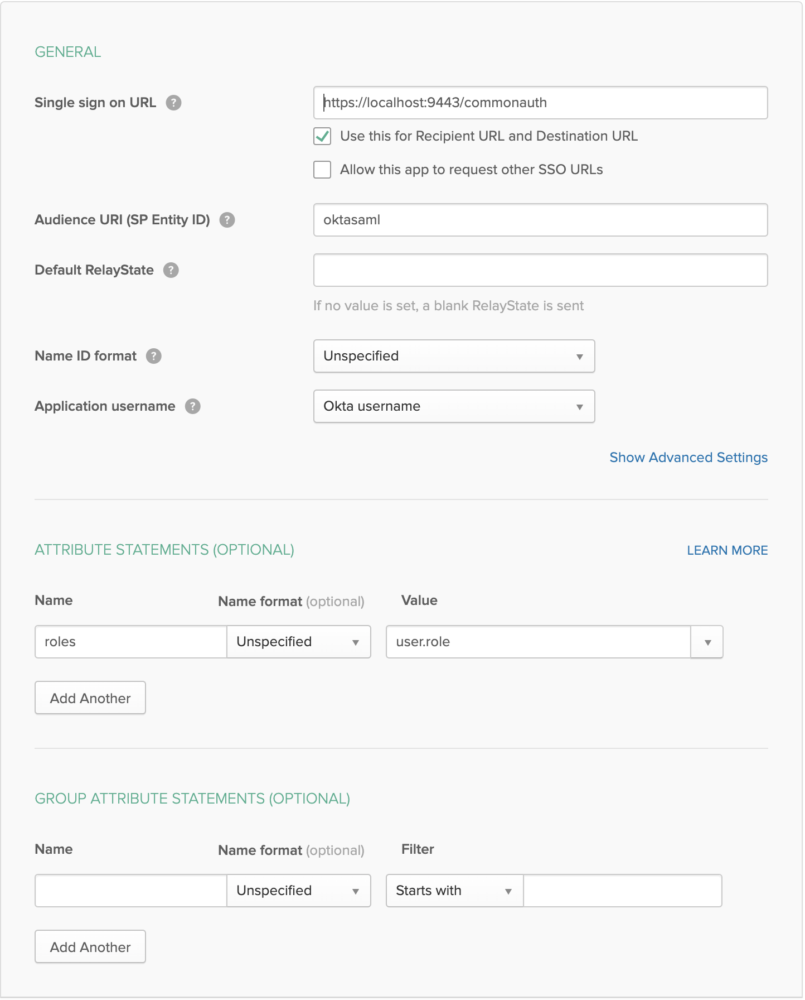](../../../assets/img/learn/okta-saml-create-saml-app-details.png)

    !!!warning
        **Audience URI** should be same as the identity provider entity id name that is created in WSO2 API-Manager

3. Inside the saml app you created go to sign on -> view setup instructions which will redirect you to a another page which contains okta saml related configurations. 

    [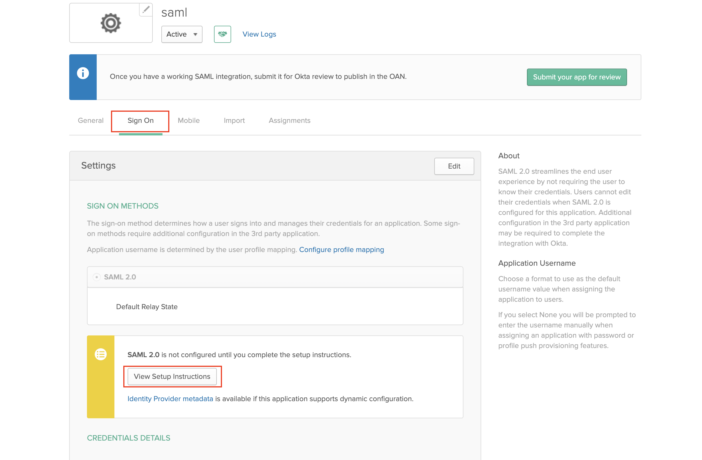](../../../assets/img/learn/okta-saml-create-new-app-config1.png)

    Scroll to the bottom of the page which has **Provide the following IDP metadata to your SP provider.**. Copy and save the details given to a xml file.

    [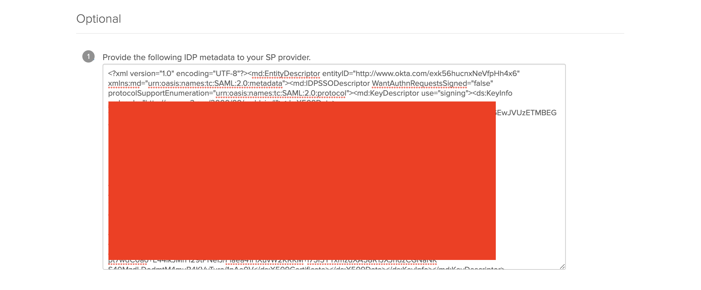](../../../assets/img/learn/okta-saml-create-new-app-config2.png)

    Go to assignments -> assign -> assign to people and assign your current user

    [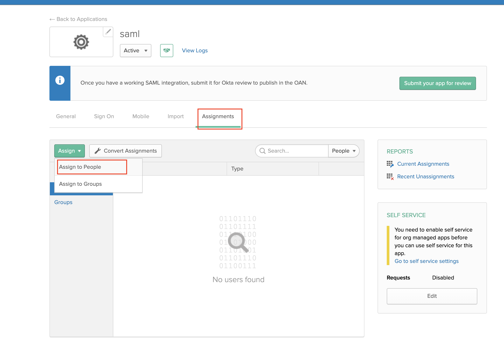](../../../assets/img/learn/okta-saml-create-new-app-assign.png)
    
4. Switch back to the developer console same as step 1

5. Next we need to add a new attribute to the default user profile of OKTA to epresent the user role. Navigate to Users -> Profile Editor and click on the pencil icon to edit the default profile

    [](../../../assets/img/learn/okta-add-new-attribute.png)

    [](../../../assets/img/learn/okta-add-new-attribute-add.png) 

6. Enter the following details and click save

    [](../../../assets/img/learn/okta-add-new-attribute-details.png) 

7. Go to Users -> People and click on your profile name. And navigate to the profile edit page as shown below

    
    <br/>
    <br/>
    
    <br/>
    <br/>

    add the following role value. This will be used in the API-Manager to map an internal role to user that will be provisioned.
    

### Setup API-Manager
1. Login in to `https://localhost:9443/carbon`.

2. First we need to create a role that needs to be assinged to users that will be provisioned from okta. click on add in Users and Roles section and add a new role.
    

    

    Assign the following permissions to the role and save

    
    <br/>
    <br/>
    
    <br/>
    <br/>
    

3. Login to `https://localhost:9443/admin` expand settings & click on scope mapping

    

    Update the following scopes with the okta_role

    [](../../../assets/img/learn/okta-apim-role-scope-mapping-edit1.png) 
    <br/>
    <br/>
    [](../../../assets/img/learn/okta-apim-role-scope-mapping-edit2.png) 
    <br/>
    <br/>
    [](../../../assets/img/learn/okta-apim-role-scope-mapping-edit3.png) 

    This will allow the user a user having the okta_role to login to Publisher and Developer Portal

4. Login in to `https://localhost:9443/carbon` & Click on add in identity providers section. Enter Identity Provider Name. 

    [](../../../assets/img/learn/okta-saml-add-idp.png) 
    <br/>
    <br/>
    
    Expand the federated authenticators -> SAML2 Web SSO Configuration section and under Select Mode select Metadata File Configuration and update the xml file that was saved during the okta setup process.
    [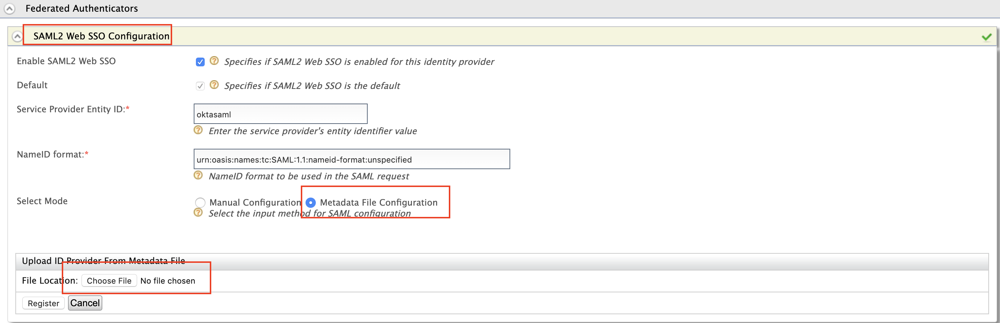](../../../assets/img/learn/okta-saml-apim-idp.png) 

    <table>
        <colgroup>
            <col />
            <col />
            <col />
        </colgroup>
        <tbody>
            <tr>
                <th colspan="2">Field</th>
                <th>Sample value</th>
            </tr>
            <tr>
                <td colspan="2" class="confluenceTd">specifies if SAML2 Web SSO is enabled for this identity provider</td>
                <td class="confluenceTd">True</td>
            </tr>
            <tr>
                <td colspan="2" class="confluenceTd">Service Provider Entity ID</td>
                <td class="confluenceTd">Entity id specified when creating saml app (eg: oktasaml)</td>
            </tr>
        </tbody>
    </table>

5. Expand Claim configuration -> Basic claim configuration and add the following claim configurations

    [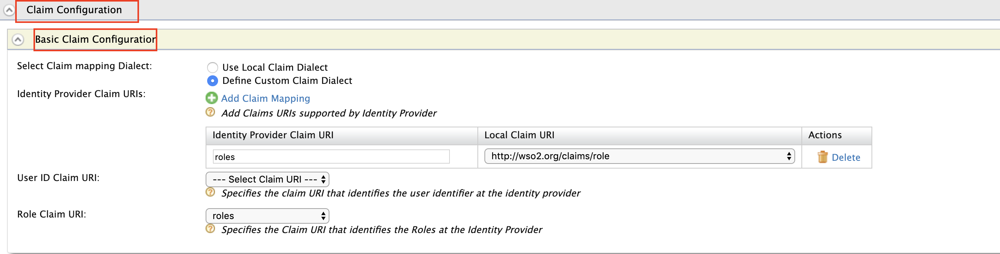](../../../assets/img/learn/okta-saml-apim-idp-claim.png) 

6. Expand Role configuration and add the following role. Here we check if the user that is being logged in has the role `any` and assign him the local role okta_role

    

7. Enable Just in time provisioning so that the user will be saved in the API-Manager user store

    

8. Navigate to Service providers -> list as shown below. There are two service providers created apim_publisher, apim_devportal. Click on edit on apim_publisher.

    !!!warning
        You will have to logged into the Developer Portal and Publisher at least once for the two service providers to appear as it is created during first login.

    

    Expand local and outbound authentication configuration and under federated authentication select the name of the identity provider you created.

    
    
    Repeat the same for apim_devportal service provider.

Now you are able to login to the Publisher & Developer Portal using OKTA.