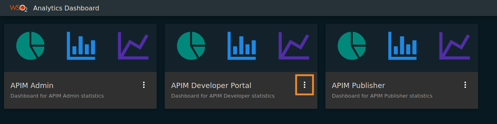
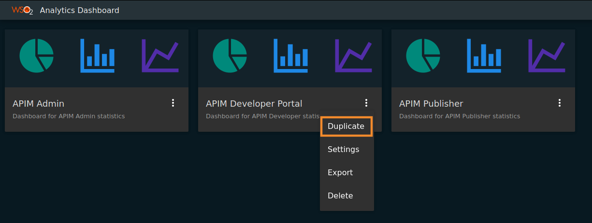
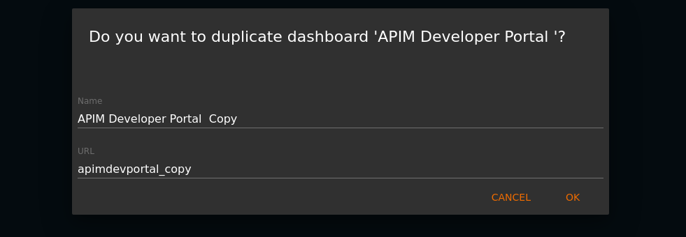
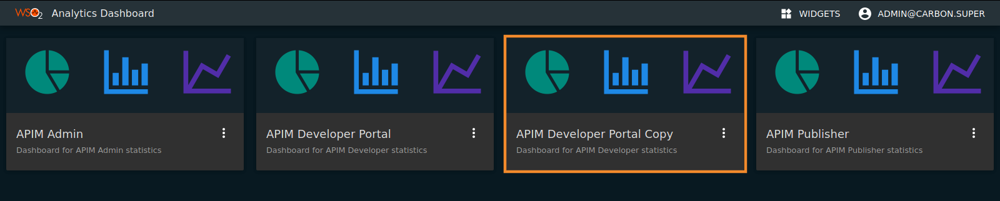
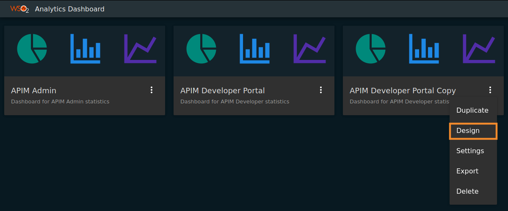

# Customizing Analytics Dashboards

WSO2 API Manager Analytics provides three types of dashboards: API-M Admin, API-M Developer Portal, and API-M Publisher.

You are not allowed to modify the default dashboards (i.e., modify the layout of the widget or add custom widgets of a particular dashboard). If you need to modify one of the default dashboards, you need to make a copy of the dashboard and do the required modifications to the copy of the dashboard as described in[Customizing an Analytics Dashboard](#customizing-an-analytics-dashboard).

!!! note "Enabling permission for other users to create dashboards"
    In order to make it possible for other users to create dashboards, you need to append `_<tenant domain>` to the existing scopes in the `<ANALYTICS-HOME>/conf/dashboard/deployment.yaml` file.

    !!! example
        ``` bash tab="Format"
        apim_analytics:admin_<tenant-domain>
        ```

        ``` bash tab="Sample"
        wso2.dashboard:
        roles:
            creators:
            - apim_analytics:admin_carbon.super 
            - apim_analytics:admin_abc.com
        ```

## Customizing an Analytics Dashboard

Follow the instructions below to customize an Analytics dashboard:

1. Click on the **more options** link as shown below.

    [](../../assets/img/learn/apim-analytics-default-dashboards.png)
    
2. Click **Duplicate**.
    
    [](../../assets/img/learn/apim-analytics-dashboard-dropdown.png)
    
3. Add a valid **name** and **URL** for the dashboard based on your preference and click **OK**.

    [](../../assets/img/learn/apim-analytics-dashboard-duplication-form.png)
    
     A copy of the dashboard is created with the provided name as shown below.
    
    [](../../assets/img/learn/apim-analytics-duplicated-dashboard.png)
    
4. Click on the **more options** link of the newly created dashboard as shown below.
    
    [](../../assets/img/learn/apim-analytics-design-dropdown.png)

5. Click **Design**.
    
     Now you are directed to the design portal where you can do the required customization of the selected dashboard.