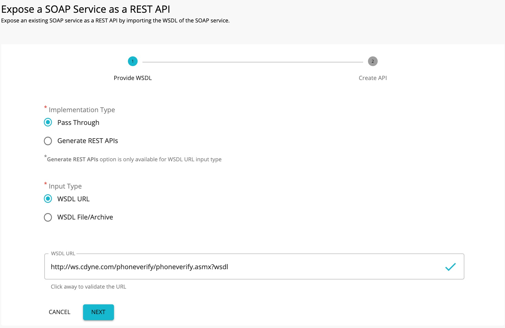
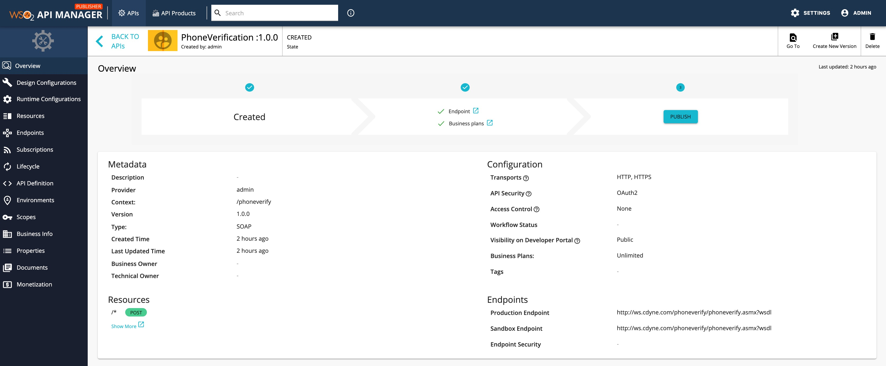
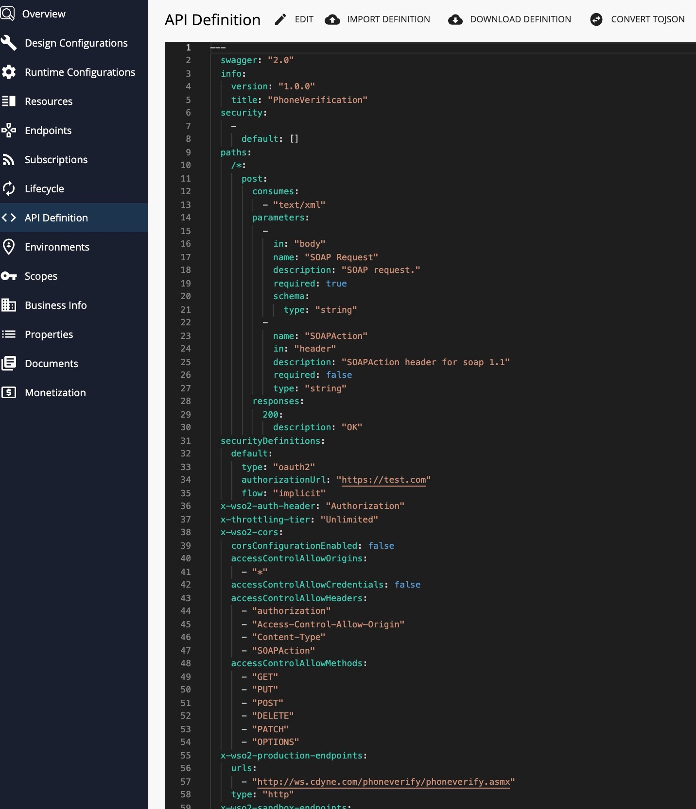
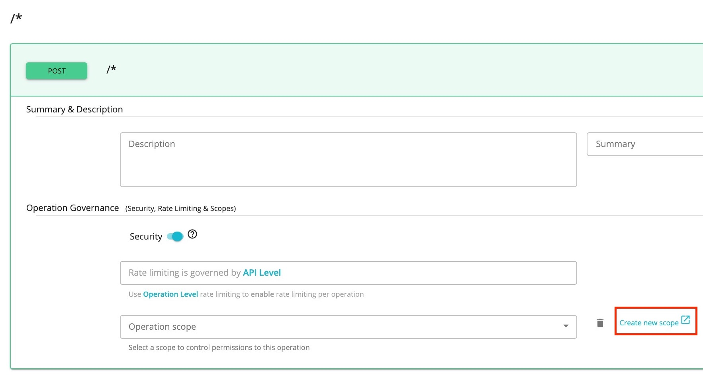

# Expose a SOAP Service as a REST API

WSO2 API Manager supports the management of an existing SOAP and WSDL based services exposing as REST APIs.
The organizations that have SOAP/WSDL based services can easily bridge their existing services to REST without the cost of a major migration. WSO2 API Manager supports two types of services. One service performs a pass-through of the SOAP message to the backend, and the other service generates [a RESTful API from the backend SOAP service](generate-rest-api-from-soap-backend.md).

Follow the instructions below to create a SOAP service as a RESTful API using **Pass Through**

1.  Sign in to the API Publisher and click **CREATE API**.
      <html>
     
     </html>

2.  Select the **Pass Through** option and thereafter, select one of the following options:

     * WSDL URL - If you select this option, you need to provide an endpoint URL.

     * WSDL Archive/File - If you select this option, click Browse and upload either an individual WSDL file or a WSDL archive, which is a WSDL project that has multiple WSDLs.

     <html>

     
Note

     
When uploading a WSDL archive, all the dependent WSDLS/XSDS that are referred to in the parent WSDL file should reside inside the WSDL archive itself. If not, the validation will fail at the point of API creation.

     

     </html>

     This example uses the WSDL [Phone Verify](http://ws.cdyne.com/phoneverify/phoneverify.asmx?wsdl) from CDYNE as the endpoint here, but you can use any SOAP backend of your choice.
        

3.  Click **NEXT** to proceed to the next phase, provide the information in the table below, and click **CREATE**.

    | Field   | Sample Value       |
    |---------|--------------------|
    | Name    | PhoneVerification  |
    | Context | /phoneverify       |
    | Version | 1.0                |
    | Endpoint| http://ws.cdyne.com/phoneverify/phoneverify.asmx|
    | Business Plans| Unlimited|

    
    
     The created API appears in the Publisher as follows.

     
     
4. Click **API Definition** to view the API definition of the created schema.

    
  
     <html>

Note

     

     If you wish to add scopes to the resources that were created, click  **Resources**. Thereafter, create new scopes and specify them under operation scope. If you specify a scope, you need to use the same scope when generating access tokens for the subscribed application to invoke the API. For more information on working with the scopes, see [OAuthscopes](../../api-security/oauth2/oauth2-scopes/fine-grained-access-control-with-oauth-scopes.md).
     

     
</html>   

     

     <html>

     
Note

     
 Note that when creating this API, **API Level** was selected as the default option for the **Rate limiting level**. For more information on setting advanced throttling policies,
     see [Enforce Throttling and Resource Access Policies](../../rate-limiting/setting-throttling-limits.md).

     

     </html>

Now, the SOAP service is created and configured successfully as a RESTful API. 

For more information on API publishing, see [Publish API](../publish-api/publish-an-api.md).

To learn more, see the tutorial on [Creating and Publishing a SOAP service as a RESTful API](../../tutorials/expose-a-soap-service-as-a-rest-api.md).