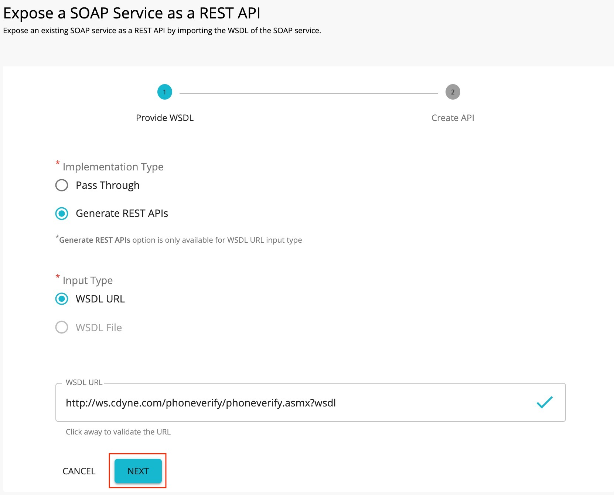
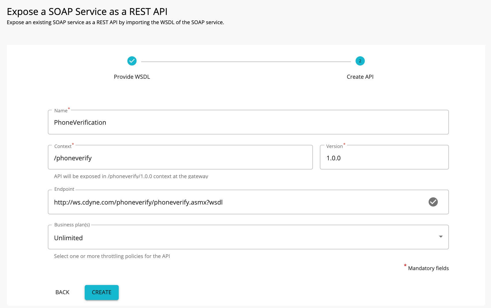
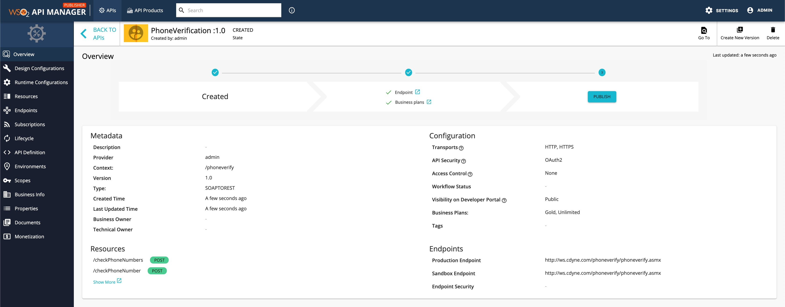
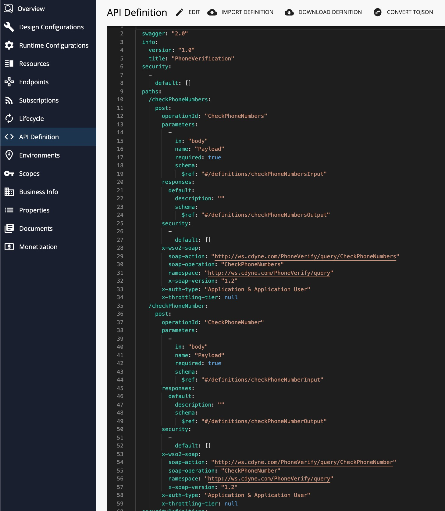
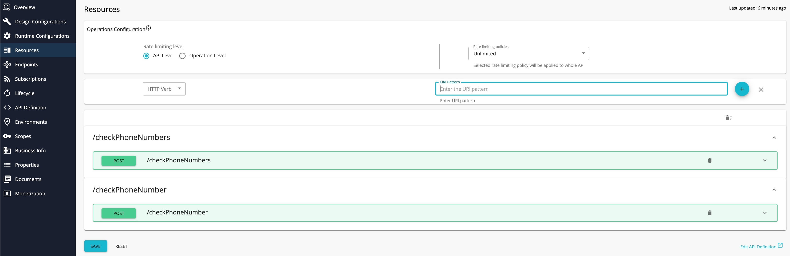
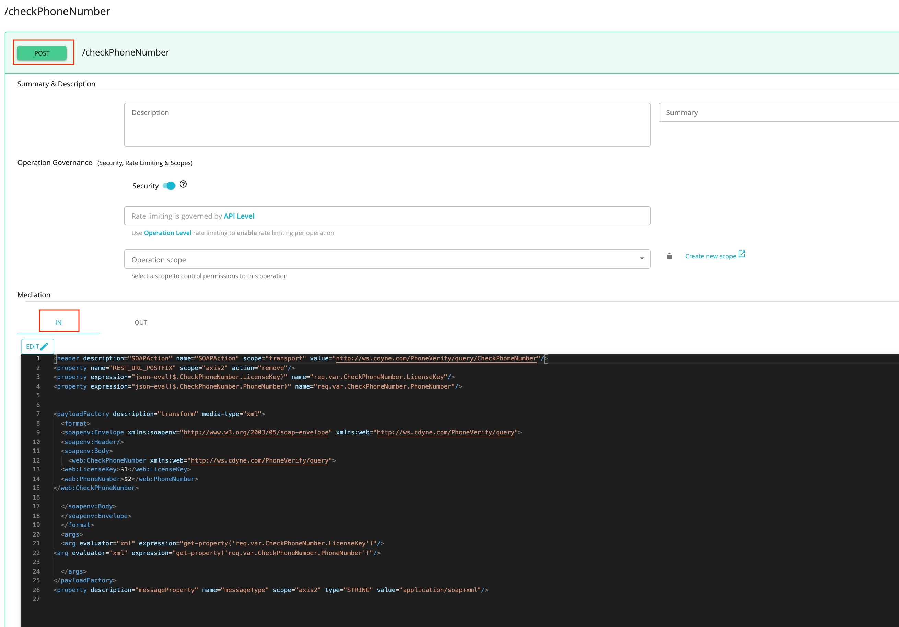

# Generate REST API from SOAP Backend

This feature allows users to expose their legacy SOAP backends as REST APIs through WSO2 API Manager. 
WSO2 API Manager supports WSDL 1.1 based SOAP backends.

Follow the instructions below to generate REST APIs in WSO2 API Manager for an existing SOAP backend.

   <html><div class="admonition note">
      <p class="admonition-title">Note</p>
      <ul>Before you begin... </ul>
      <ul>Make sure that you have a valid WSDL URL from the SOAP backend. It should belong to the WSDL 1.1 version.</ul>
      </div>
    </html>

1.  Sign in to the API Publisher and click **CREATE API**
   <html>
     
     </html>
 
    <html><div class="admonition info">
      <p class="admonition-title">Info</p>
      <ul>The following are two options to create APIs for SOAP backends
      <li>**Pass Through** – Creates a pass-through proxy for SOAP requests coming to the API Gateway.</li>
      <li>**Generate REST APIs** – Generates REST API definitions from the given WSDL URL.</li>
      </ul>
      </div>
    </html>

2. Select **Generate REST APIs** and provide the WSDL URL for the SOAP backend. 

      [](../../../assets/img/learn/create-soap-api-as-a-generated-api.jpg)

3. Click **Next** and provide the information in the table below.

    | Field   | Sample value       |
    |---------|--------------------|
    | Name    | PhoneVerification  |
    | Context | /phoneverify       |
    | Version | 1.0                |
    | Endpoint| http://ws.cdyne.com/phoneverify/phoneverify.asmx|
    | Business Plans| Unlimited|

    [](../../../assets/img/learn/create-soap-api-form.jpg)

4. Click **CREATE**.
    
     The created API appears in the publisher as follows.
    [](../../../assets/img/learn/generate-rest-api-from-soap-backend-overview.jpg)

5.  Click **API Definition** and click **Edit** to modify the open API Definition of the API.
     [](../../../assets/img/learn/api-definition-of-generated-rest-api-from-soap-backend.jpg)
    
     The generated API resources are added to the API, as shown below.
     [](../../../assets/img/learn/generated-resources-of-soap-backend.jpg)

7.  Click on a resource to view the In and Out sequences of the API.
    [](../../../assets/img/learn/in-out-sequences-of-generated-rest-api.jpg)

     The following sample shows the generated API In-sequence for a POST method.

     ``` xml
        <header description="SOAPAction" name="SOAPAction" scope="transport" value="http://ws.cdyne.com/PhoneVerify/query/CheckPhoneNumber"/>
        <property name="REST_URL_POSTFIX" scope="axis2" action="remove"/>
        <property expression="json-eval($.CheckPhoneNumber.LicenseKey)" name="req.var.CheckPhoneNumber.LicenseKey"/>
        <property expression="json-eval($.CheckPhoneNumber.PhoneNumber)" name="req.var.CheckPhoneNumber.PhoneNumber"/>


        <payloadFactory description="transform" media-type="xml">
        <format>
        <soapenv:Envelope xmlns:soapenv="http://www.w3.org/2003/05/soap-envelope" xmlns:web="http://ws.cdyne.com/PhoneVerify/query">
        <soapenv:Header/>
        <soapenv:Body>
            <web:CheckPhoneNumber xmlns:web="http://ws.cdyne.com/PhoneVerify/query">
        <web:LicenseKey>$1</web:LicenseKey>
        <web:PhoneNumber>$2</web:PhoneNumber>
        </web:CheckPhoneNumber>

        </soapenv:Body>
        </soapenv:Envelope>
        </format>
        <args>
            <arg evaluator="xml" expression="get-property('req.var.CheckPhoneNumber.LicenseKey')"/>
        <arg evaluator="xml" expression="get-property('req.var.CheckPhoneNumber.PhoneNumber')"/>

        </args>
        </payloadFactory>
        <property description="messageProperty" name="messageType" scope="axis2" type="STRING" value="application/soap+xml"/>
     ```

    The incoming JSON message parameters are stored using properties. A payload factory mediator is used to generate the SOAP payload required for the backend.
