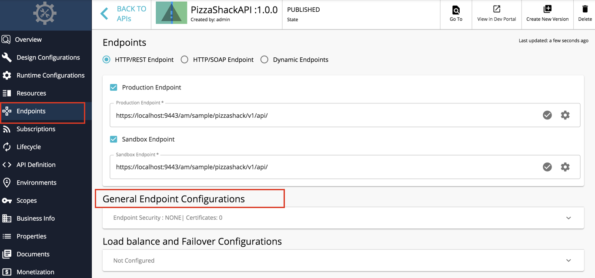
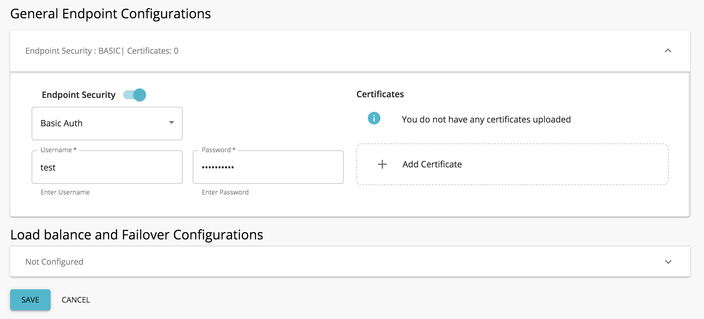

# Secure Endpoint with Basic Auth

A secured endpoint is when there are access-protected resources. You have to specify the username and the password when a request is sent to a secured endpoint. The endpoint authentication mechanism can either be Basic Authentication or Digest Authentication. They differ on how the credentials are communicated and how access is granted by the backend server.

Basic Authentication is the simplest mechanism used to enforce access controls to web resources. Here, the HTTP user agent provides the username and the password when making a request. The string containing the username and the password separated by a colon is Base64 encoded and sent in the authorization header when calling the backend when authentication is required.

!!! info
    If the user name and password is admin, the following header will be sent to the backend.
    ```
    Authorization: Basic YWRtaW46YWRtaW4=` (where `YWRtaW46YWRtaW4=` is equivalent to Base64Encoded{admin:admin} )
    ```

When you [create an API](../../create-api/create-a-rest-api.md) using the API Publisher, you can specify the endpoint of the API backend implementation via the **Endpoint** page as Production and Sandbox endpoints.

Follow the instructions below to use Basic Auth as the endpoint authentication type when using a secured endpoint:

1. Click **Endpoint** in the API Publisher.

2. Click **General Endpoint Configurations** to select the endpoint security scheme. 

     

3. Select **Basic Auth** as the endpoint authentication type and enter your credentials.

    !!! info
        The Endpoint Auth Type selected should match with the authentication mechanism supported by the secured endpoint.

     

4. Click **SAVE.** 