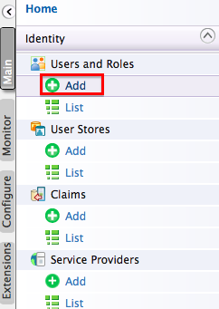
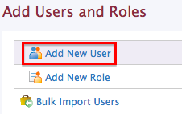
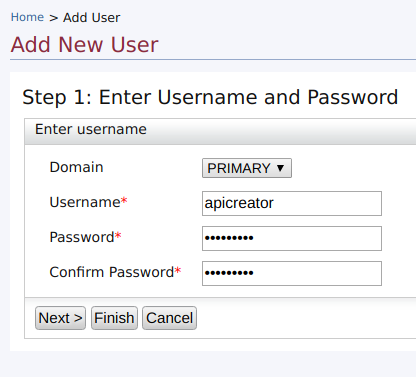
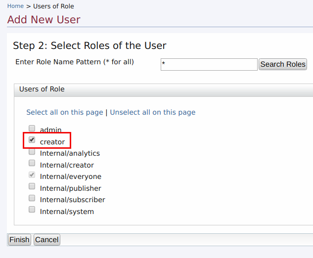
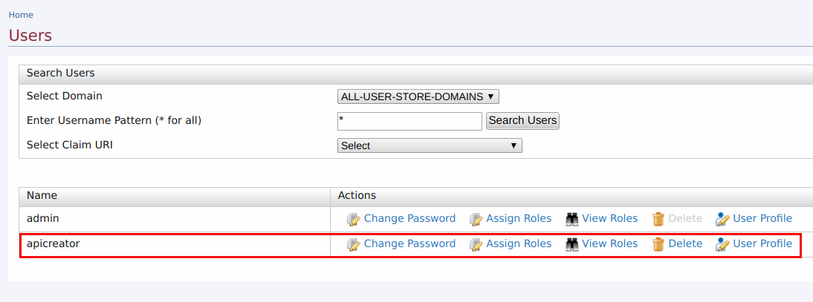

# Managing Users

Users are consumers who interact with your enterprise's applications, databases or any other systems. These users can be persons, devices or applications/programs within or outside of the enterprise's network. Since these users interact with internal systems and access data, the need to define which user is allowed to do what, is critical. This is called user management.

Follow the steps below to create users and assign them to roles via the Management console. Also, if you want to authenticate users via **e-mail** , **social media** , **multiple user store attributes** , see [Maintaining Logins and Passwords](../../install-and-setup/setup/security/logins-and-passwords/maintaining-logins-and-passwords.md).

## Adding a new User

1.  Log in to the Management Console ( `https://<hostname>:9443/carbon` ) and click **Add** under **Users and Roles** in the **Main** menu.

        
    
2.  Click **Add New User**.

    

3.  Provide the username and password and click **Next**.

    

    !!! tip
            The **Domain** drop-down list contains all user stores configured in the system. By default, only the PRIMARY user store is configured. To configure secondary user stores, see [Configuring Secondary User Stores](managing-user-stores/configuring-secondary-user-stores.md).

4.  Select the roles you want to assign to the user. In this example, we assign the `creator` role defined in the [previous section](managing-user-roles.md). For details on adding roles, see [Create user roles.](managing-user-roles.md#create-user-roles)

    

5.  Click **Finish** to complete.
    The new user appears in the **Users** list. You can change the user's password, assign it different roles or delete it.

    

    !!! warning
        You cannot change the user name of an existing user.

## Accessing the Admin Dashboard

The Admin Dashboard ( `https://<hostname>:9443/admin`) is intended to be used by API Manager admins. The admin user has special permissions specified under `All Permissions > Admin Permissions > Manage > API-M Admin` attached to the `admin` role. If a new user needs to access the admin dashboard, follow the steps below:

1.  Create a user.
2.  Create a new role. For more information, see [Create User Roles](managing-user-roles.md#create-user-roles).
3.  Assign the following permissions to the new role you just created: `All Permissions > Admin Permissions > Manage > API-M Admin` and `All Permissions > Admin Permissions > Configure > Login`.
4.  Assign the role created in step 2, to the user created in step 1.

Now this user is able to login and perform administrative tasks using the Admin Dashboard.

For more details on User Management refer [Configuring Users.](https://is.docs.wso2.com/en/5.10.0/learn/configuring-users/)