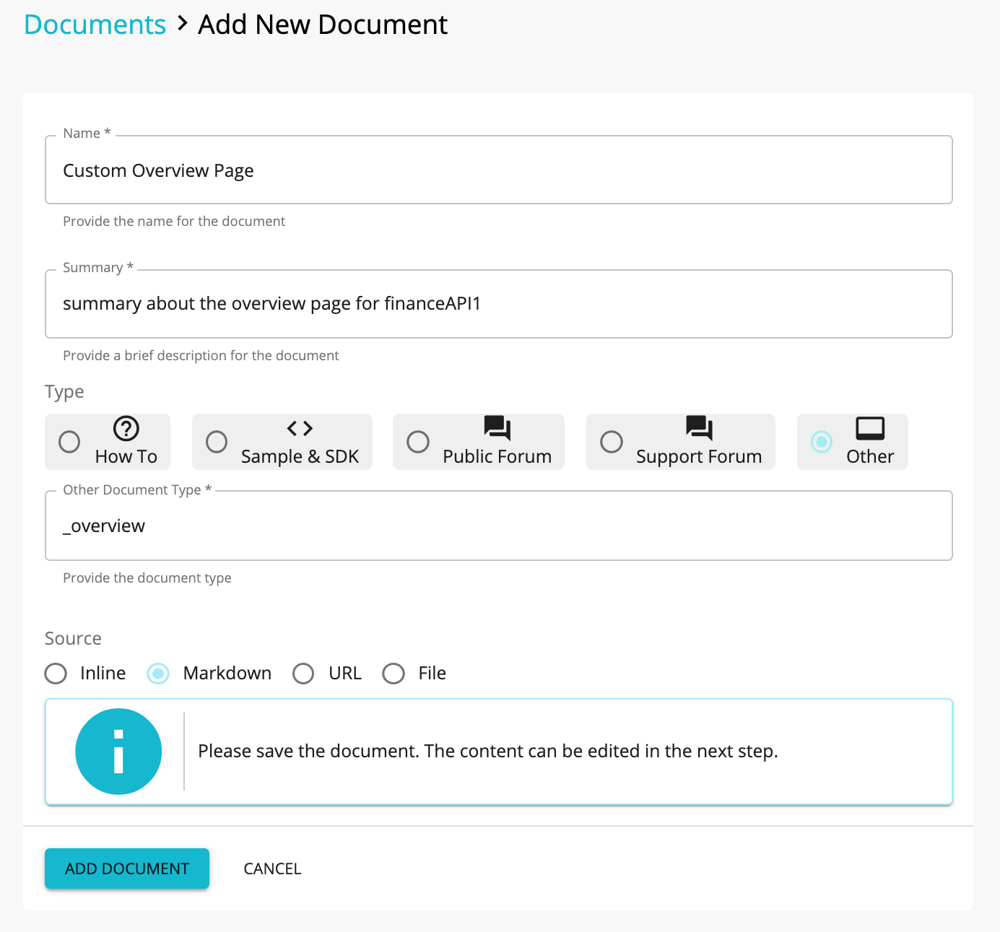
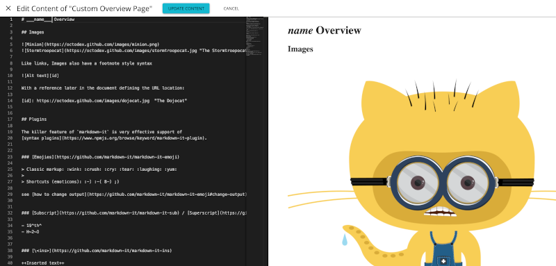
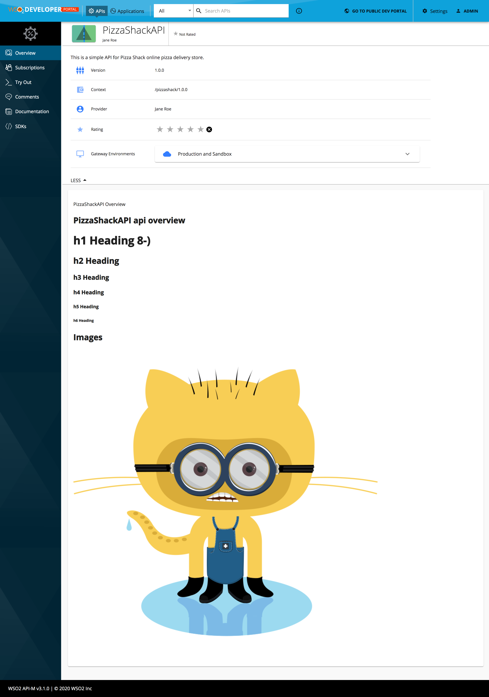

# Override API Overview page per API

It is possible to display a custom Overview content for any API by adding a document by following the steps given bellow.

1. Login to the API Publisher and go to the `Documents` tab of the API that you want to override.

2. Create a new document with the following settings.

     

    | Input Name | Input Value |
    | -- | -- |
    | Name | Custom Overview |
    | Summary | summary about the overview page for financeAPI1 |
    | Type | Other |
    | Other Document Type | _overview |
    | Source | Markdown |

3. Click the save button and select **ADD CONTENT** from the dialog box.

4. Add the markdown content.

    Following keys can be used within the markdown to get some of the API properties.

    | Property Name | Key to use in markdown |
    | --- | --- |
    | name | `___name___` |
    | authorizationHeader | `___authorizationHeader___` |
    | avgRating | `___avgRating___` |
    | context | `___context___` |
    | id | `___id___` |
    | lifeCycleStatus | `___lifeCycleStatus___` |
    | provider | `___provider___` |
    | type | `___type___` |
    | version | `___version___` |

     

    Above screen demonstrates the use of `___name___` key to display API name within the markdown content.

    Overview for the selected API will be rendered from the markdown content in the developer portal.

     