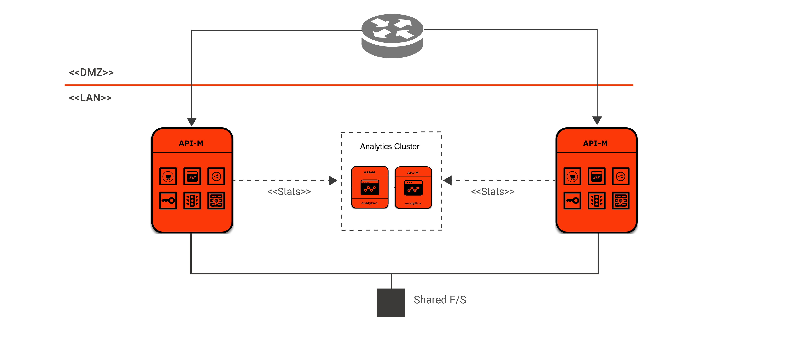
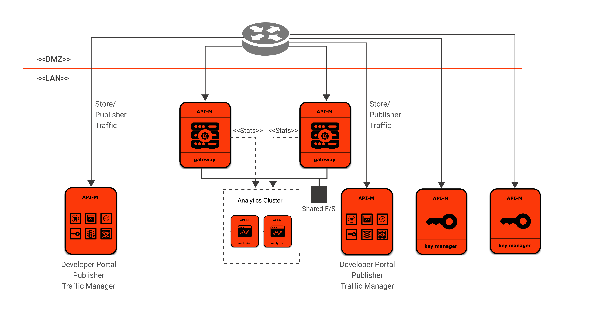
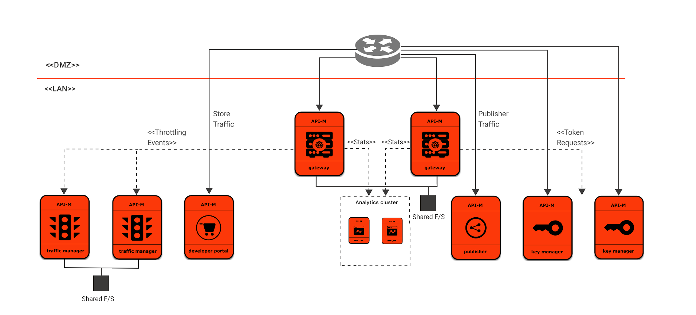
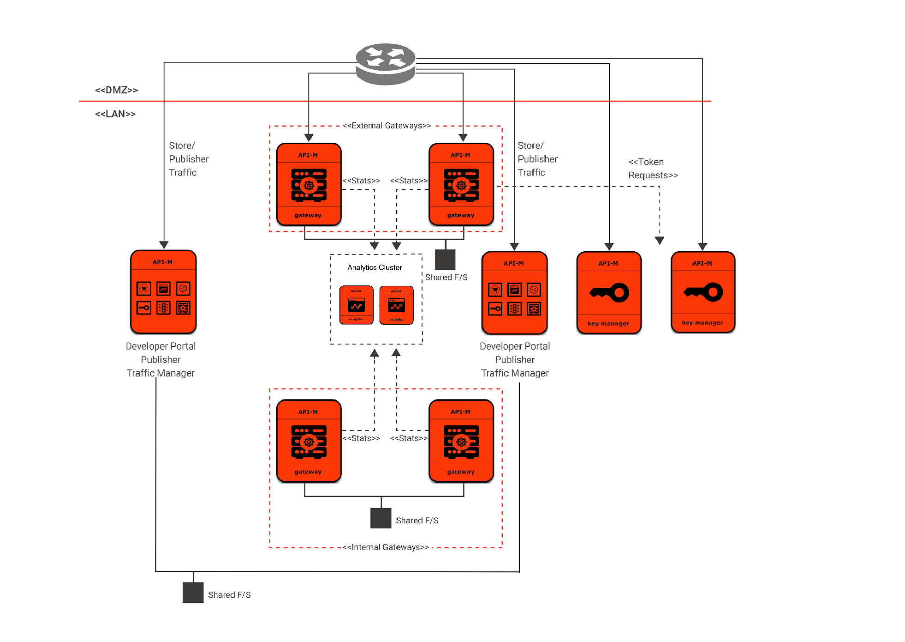
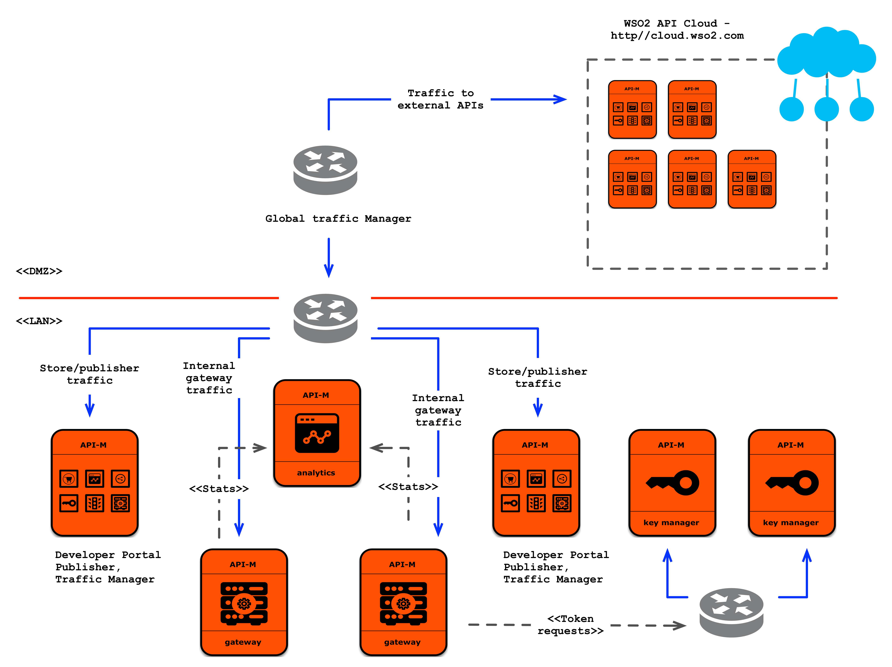

# WSO2 API Manager Deployment Patterns

## Pattern 1: Single node (all-in-one) deployment

You can use this pattern when you are working with low throughput.

## Pattern 2: Deployment with a separate Gateway and separate Key Manager

You can use this pattern when you require a high throughput scenario that requires a shorter token lifespan.

## Pattern 3: Fully distributed setup

You can use this pattern to maintain scalability at each layer and higher flexibility at each component.

## Pattern 4: Internal and external (on-premise) API Management

You can use this pattern when you require a separate internal and external API Management with separate Gateway instances.

## Pattern 5: Internal and external (public and private cloud) API Management

You can use this pattern when you wish to maintain a cloud deployment as an external API Gateway layer.