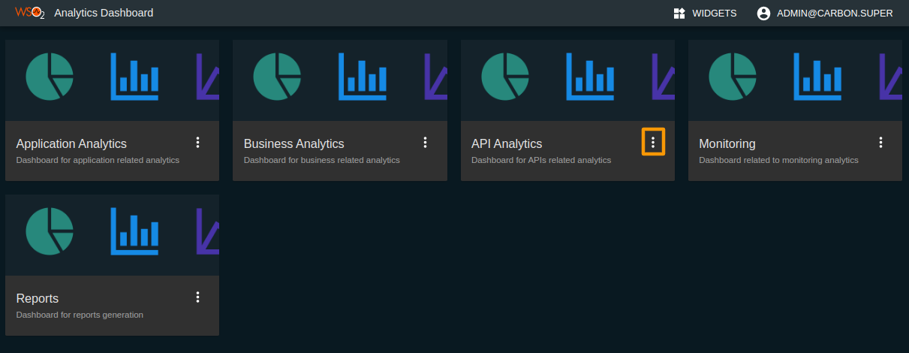
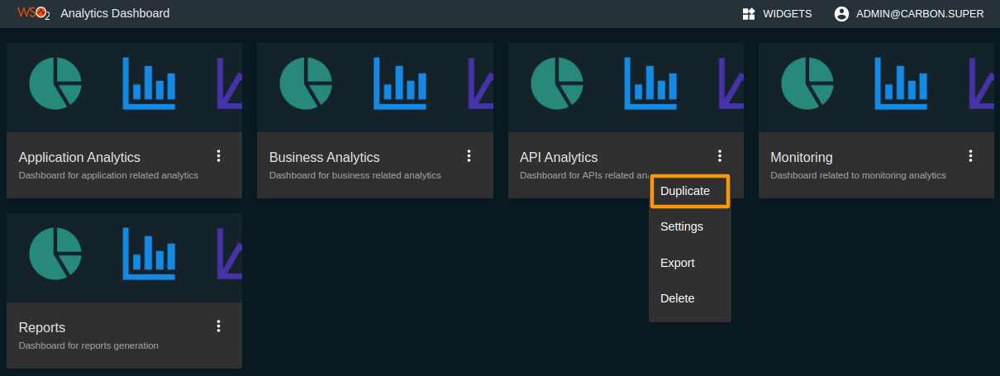
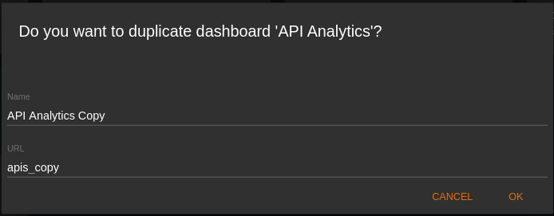
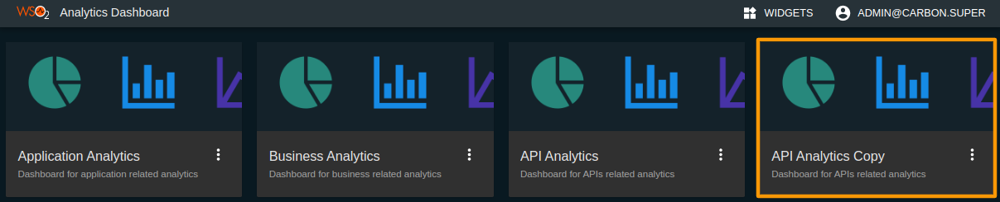
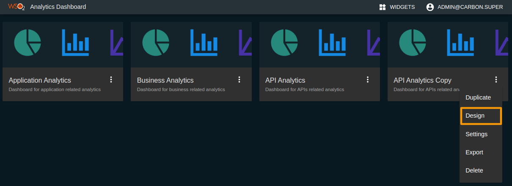

# Customizing the Analytics Dashboards

WSO2 API Manager Analytics has five different dashboards that are namely, API Analytics, Application Analytics, Business Analytics, Monitoring, and Reports.

The users are not allowed to modify the default dashboards - i.e modify the layout of the widget or add custom widgets to a particular dashboard. If you need to modify one of the default dashboards, you need to make a copy of the dashboard and do modifications to the copy of the dashboard as described in steps 1 to 5.

In order to make it possible for other users to create dashboards, you need to append `_<tenant domain>` to existing scopes in the `deployment.yaml` file which resides in `<Analytics_HOME>/conf/dashboard` directory. 

!!! example
    ``` bash tab="Format"
    apim_analytics:admin_<tenant-domain>
    ```

    ``` bash tab="Sample"
    wso2.dashboard:
      roles:
        creators:
          - apim_analytics:admin_carbon.super 
          - apim_analytics:admin_abc.com
    ```

        
1.  Click on the dashboard customization icon in the dashboard card as shown below.

    [](../../assets/img/learn/apim-analytics-default-dashboards.png)
    
2.  Click **Duplicate**.
    
    [](../../assets/img/learn/apim-analytics-dashboard-dropdown.png)
    
    A form will be displayed as shown below.
    
3.  Enter a valid **Name** and **URL** for the dashboard based on your preference and click **OK**.

    [](../../assets/img/learn/apim-analytics-dashboard-duplication-form.png)
    
     A copy of the dashboard is created with the provided **Name** as shown below.
    
    [](../../assets/img/learn/apim-analytics-duplicated-dashboard.png)
    
4.  Click the dashboard customization icon that corresponds to the created dashboard card and click **Design** as shown below.
    
    [](../../assets/img/learn/apim-analytics-design-dropdown.png)
    
     Now, you will be directed to the Design Portal.
    
5.  Do the required customization on the selected dashboard.