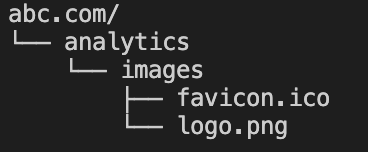
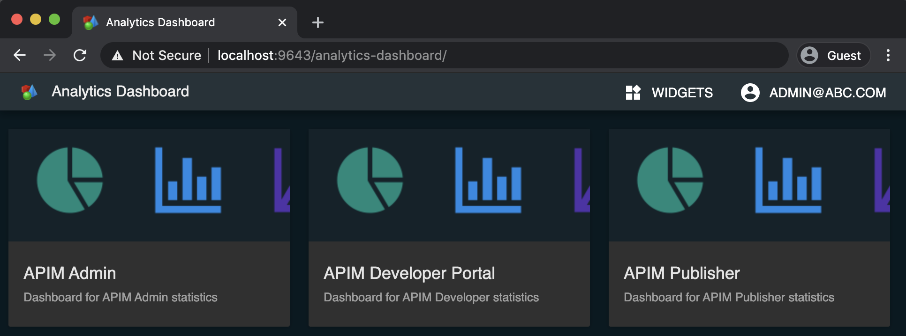

# White Labeling for Tenants
This section explains how to white label analytics dashboard for tenants. You can customize logo and favicon for tenants. 
1. Add following configuration in the deployment.yaml. You can use `logoFileName` and `faviconFileName` directives of deployment.yaml to specifiy file names of logo and favicon.(Ex: logo.png, favicon.ico)
    ```yaml
    themeConfigProviderClass: org.wso2.analytics.apim.dashboards.theme.config.provider.CustomDashboardThemeConfigProvider
    logoFileName: logo.png
    faviconFileName: favicon.ico
    ```
2. Go to `<API-M_ANALYTICS_HOME>/wso2/dashboard/deployment/web-ui-apps/analytics-dashboard/public/` directory and create a directory with the name of tenant (Ex: abc.com)
    
Create following folder structure inside the tenant folder and add relavent logo and favicon file.



3. To verify changes Log in to the Analytics Dashboard by accessing `<Protocol>://<Host>:<Port>/analytics-dashboard` (ex: [https://localhost:9643/analytics-dashboard](https://localhost:9643/analytics-dashboard)).

