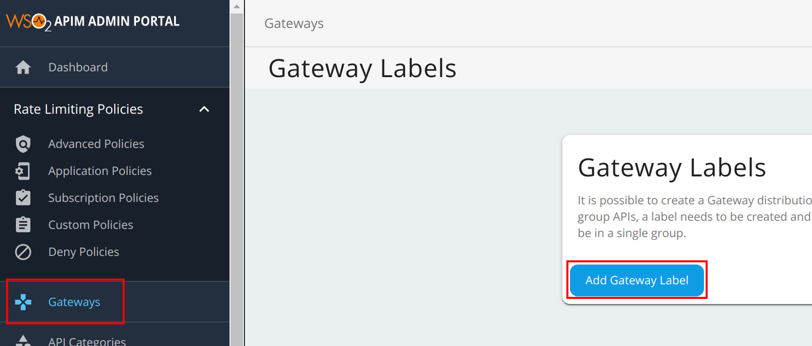
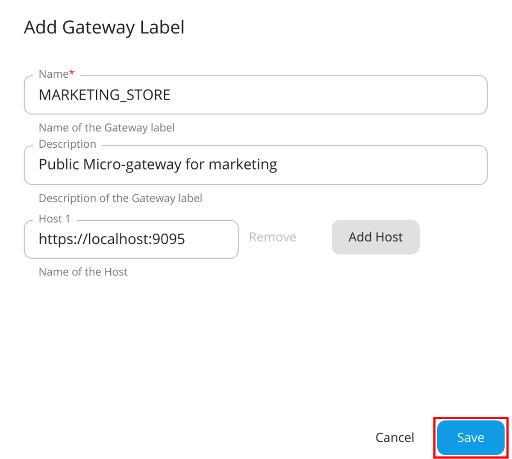
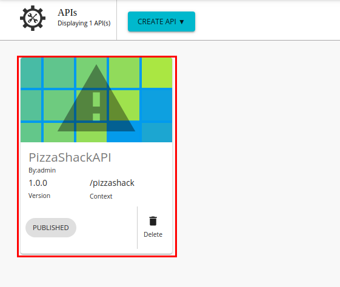
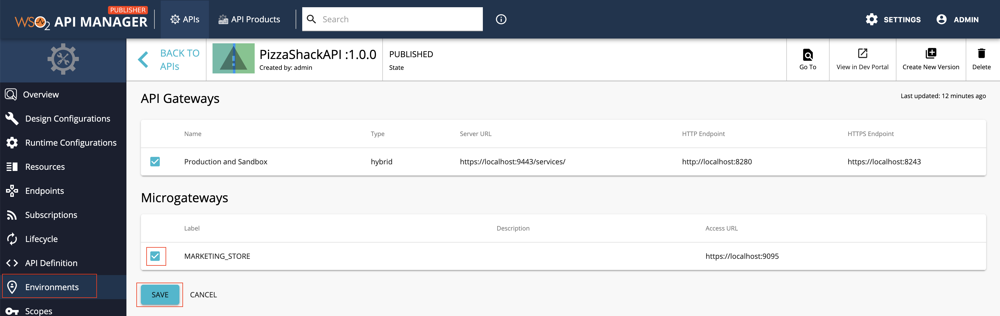
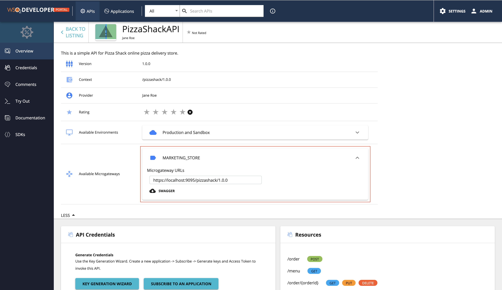

# Grouping APIs with Microgateway Labels

If required, you can create a [WSO2 API Microgateway](https://wso2.com/api-management/api-microgateway/) distribution for a group of APIs. Therefore, if you need to group APIs in order to import it later into the WSO2 Microgateway, you need to create a Microgateway label and add the label to the respective APIs that belong to the group.

<html>

Note

For more information on WSO2 API Microgateway, see <a href="https://mg.docs.wso2.com/en/3.2.0/">API Microgateway Documentation</a>.

 
</html>

## Step 1 - Create a Microgateway label

1.  Sign in to the Admin Portal.
     
     `https://<hostname>:9443/admin` 
   
     Example: `https://localhost:9443/admin`

     Let's use `admin` as your username and password to sign in.

2.  Add a new Microgateway label.

     1. Click **Gateways**, and then click **Add Gateway Label**.

         

     2. Enter a name, which will be used as the Microgateway label and a host.

        <table>
        <tr>
        <td>Label
        </td>
        <td>
        MARKETING_STORE
        </td>
        </tr>
        <tr>
        <td>Host
        </td>
        <td><code>https://localhost:9095</code>
        </td>
        </tr>
        </table>
     
     3. Optionally, to add multiple hosts click **Add Host** and add another host.

     4. Click **Save**.

         

## Step 2 - Assign the Microgateway label to an API

<html>

Note

Repeat this step if you wish to add multiple APIs to the API group.

 
</html>

1.  Sign in to the API Publisher using `admin` as the username and password.

     `https://<hostname>:9443/publisher` 
   
     Example: `https://localhost:9443/publisher`

2.  Create a new API or skip this step if you wish to use an existing API.
     
     Let's deploy the sample Pizzashack API by clicking **Deploy Sample API** (If you have not done so already).

3.  Click on the API to edit its configurations.

     

4.  Click **Environments**.

5.  Select the newly created Microgateway label.

     

6. Click **Save** to attach it to the Pizzashack API.
   
     Similarly, you can assign the `MARKETING_STORE` Microgateway label for other APIs as well.

## Step 3 - View the Microgateway labels

1. Sign in to the Developer Portal using `admin` as the username and password.

     `https://<hostname>:9443/devportal` 
   
     Example: `https://localhost:9443/devportal`

2. Click on the specific API.

3. Click **Overview**.

     The Microgateways, which are attached to the API, appear.

     