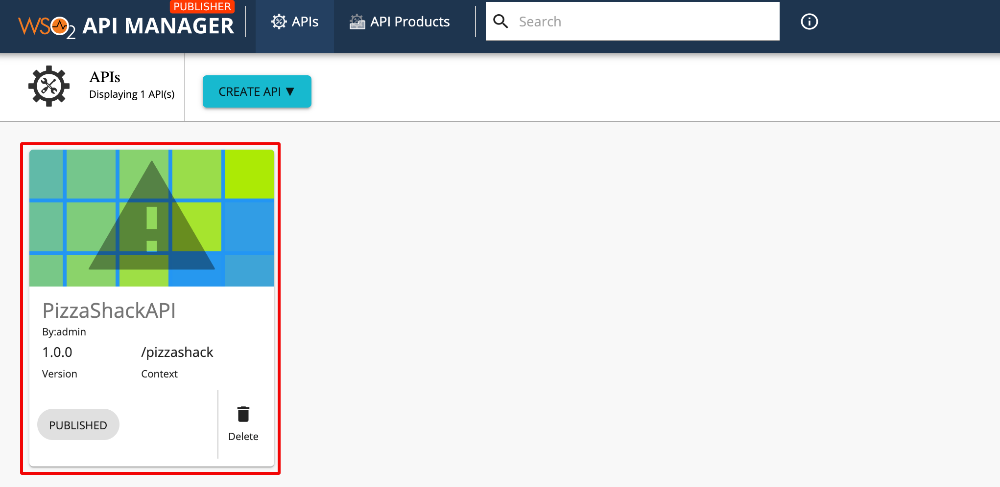
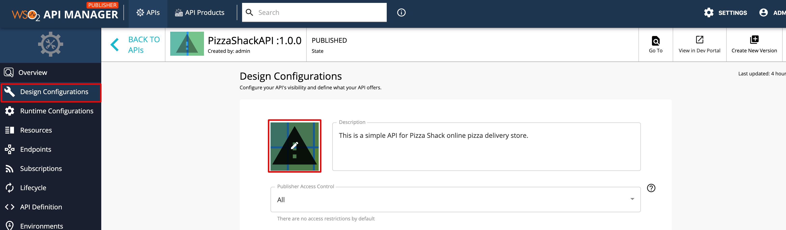
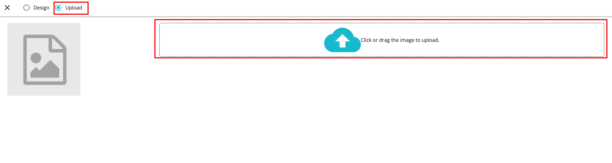
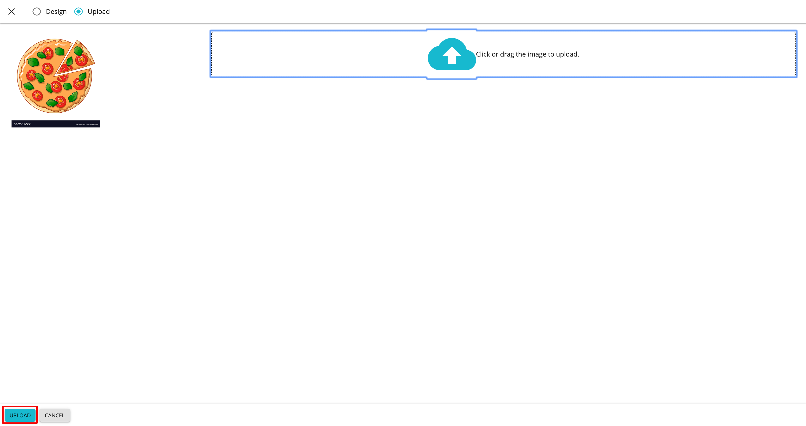
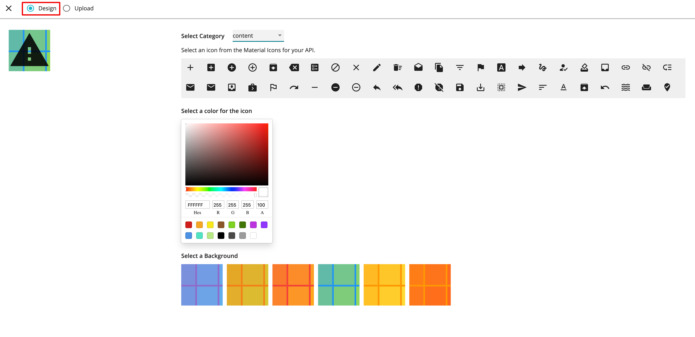
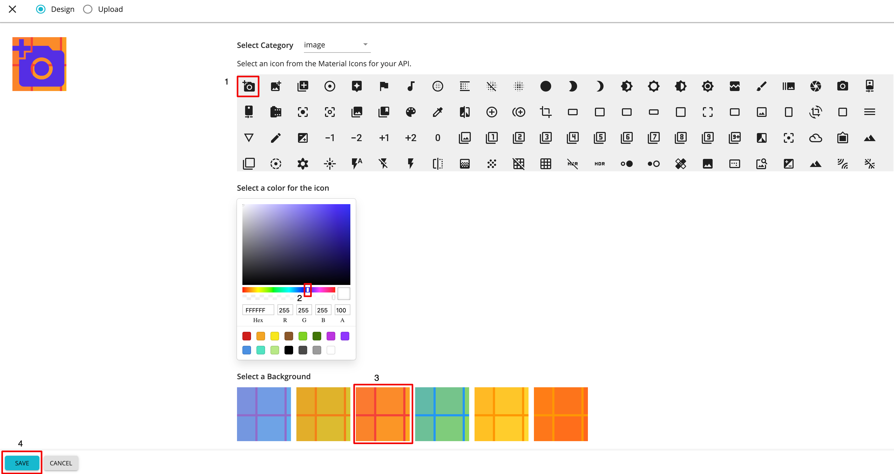

# Change the Thumbnail of an API

The thumbnail of an API can be changed by uploading an image for the thumbnail or by designing a new thumbnail image via the Publisher.

## Upload new API thumbnail

1. Sign in to API Publisher and click on the API that you want to change the thumbnail.
    
  
2. Click **Design Configurations** and click on the API Thumbnail image.
    
3. Click **Upload** and click on the Drop Zone to select an image for the thumbnail.
     
 
5. Click **Upload** to save the newly uploaded thumbnail.
      
  
    The newly added image appears as the API thumbnail.
    
    
      
## Design a new API Thumbnail

1. Follow [steps 1 - 3 under Upload new API thumbnail](#upload-new-api-thumbnail).

2. Click **Design**.
     
    
4. Select an icon, color, and background for the thumbnail.
    
    - **Category**
        
        Select the icon category. Currently, the API Publisher supports the following categories.
        
        

    - **Icon Color**
        
        Select the icon color from the color picker.
    
        
        
    - **Background**
        
        Select the thumbnail background from the designs.
        
        
          
5. Click  **SAVE** to save the thumbnail.
      
     
     The designed thumbnail appears as the API thumbnail.

     
    