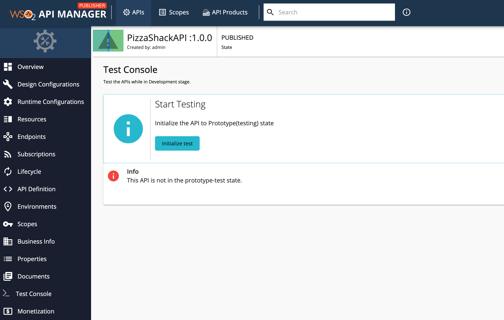
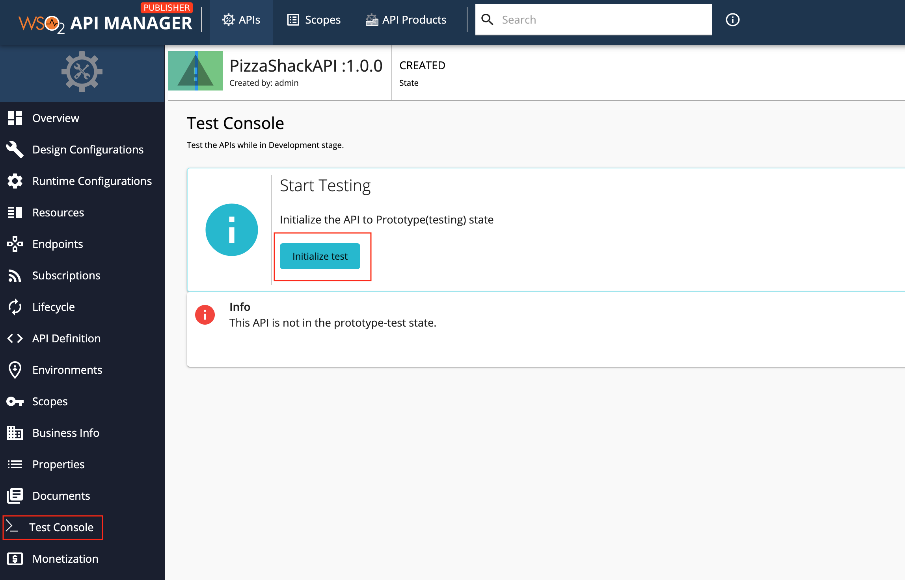
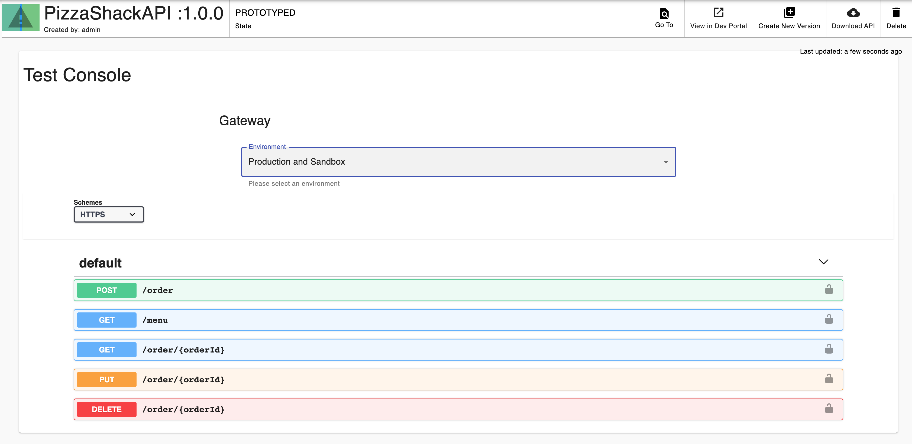
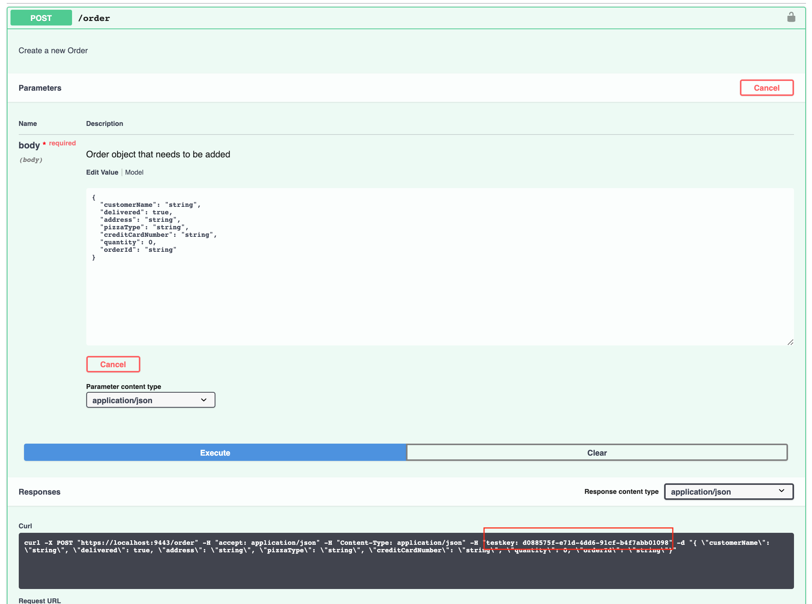

# Test a REST API

**Testing APIs** is trying out the APIs at the publisher itself and make sure whether the functionalities and behaviours are  met before publishing to the gateway for subscribers to access.

Only the API developers (creator, publisher) are allowed to test the APIs through the test console. The developers can do the basic functional tests such as checking mediation policy, validating that the request is sent to the back-end and a proper responses is received as expected, request/response schema validation, and making sure that the API resources are defined correctly.
The **Test Console**  menu item in the Publisher portal's left navigation menu can be used to initialize the test at the design phase. Once the developer initiates the test by clicking on the initialize test button, the API is transformed to the prototype(testing)
state and the swagger console is populated with a test-key(token) which prevents the unauthorized users accessing the particular API.

If the API is in the created lifecycle state, the developer can initialize the test.

!!! Note
    We don't allow testing for the APIs that are in publish state.Hence API developer/publisher has to demote the API to prototype/created
    state.
    

Let's see how to use the Publisher test Console to test an API.

The examples here use the `PizzaShack` REST API, which was created in [Create a REST API](create-a-rest-api.md) .

1.  Sign in to the API Publisher `https://<hostname>:9443/publisher` (e.g., `https://localhost:9443/publisher` ). Upon signing in, the list of APIs in the API Publisher is listed. Please refer [create an API guide](create-a-rest-api.md) to create a new API.

     If there are no APIs created, [create an API](create-a-rest-api.md) before starting.

2.  Click on an API that is in the **CREATED** state.

     

3.  Click **Test Console** on the left navigation menu.

     

4.  Click on  the **Initiate Test**  button. This will open the swagger UI(API Console) to test the PizzaShack API before publish to the subscribers.

      

5.  Expand the POST  method and click Try it out. It will generate the **test-key** to invoke the API. Click Execute.

    

    !!! tip
            **test-key token**

            if an API developer initiates a test, the swagger console will be automatically populated with the generated **test-key**. If you try the test api call through the terminal or command line, make sure you copy the generated test-key.

You have now successfully tested an API using the publisher test Console. Now you can publish the API to the gateway.