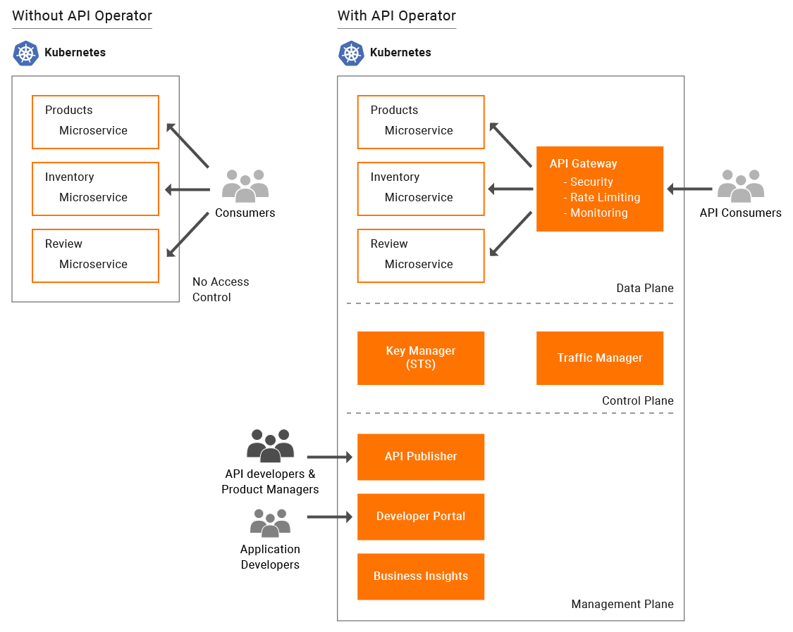

# Kubernetes API Operator

As microservices are increasingly being deployed on Kubernetes, the need to expose these microservices as well documented, easy to consume, managed APIs is becoming important to develop great applications. The API operator for Kubernetes makes APIs a first-class citizen in the Kubernetes ecosystem. Similar to deploying microservices, you can now use this operator to deploy APIs for individual microservices or compose several microservices into individual APIs. With this users will be able to expose their microservice as managed API in Kubernetes environment without any additional work.

## Quick Start Guide

[Quick Start Guide v1.2.2](https://github.com/wso2/k8s-api-operator/blob/v1.2.2/README.md).

## Kubernetes API Operator doc space

[Kubernetes API Operator documentation space](https://github.com/wso2/k8s-api-operator/tree/v1.2.2/docs)
 
## Install K8s API Operator using OperatorHub.io
 
For information, see the installation instructions in the [OperatorHub.io](https://operatorhub.io/operator/api-operator).