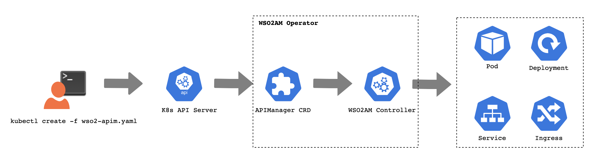

# Kubernetes WSO2 API Manager Operator

With WSO2 API Manager Operator, it makes easy to deploy WSO2 API Manager in Kubernetes through a simple command. Also it supports deploying recommended deployment patterns in Kubernetes. Introducing a new Custom Resource Definition called APIManager to efficiently and easily deploy patterns, and custom patterns in Kubernetes.

 
## Quick start guide

[WSO2 API Manager Operator v1.1.0 Quick Start guide](https://github.com/wso2/k8s-wso2am-operator/tree/v1.1.0#quick-start-guide).

## WSO2 API Manager Operator doc space
[WSO2 API Manager Operator v1.1.0 documentation space](https://github.com/wso2/k8s-wso2am-operator/tree/v1.1.0/docs)
 
## Install K8s WSO2 API Manager Operator

For information, see the installation instructions in [OperatorHub.io](https://operatorhub.io/operator/wso2am-operator).