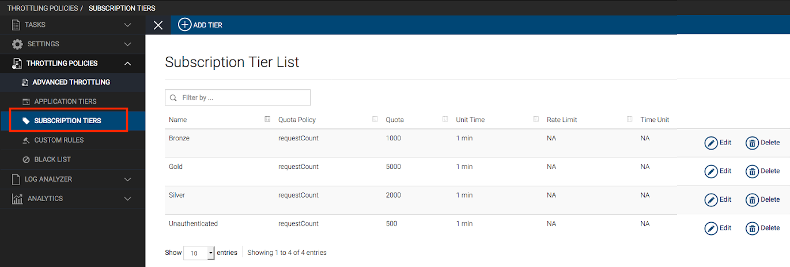

# API Rate Monetization Sample

### Usecase

Defining, enabling and monitoring revenue for APIs.

Defining monetization tiers and throttling traffic based on these tiers.

Support for different API subscription models.

-   By call volume

-   By bandwidth consumption

-   By time of day usage

For backends that are also monetized, create reports and compare against invoices from backend vendors.

Offer a free trial version and request payment if they wish to continue the service for a long time

### Business Story

ABC organization exposes the prices of their products through an API. The API is accessed by sales agents, of whom a large are third parties. The organization needs to gain revenue from the third party sales agents based on their subsctiption models. Therefore, they charge the agents based on the number of requests and the bandwodth consumption.

### Implement using WSO2 API Manager

WSO2 API Manager has the following subscription tiers defined by default.

You can add custom subscription tiers according your pricing requirements. You can also create a free subscription tier as a trail version, by limiting the number of requests and the consumption of resources. Once the  limit is exceeded, you can offer a pricing model or terminate the trial usage.

To monetize APIs using your subscription models, do the following

-   Connect to a billing engine
-   Connect the API manager node to the billing engine to charge according to the API usage and bandwidth consumption.

For more details, see [Enabling Monetization of APIs-](../../learn/api-monetization/monetizing-an-api.md).

To view API usage and statistics, configure WSO2 API-M Analytics. For more details, see [Configuring APIM Analytics](../../learn/analytics/configuring-apim-analytics.md#configuring-apim-analytics).