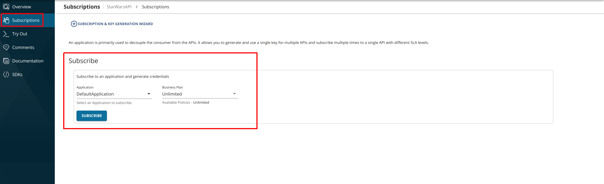
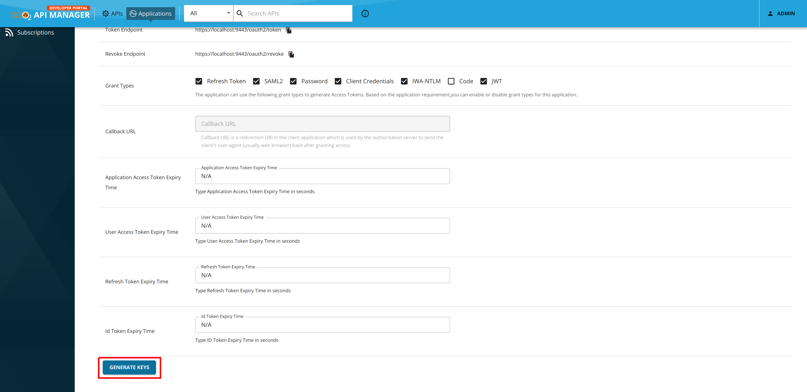
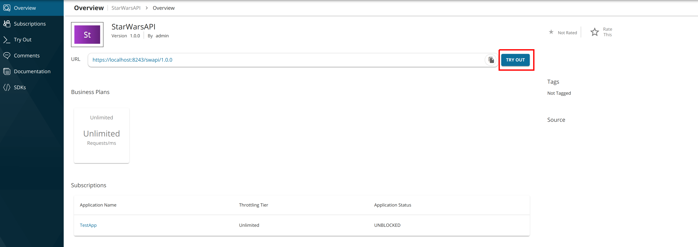
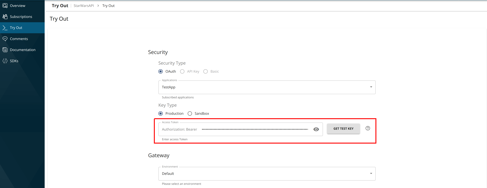
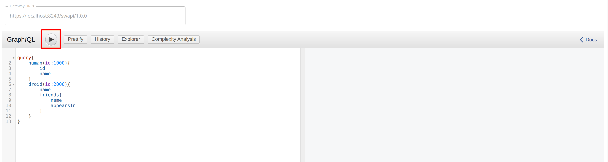
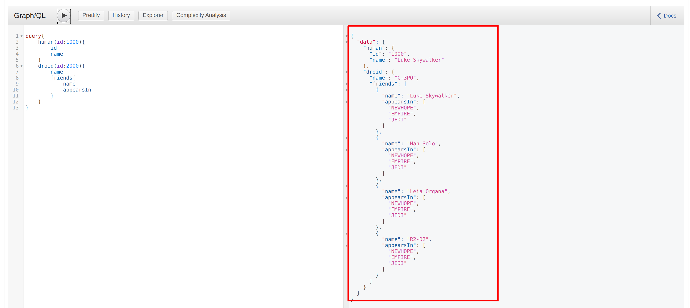

# Test a GraphQL API Using the Integrated GraphQL Console

WSO2 API Manager (WSO2 API-M) has an Integrated GraphiQL UI for the GraphQL APIs.

[GraphQL](https://github.com/graphql/graphiql) is the graphical, interactive, web-based GraphQL integrated development environment (IDE) for GraphQL query and it has a reference implementation from the GraphQL Foundation. 

GraphiQL UI supports full GraphQL Language Specification (Queries, Mutations, Subscriptions, Fragments, Unions, directives, multiple operations per query, etc.) and it provides interactive schema documentation, real-time error highlighting and reporting for queries and variables, automatic query and variables completion, it automatically adds the required fields to the queries, and also queries the history using local storage.

Follow the instructions below to use the GraphQL Console, which is in the WSO2 API Manager Developer Portal, to invoke a GraphQL API:

!!! Note
    You can only try out HTTPS based APIs via the GraphQL Console because the API Store runs on HTTPS.

The examples here use the `StarWarsAPI` GraphQL API, which was created in [Create a GraphQL API](../../../design/create-api/create-a-graphql-api.md).

1. Sign in to the WSO2 Developer Portal and click on an API (e.g., `StarWarsAPI`).

     `https://<hostname>:9443/devportal`

2. Subscribe to the GraphQL API (e.g., `StarWarsAPI` 1.0.0) using an application and an available throttling policy.

    [](../../../assets/img/learn/subscribe-to-graphql-api.png)

3. Click **Applications** and open the application that you used to subscribe to the API.

4. Click **Production Keys** and navigate to **OAuth2 Tokens**.[](../../../assets/img/learn/navigate-to-oauth-tokens-graphql-console.png)

5. Scroll down and generate a production key
   
    [](../../../assets/img/learn/graphql-generate-keys-production.png)

    !!! tip
         **Production and Sandbox Tokens**
            
         To generate keys for the Sandbox endpoint, go to the **Sandbox Keys** tab. For more details, see [Maintaining Separate Production and Sandbox Gateways](../../../deploy-and-publish/deploy-on-gateway/api-gateway/maintaining-separate-production-and-sandbox-gateways.md#multiple-gateways-to-handle-production-and-sandbox-requests-separately).

    !!! tip 
         **JWT vs OAuth tokens**

         If the application you are using for this example is self-contained (JWT), then **copy the generated access token** before proceeding to the next step. If the application is of OAuth type, then the GraphQL console will be automatically populated with the generated token in the authorization field.

6. Click **APIs** to navigate to the APIs and select the GraphQL API that you want to invoke. 

7. Click **Try Out** in the  **Overview** tab.

    [](../../../assets/img/learn/graphql-console-try-button.png)

    This opens the GraphiQL UI (GraphQL Console) to test the StarWarsAPI.

8. Copy the generated access token to the Authorization field as shown below.

    [](../../../assets/img/learn/graphql-api-copy-access-token.png)


9. Enter the following sample query.

    ```
    query{
        human(id:1000){
            id
            name
        }
        droid(id:2000){
            name
            friends{
                name
                appearsIn
            }
        }
    }
          
    ```
 
10. Click **Execute**.

     [](../../../assets/img/learn/graphql-console-execute-query.png)

    !!! info "Troubleshooting"
        If you **cannot invoke the API's HTTPS endpoint** (this causes the **SSLPeerUnverified exception**), it could be because the security certificate issued by the server is not trusted by your browser. 
        
        To resolve this issue, access the HTTPS endpoint directly from your browser and accept the security certificate.
        
        If the API Manager has a **certificate signed by a Certificate Authority (CA)**, the HTTPS endpoints should work out-of-the-box.

     Note the successful response for the API invocation. 

     [](../../../assets/img/learn/graphql-response-query.png)

You have now successfully invoked a GraphQL API using the GraphQL API Console.
