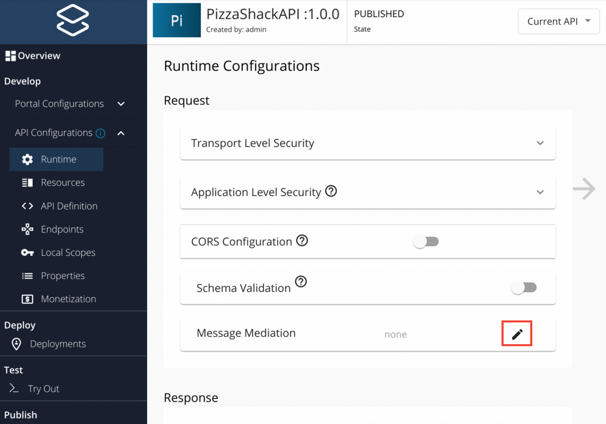
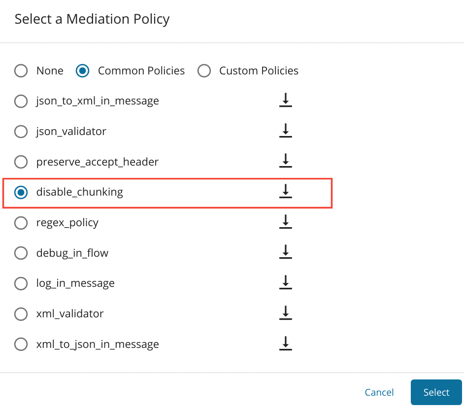

# Disabling Message Chunking

When processing large messages, message chunking facilitates sending the message as multiple independent chunks. 
Message chunking is set using the `Transfer-Encoding: chunked` header. However, some legacy backends might not support 
chunked messages. To disable sending chunked messages to the backend for a specific API, follow the steps below:

1.  Go to the created API and from the Left Menu, go to **API Configurations** --> **Runtime**.
2.  Click  button in the **Message Mediation** under the **Request** section.      
  
      

3.  In the **Select a Mediation Policy** popup you can select **Common Policies** radio button and then select disable-chunking radio button.  

    

4.  Press select button and then save the API.

Once the API is published, chunking is disabled for the message that is sent to the backend.

!!! tip
    To stop chunked messages from being sent to the client, you can apply the same mediation policy in the response section as well.
        

