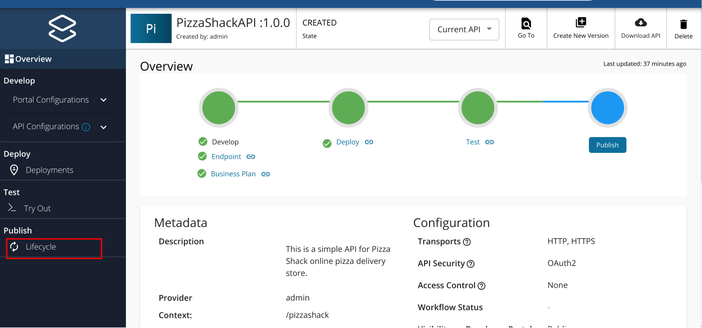
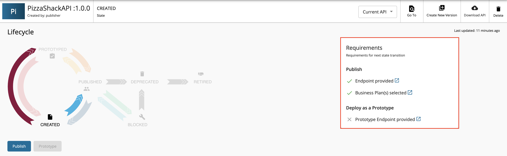
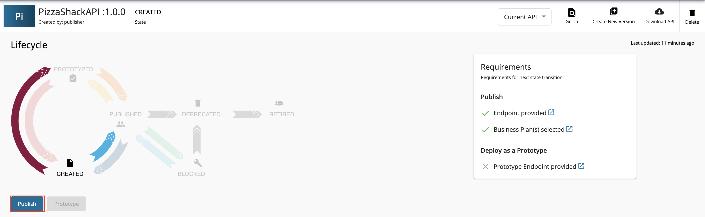
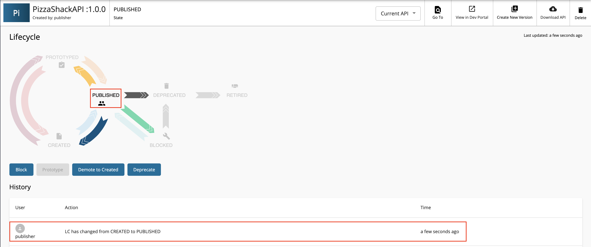

# Publish an API on the Developer Portal

**API Publishing** is the process of making the API available for subscription. An API in the lifecycle state CREATED will have the  API metadata added to the Developer Portal, but not deployed to the API Gateway. Therefore, it is not visible to subscribers in the Developer Portal. When the API is published the API lifecycle state will be changed to **PUBLISHED**. 

Follow the steps below to publish an API using WSO2 API Manager.

1.  Sign in to the API Publisher `https://<hostname>:9443/publisher` (e.g., `https://localhost:9443/publisher` ). Upon signing in, the list of APIs in the API Publisher is listed. Please refer [create an API guide](../../design/create-api/create-rest-api/create-a-rest-api.md) to create a new API. 

     The list of APIs in the API Publisher appears. If there are no APIs created, [create an API](../../design/create-api/create-rest-api/create-a-rest-api.md) before starting.

2.  Click on an API that is in the **CREATED** state.

     

3.  Click **Lifecycle**.

     

     The lifecycle state transition grid appears. Before publishing an API, the following requirements have to be satisfied.

        -   Endpoint provided
        -   Business Plan(s) selected
    
    If any of the above requirements are not satisfied, it is indicated in the lifecycle page, and you need to navigate to relevant sections and provide the missing information such as endpoint URL and business plans.
  
    

    
4.  If the latter mentioned requirements are satisfied, click **PUBLISH** to push the API.

      
        
     If the API is published successfully, the lifecycle state will shift to **PUBLISHED**. 

      
     
5. Navigate to the Developer Portal (`https://<hostname>:9443/devportal`).
     
     Note that the API that you published is visible under the **APIs** listing.