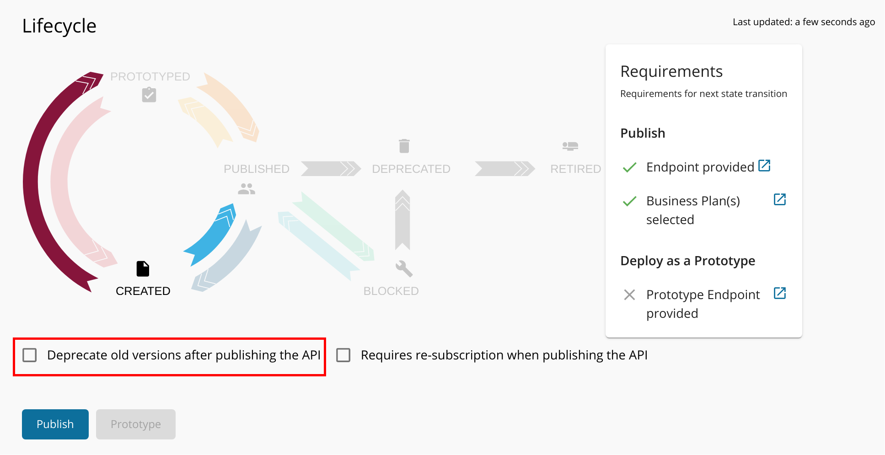

# Publish the New Version and Deprecate Old Versions

When you publish a new version of an API, you have to maintain the old versions of the API until all the subscribers move to the new version. However, it would be best if you encourage subscribers to use the latest version. For this use case, you can use '**Deprecate old versions after publishing the API**' option when publishing the new version.

!!! note
    For more details on the API lifecycle stages, see [API lifecycle](../lifecycle-management/api-lifecycle.md).

1.  Sign in to the WSO2 API Publisher as a user who has the `publisher` role assigned to themselves.

     `https://<hostname>:9443/publisher`

2.  Click on the API that you created in the [previous tutorial](create-a-new-api-version.md) (e.g., `PizzaShackAPI 2.0.0`).

3.  Click **Lifecycle**. The API Lifecycle page appears.

4.  Check **Deprecate old versions after publishing the API** checkbox, if you want to deprecate previous versions. 

5. Click **Publish**.

    !!! info
        The **Publish** button is only accessible to users who have the `publisher` permission.

     
        
!!! note
    Leave the **Requires Re-Subscription when publishing the API** checkbox cleared if you want all users who are subscribed to the older version of the API to be automatically subscribed to the new version. If not, they need to subscribe to the new version again.

You have now published the API to the Developer Portal and deprecated the previous versions that correspond to that respective API.

!!! tip
    When an API is deprecated, new subscriptions are disabled (you cannot see the subscription options), and existing subscribers can continue to use the API as usual until it is eventually retired.
