# Deploy and Test Prototype APIs

You would need to create an API prototype for the purpose of early promotion and testing. You can deploy a new API or a new version of an existing API as a prototype. It gives subscribers an early implementation of the API that they can try out without a subscription or monetization, and in-turn the subscribers can provide feedback to improve the API. After a period of time, the publishers can make changes that the users request and publish the API.

## Step 1 - Deploy a created API as a Prototype

!!! note

    The example described in the following steps uses the `PizzaShackAPI 1.0.0` API. For more information on creating this API, see 
    [Create a New API Version](../api-versioning/create-a-new-api-version.md).

1.  Sign in to the WSO2 API Publisher `https://<hostname>:9443/publisher` and click on the API (e.g., `PizzaShackAPI 1.0.0`) that you want to prototype.
     
     [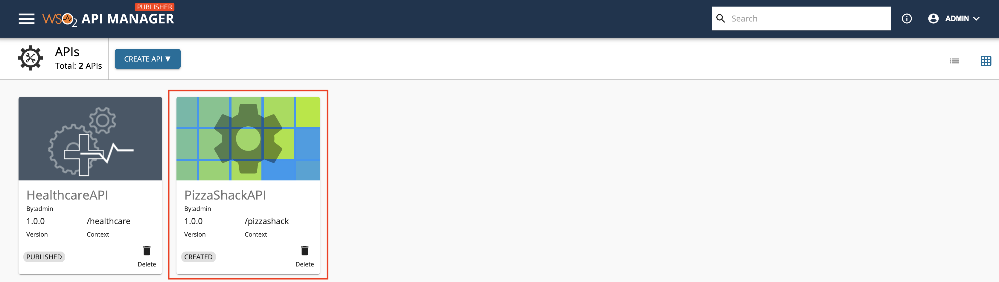](../../assets/img/learn/prototype-api-pizza-shack-publisher.png)

2. Click **Endpoints** and select **Prototype Endpoint** to select the prototype endpoint type.

     [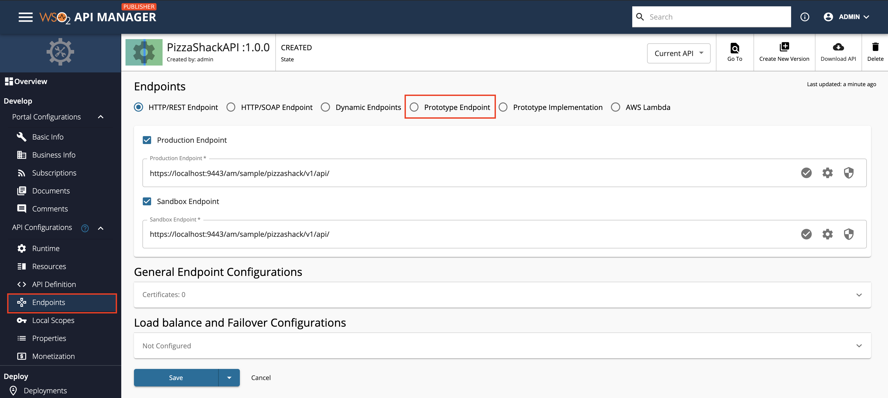](../../assets/img/learn/prototype-api-select-endpoint-type.png)

3. Save and then click **PROCEED**.
    
     
 
4.  Enter the prototype endpoint for the API.

     Let's use the same Production/Sandbox endpoint in this example: `https://localhost:9443/am/sample/pizzashack/v1/api/`

     [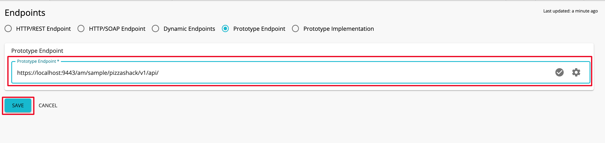](../../assets/img/learn/prototype-api-endpoint-added.png)

5. Click **SAVE** after the endpoint is added.    

6.  Click **Lifecycle** and click **Deploy as a Prototype**.

     [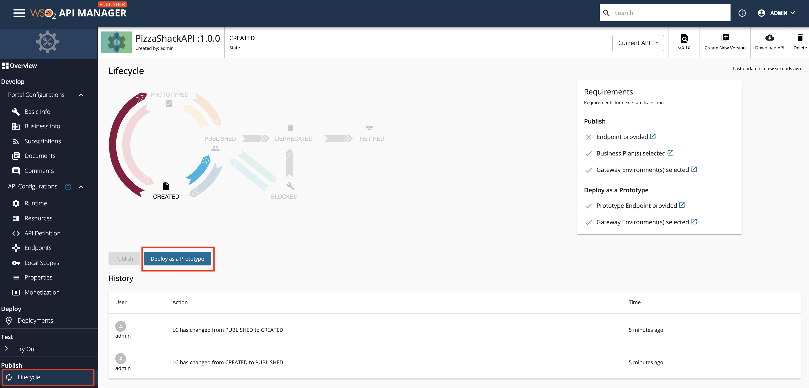](../../assets/img/learn/prototype-api-deploy-as-prototype.png)

    !!! note
        After creating a new version, you typically deploy it as a prototype for the purpose of testing and early promotion.

4.  Click **View in Developer Portal** in the API Publisher to navigate to the Developer Portal.

     [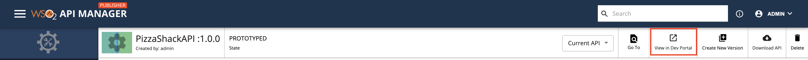](../../assets/img/learn/prototype-api-view-in-dev-portal.png)
    
    !!! note
        - It is not necessary to sign in to the Developer Portal to invoke prototyped APIs.
        - Subscriptions are not allowed for prototype API.
    
    The **Overview** page of the API appears.

    [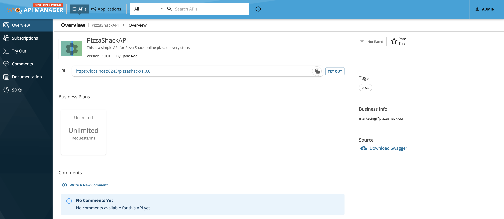](../../assets/img/learn/prototype-api-subscriptions-not-allowed.png)

5.  Click **Try Out** to invoke the Prototyped API. 
   
     [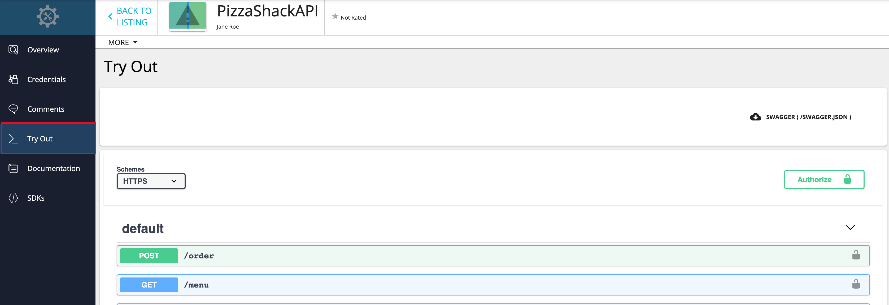](../../assets/img/learn/prototype-api-try-out-menu.png)

6.  Expand the `GET /menu` method and click **Try it out** in the **API Console** of the prototyped API.

     [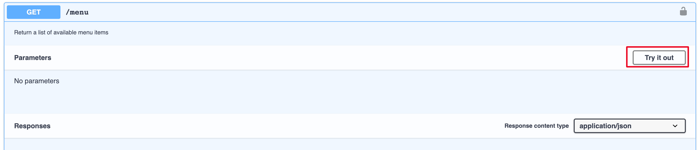](../../assets/img/learn/prototype-api-menu-try-it-out.png)

7.  Click **Execute** to invoke the API.

     [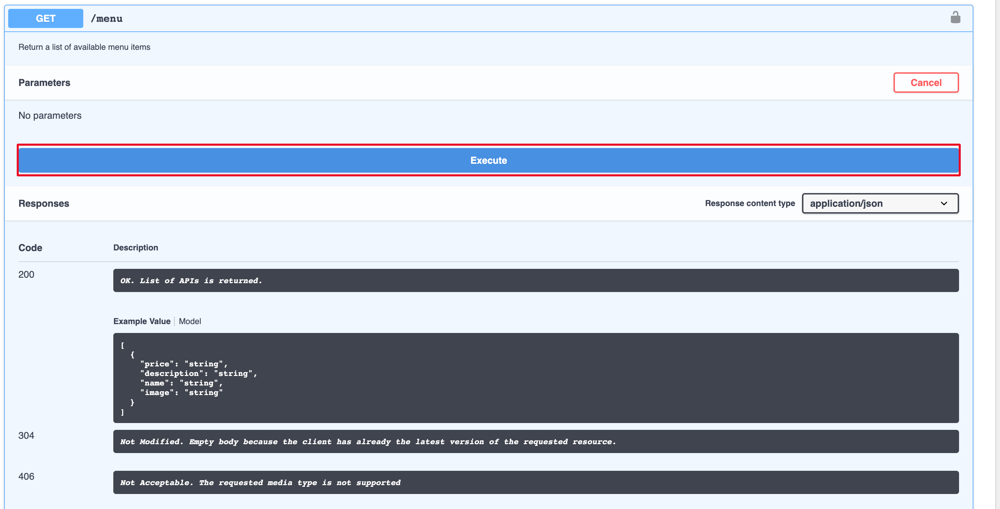](../../assets/img/learn/prototype-api-execute.png)

    Note the response that appears in the console. You do not have to subscribe to the API or pass an authorization key to invoke a prototyped API.
    
    [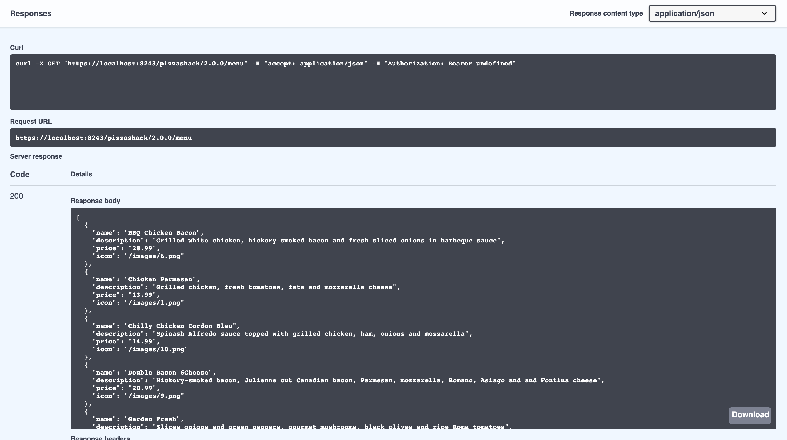](../../assets/img/learn/prototype-api-success-response.png)

## Step 2 - Publish a Prototyped API

After the API is published, the users need to subscribe and generate an access token to invoke the API.

Follow the instructions below to publish a prototyped API with proper production/sandbox endpoints (after testing and promotions): 

1. Navigate to the API Publisher and click on the Prototyped API that you need to Publish.
    
     
    
2. Click **Lifecycle** and click **Demote to Created**.

     [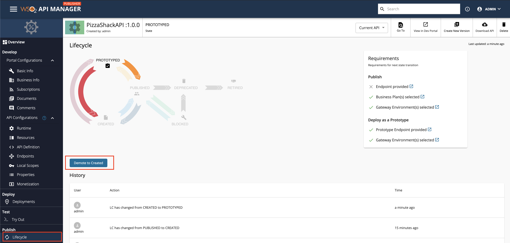](../../assets/img/learn/prototype-api-demote-to-created.png)

3. Check on the **Requirements** section, which lists out the requirements that need to be completed in order to Publish an API. 

    !!! tip
        The requirements for the next lifecycle state change are listed in the Requirements section.
        If there are any requirements that you have not fulfilled, you can click on the link next to each item in the Requirement section to navigate to the corresponding page where you will be able to add the required details.
        [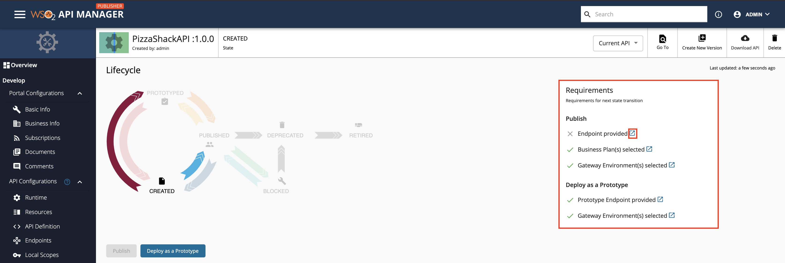](../../assets/img/learn/api-lifecycle-requirements.png)
        
        
    !!! note
        In this scenario, the current endpoint is set as a prototype endpoint. Enter the Production/Sandbox endpoints to publish the API.
         
4. Click **Endpoints**.

     [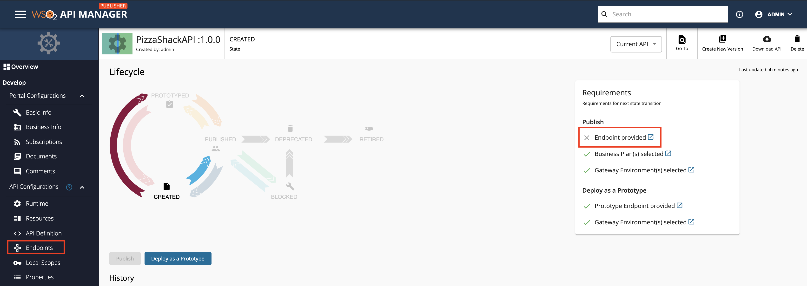](../../assets/img/learn/prototype-api-to-endpoints.png)
 
5. Select the Endpoint type.

     [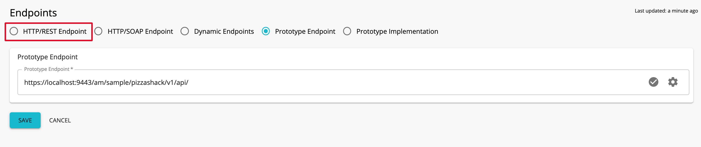](../../assets/img/learn/prototype-api-select-http-endpoint.png)

6. Check the Production/Sandbox check boxes, add the endpoint URL, and click **SAVE** to save the API.

     [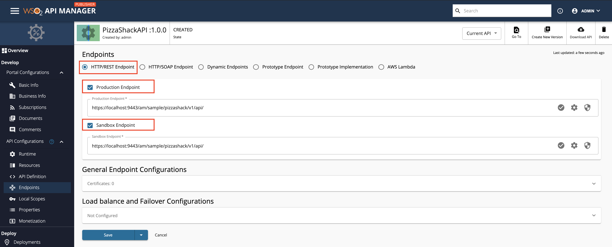](../../assets/img/learn/prototype-api-to-publish-add-endpoint.png)
   
7. Click **Lifecycle** and click **PUBLISH** to Publish the API.

     [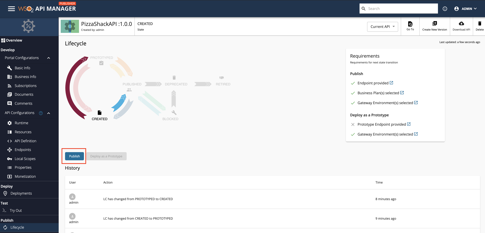](../../assets/img/learn/prototype-api-publish.png)
   