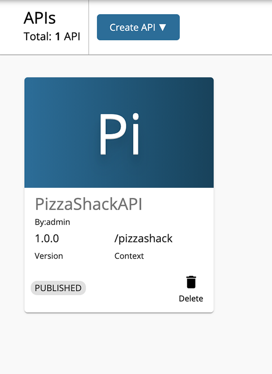
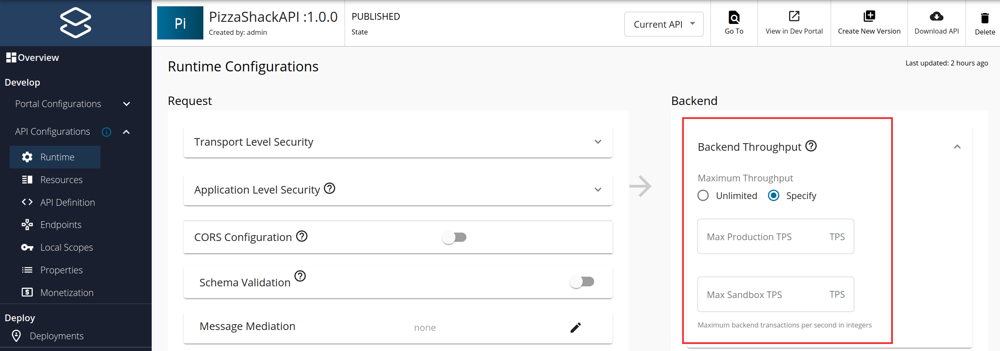

# Setting Maximum Backend Throughput Limits

The maximum backend throughput setting limits the total number of calls a particular API in the API Manager is allowed to make to the backend. While the [other rate limiting levels](setting-throttling-limits.md) define the quota the API invoker gets, they do not ensure that the backend is protected from overuse. The maximum backend throughput setting limits the quota the backend can handle. The counters maintained when evaluating the maximum backend throughput are shared across all nodes of the Gateway cluster and apply across all users using any application that accesses that particular API.

Please follow below steps to set a maximum backend throughput for a given API.

1.  Sign in to the WSO2 API Publisher `https://<hostname>:9443/publisher`.

2.  Click on the API which you want to set the maximum backend throughput.
    
    [](../../assets/img/learn/select-api.png)
    
3.  Navigate to **Runtime** tab under **API Configurations**.

4.  Select the **Specify** option for the maximum backend throughput and specify the limits of the Production and Sandbox endpoints separately, as the two endpoints can come from two servers with different capacities.

    [](../../assets/img/learn/learn-throttling-maxtps.png)
    
5.  Save the API.
    
When the maximum backend throughput quota is reached for a given API, anymore requests won't be accepted for that particular API. Following error message will be returned for all the throttled out requests.

```json
{
  "fault": {
    "code": 900801,
    "message": "API Limit Reached",
    "description": "API not accepting requests"
  }
}

```  