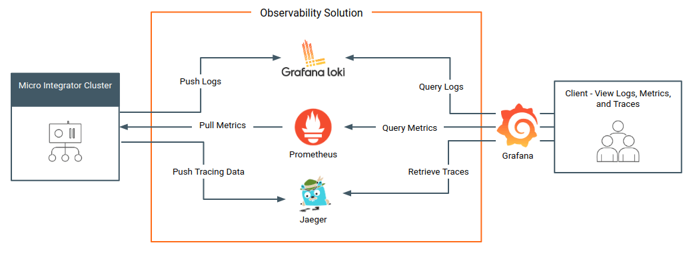
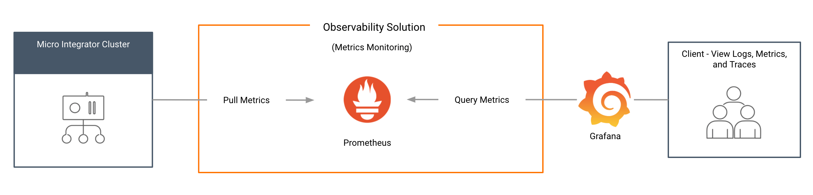
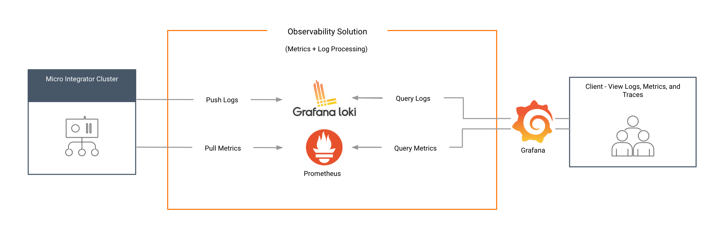
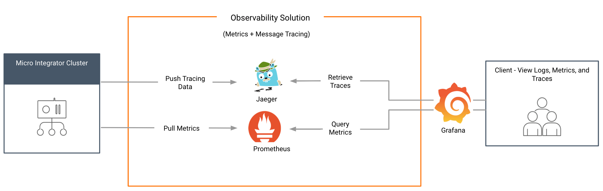

# Observability Deployment Strategy

The following diagram depicts the complete **cloud-native** observability solution for your Micro Integrator deployment, which includes **metrics monitoring**, **log monitoring**, and **message tracing** capabilities.

You can also set up different flavors of this solution depending on your requirement.

The cloud-native solution is more suitable in the following scenarios:

- You are creating a new cloud-native Micro Integrator deployment. 

	!!! Note
		See the instructions on setting up a cloud-native [Micro Integrator deployment on Kubernetes](../deployment/kubernetes_deployment_patterns.md).

- You already have Prometheus, Grafana, and Jaeger as your in-house monitoring and observability tools. This applies to [VM deployments](../deployment/deploying_wso2_ei.md) as well as [Kuberentes deployments](../deployment/kubernetes_deployment_patterns.md).

### Technologies

The cloud-native observability solution is based on proven projects from the **Cloud Native Computing Foundation**, which makes the solution cloud native and not susceptible to changes in future trends. Following are the technologies used in the current solution:

| **Feature**   | **Technology**              |
|---------------|-----------------------------|
| Metrics       | Prometheus                  |
| Visualization | Grafana                     |
| Logging       | Log4j2, Fluent-Bit, and Grafana Loki |
| Tracing       | Jaeger                      |

### Minimum cloud-native observability

The basic deployment offers you metrics capabilities. You can set up the basic deployment with only Prometheus and Grafana to view and explore with the available Prometheus metrics.

### Log processing add on
 
Once you set up the basic deployment, you can integrate log-processing capabilities. To use this, you need to install **Fluent-Bit** as the logging agent and **Grafana Loki** as the log aggregator.

### Message tracing add on

Once you set up the basic deployment, you can integrate message tracing capabilities. To use this, you need to install **Jaeger**.  

## What's Next?

-	Set up <a href="../../../../../observe/micro-integrator/setting-up-cloud-native-observability-on-a-vm.md">cloud-native observability on a VM</a>.
-	Set up <a href="../../../../../observe/micro-integrator/setting-up-cloud-native-observability-in-kubernetes.md">cloud-native observability on Kubernetes</a>.