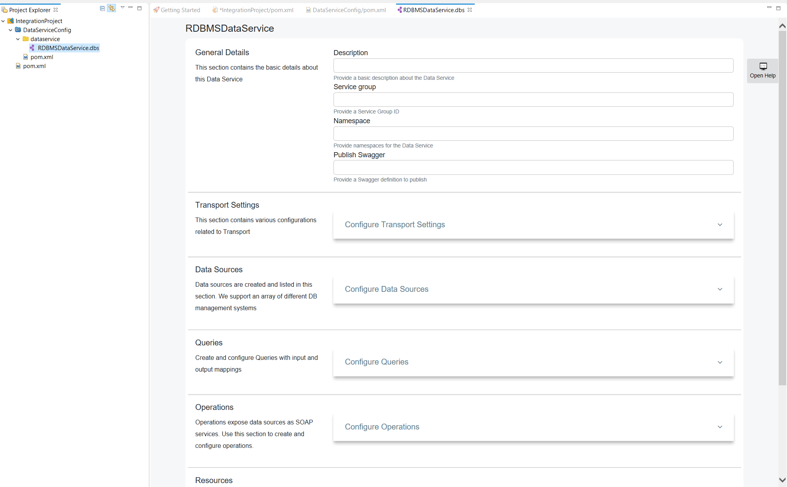
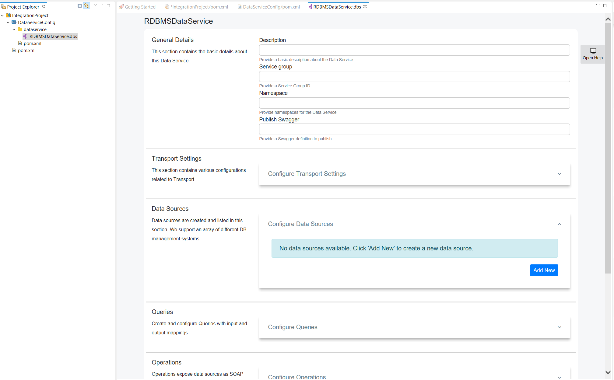
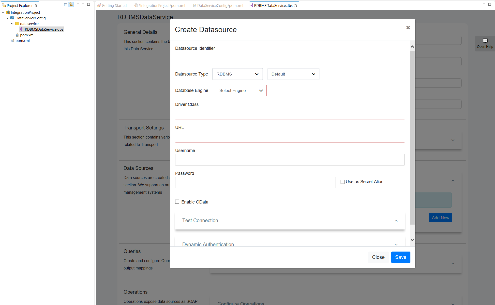
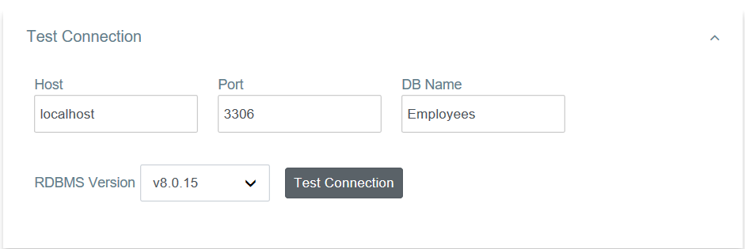
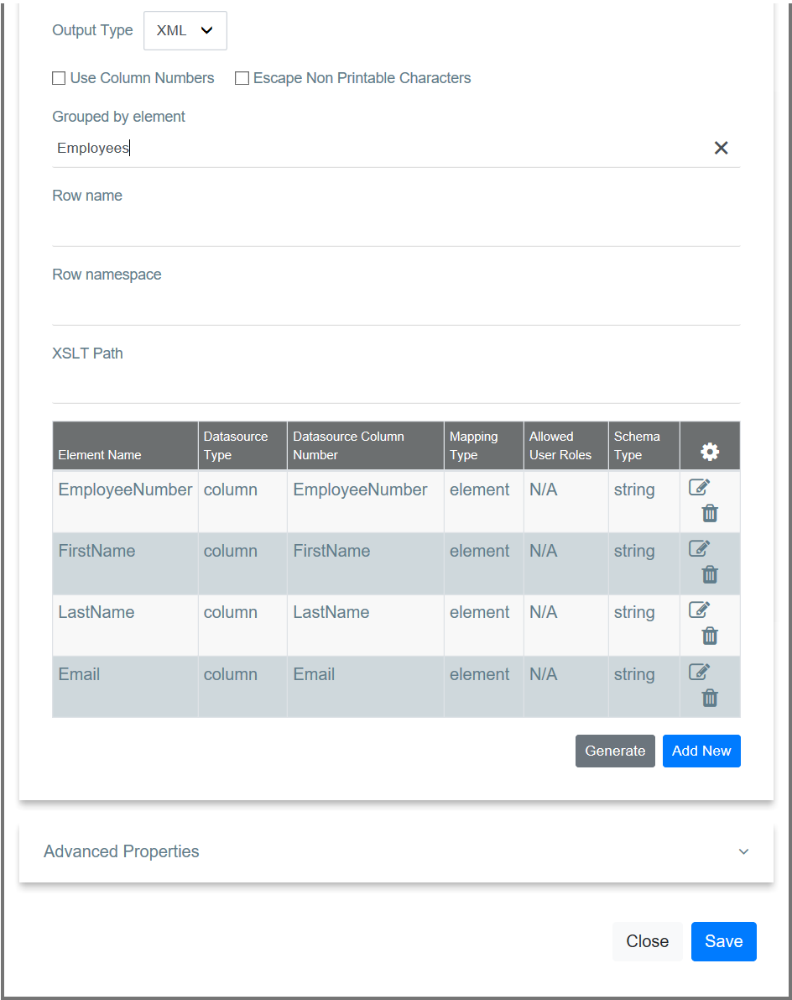
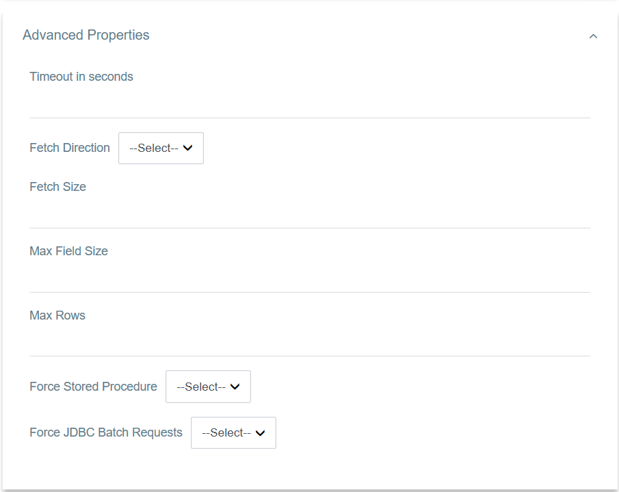

# Creating a Data Service

Follow the instructions given below to create a new data service artifact.

!!!	Tip	
	You can also use a sample template to create your data service.

	1.	Open the **Getting Started** view of WSO2 Integration Studio (**Menu -> Help -> Getting Started**). 
	2.	In the Getting Started view, go to the **Data Service** tab and select the **REST Data Service** example.

## Instructions

### Create the data service artifact

Follow the steps given below to create the data service file:

1.  Right-click the **Data Service Config** module in the project
    explorer and go to **New -> Data Service**. 

    

2.	In the **New Data Service** wizard that opens, select **Create New
    Data Service** and click **Next**.

    

3.  Enter a name for the data service and click **Finish**.

A data service file (DBS file) will now be created in your data service
project as show below.

### Adding a datasource

You can configure the datasource connection details using this section.

1.	Click **Data Sources** to expand the section.

	

2.	Click **Add New** to open the **Create Datasource** page.

	

3.	Enter the datasource connection details.
4.	Click **Test Connection** to expand the section.

    

5.  Click the **Test Connection** button to verify the connectivity between the MySQL datasource and the data service.

6.  Save the data service.

### Creating a query

You can configure the main query details using this section.

1.  Click **Queries** to expand the section. 

    

2.  Click **Add New** to open the **Add Query** page.

    

3.  Enter the following query details.
	
	<table>
		<tr>
			<th>
				Parameter
			</th>
			<th>
				Description
			</th>
		</tr>
		<tr>
			<td>
				Query ID
			</td>
			<td>
				Give a unique name to Identify the Query.
			</td>
		</tr>
		<tr>
			<td>
				Datasource
			</td>
			<td>
			   All the datasources created for this data service are listed. Select the required datasource from the list.
			</td>
		</tr>
		<tr>
			<td>
				SQL Query
			</td>
			<td>
				You can enter the SQL query in this text box.
			</td>
		</tr>
	</table>

#### Input mapping

You can configure input parameters for the query using this section.

1.  Click **Input Mappings** to expand the section. 

    

2.	There are two  ways to create the mapping:
	
	-	You can click **Generate** to automatically generate the input mappings from the SQL query.
	-	If you want to add a new input mapping:

		1.	Click **Add New** to open the **Add Input Mapping** page.

			

		2.	Enter the following input mapping details:

			<table>
				<tr>
					<th>
						Parameter
					</th>
					<th>
						Description
					</th>
				</tr>
				<tr>
					<td>
						Mapping Name
					</td>
					<td>
						Give a name for the mapping.
					</td>
				</tr>
				<tr>
					<td>
						Parameter Type
					</td>
					<td>
						The parameter type.
					</td>
				</tr>
				<tr>
					<td>
						SQL Type
					</td>
					<td>
						The SQL type.
					</td>
				</tr>
			</table>

		3.	Save the input mapping. 

Shown below is an example query with input mapping:
                        

#### Result (Output Mappings) 

You can configure output result parameters for the query using this section.

1.  Click **Result (Output Mappings)** to expand the section.
    
    
    
2.  Enter the following details:

    <table>
        <tr>
            <th>Property</th>
            <th>Description</th>
        </tr>
    <tr class="odd">
    <td>Grouped by Element</td>
    <td>Employees</td>
    </tr>
    </table>

3.	There are two ways to create the output mapping:

	-	You can click **Generate** to automatically generate the output mappings from the SQL query.
	-	Alternatively, you can manually add the mappings:

		1. Click **Add New** to open the **Add Output Mapping** page.

			

		2. Enter the following output element details.

		    <table>
		    <tr>
		            <th>Property</th>
		            <th>Description</th>
		        </tr>
		    <tbody>
		    <tr class="odd">
		    <td>Datasource Type</td>
		    <td>column</td>
		    </tr>
		    <tr class="even">
		    <td>Output Field Name</td>
		    <td>EmployeeNumber</td>
		    </tr>
		    <tr class="odd">
		    <td>Datasource Column Name</td>
		    <td>EmployeeNumber</td>
		    </tr>
		    <tr class="even">
		    <td>Schema Type</td>
		    <td>String</td>
		    </tr>
		    </tbody>
		    </table>   

		3.  Save the element.
		4.  Follow the same steps to create the remaining output elements.

Shown below is an example query with output mappings:

#### Advanced properties 

Click **Advanced Properties** to expand the section and add the required parameter values.

The data service should now have the query element added.

### Adding a SOAP operation

Use this section to configure a SOAP operation for invoking the data service.

1.  Click **Operations** to expand the section.

    

2.  Click **Add New** to add a SOAP Operation for your data service.

	

3.	Enter the following information:

	<table>
		<tr>
			<th>
				Parameter
			</th>
			<th>
				Description
			</th>
		</tr>
		<tr>
			<td>
				Operation Name
			</td>
			<td>
				Give a name to the SOAP Operation.
			</td>
		</tr>
		<tr>
			<td>
				Query ID
			</td>
			<td>
				Select the Query from the listed queries.
			</td>
		</tr>
		<tr>
			<td>
				Operation Parameters
			</td>
			<td>
				Click <b>Add New</b> to add new parameters to the operation.
			</td>
		</tr>
	</table>

### Adding a Resource

Use this section to configure a REST resource for invoking the data service.

1.  Click **Resources** to expand the section.
	
	

2.	Click **Add New** to add a new resource.

	

3.	Give the following details to create the REST resource. 

	<table>
		<tr>
			<th>
				Parameter
			</th>
			<th>
				Description
			</th>
		</tr>
		<tr>
			<td>
				Resource Path
			</td>
			<td>
				Give the HTTP REST resource path you need to expose.
			</td>
		</tr>
		<tr>
			<td>
				Query ID
			</td>
			<td>
				Select the Query ID from the drop down list that you need to expose as a REST resource.
			</td>
		</tr>
	</table>

4.	Click **Save** to add the resource to the data service.

The data service should now have the resource added.

## Examples

<ul>
	<li>
		<a href="../../../../examples/data_integration/rdbms-data-service.md">Exposing an RDBMS Datasource</a>
	</li>
	<li>
		<a href="../../../../examples/data_integration/json-with-data-service.md">Exposing Data in JSON Format</a>
	</li>
	<li>
		<a href="../../../../examples/data_integration/odata-service.md">Using an OData Service</a>
	</li>
	<li>
		<a href="../../../../examples/data_integration/nested-queries-in-data-service.md">Using Nested Data Queries</a>
	</li>
	<li>
		<a href="../../../../examples/data_integration/batch-requesting.md">Batch Requesting</a>
	</li>
	<li>
		<a href="../../../../examples/data_integration/request-box.md">Invoking Multiple Operations via Request Box</a>
	</li>
	<li>
		<a href="../../../../examples/data_integration/distributed-trans-data-service.md">Using Distributed Transactions in Data Services</a>
	</li>
	<li>
		<a href="../../../../examples/data_integration/data-input-validator.md">Validating Data Input</a>
	</li>
</ul>

## Tutorials

<li>
	See the tutorial on <a href="../../../../../tutorials/integration-tutorials/sending-a-simple-message-to-a-datasource.md">data integration</a>
</li>