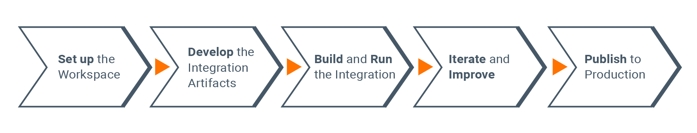

# Developing Integration Solutions

The contents on this page will walk you through the topics related to developing integration solutions using WSO2 Integration Studio.

## WSO2 Integration Studio

WSO2 Integration Studio is the comprehensive developer tool, which you will use to <b>develop</b>, <b>build</b>, and <b>test</b> your integration solutions before the solutions are pushed to your production environments. See the topics given below for details.

<table>
    <tr>
        <td>
            <a href="../wso2-integration-studio.md">Quick Tour of WSO2 Integration Studio</a>
        </td>
        <td>
            Get introduced to the main functions of WSO2 Integration Studio.
        </td>
    </tr>
    <tr>
        <td>
            <a href="../installing-wso2-integration-studio.md">Installing WSO2 Integration Studio</a>
        </td>
        <td>
            Find the instructions on how to download and install the tool on your operating system.
        </td>
    </tr>
    <tr>
        <td>
            <a href="../troubleshooting-wso2-integration-studio.md">Troubleshooting WSO2 Integration Studio</a>
        </td>
        <td>
            Find details on how to troubleshoot errors you might encounter as you use WSO2 Integration Studio.
        </td>
    </tr>
</table>

## Development workflow

Integration developers will follow the workflow illustrated by the following diagram.

### Set up the workspace

To start developing integration solutions, you need to first <a href="../installing-wso2-integration-studio.md">install and set up WSO2 Integration Studio</a>.

### Develop

-   Create projects and modules

    <table>
        <tr>
            <td>
                <a href="../create-integration-project.md#integration-project">Create an Integration project</a>
            </td>
            <td>
                An integration project is a maven multi module project that will include all the modules (sub projects) of your integration solution.
            </td>
        </tr>
        <tr>
            <td>
                <a href="../create-integration-project.md#sub-projects">Add sub projects to Integration project</a>
            </td>
            <td>
                Once you have created an integration project, you can add new sub projects if required.
            </td>
        </tr>
        <tr>
            <td>
                <a href="../create-integration-project.md#moving-sub-projects-to-mmm-project">Move sub projects to Integration project</a>
            </td>
            <td>
                You can move sub projects to the required integration project from any location in the workspace.
            </td>
        </tr>
    </table>

-   Create artifacts

    <table>
        <tr>
            <td>
                <b>Message Entry Points</b>
                <ul>
                    <li>
                        <a href="../creating-artifacts/creating-an-api.md">REST API</a>
                    </li>
                    <li>
                        <a href="../creating-artifacts/creating-a-proxy-service.md">Proxy Service</a>
                    </li>
                    <li>
                        <a href="../creating-artifacts/creating-an-inbound-endpoint.md">Inbound Endpoint</a>
                    </li>
                    <li>
                        <a href="../creating-artifacts/creating-scheduled-task.md">Scheduled Task</a>
                    </li>
                </ul>
            </td>
            <td>
                <b>Message Processing Units</b>
                <ul>
                    <li>
                        <a href="../creating-artifacts/creating-a-message-store.md">Message Store</a>
                    </li>
                    <li>
                        <a href="../creating-artifacts/creating-a-message-processor.md">Message Processor</a>
                    </li>
                    <li>
                        <a href="../creating-artifacts/creating-endpoints.md">Endpoint</a>
                    </li>
                    <li>
                        <a href="../creating-artifacts/creating-endpoint-templates.md">Endpoint Template</a>
                    </li>
                    <li>
                        <a href="../creating-artifacts/creating-sequence-templates.md">Sequence Template</a>
                    </li>
                    <li>
                        <a href="../creating-artifacts/creating-reusable-sequences.md">Reusable Sequences</a>
                    </li>
                </ul>
            </td>
            <td>
                <b>Registry Resources</b>
                <ul>
                    <li>
                        <a href="../creating-artifacts/creating-registry-resources.md">Registry Resource</a>
                    </li>
                    <li>
                        <a href="../creating-artifacts/registry/creating-local-registry-entries.md">Local Entry</a>
                    </li>
                </ul>
            </td>
        <tr>
            <td>
                <b>Data Services Resources</b>
                <ul>
                    <li>
                        <a href="../creating-artifacts/data-services/creating-data-services.md">Data Service</a>
                    </li>
                    <li>
                        <a href="../creating-artifacts/data-services/creating-datasources.md">Datasource</a>
                    </li>
                    <li>
                        <a href="../creating-artifacts/data-services/creating-input-validators.md">Input Validator</a>
                    </li>
                </ul>
            </td>
            <td>
                <b>Custom Artifacts</b>
                <ul>
                    <li>
                        <a href="../customizations/creating-custom-mediators.md">Custom Mediator</a>
                    </li>
                    <li>
                        <a href="../customizations/creating-custom-inbound-endpoint/">Custom Inbound Endpoint</a>
                    </li>
                    <li>
                        <a href="../customizations/creating-new-connector.md">Custom Connector</a>
                    </li>
                    <li>
                        <a href="../customizations/creating-custom-task-scheduling.md">Custom Scheduled Task</a>
                    </li>
                    <li>
                        <a href="../customizations/creating-synapse-handlers.md">Synapse Handler</a>
                    </li>
                </ul>
            </td>
            <td>
                <b>Other</b>
                <ul>
                    <li>
                        <a href="../exporting-artifacts.md">Export Artifacts</a>
                    </li>
                    <li>
                        <a href="../importing-artifacts.md">Import Artifacts</a>
                    </li>
                </ul>
            </td>
        </tr>
    </table>

-   Secure the artifacts

    <table>
        <tr>
            <td>
                <b>Encrypting Sensitive Data</b>
                <ul>
                    <li>
                        <a href="../../../install-and-setup/setup/mi-setup/security/encrypting_plain_text.md">Encrpting Secrets</a>
                    </li>
                    <li>
                        <a href="../creating-artifacts/using_docker_secrets.md">Docker Secrets</a>
                    </li>
                    <li>
                        <a href="../creating-artifacts/using_k8s_secrets.md">Kubernetes Secrets</a>
                    </li>
                    <li>
                        <a href="../../../install-and-setup/setup/mi-setup/security/single_key_encryption.md">Symmetric Encryption</a>
                    </li>
                </ul>
            </td>
            <td>
                <b>Securing APIs and Services</b>
                <ul>
                    <li>
                        <a href="../advanced-development/applying-security-to-an-api.md">Securing REST APIs</a>
                    </li>
                    <li>
                        <a href="../advanced-development/applying-security-to-a-proxy-service.md">Securing Proxy Services</a>
                    </li>
                    <li>
                        <a href="../creating-artifacts/data-services/securing-data-services.md">Securing Data Services</a>
                    </li>
                </ul>
            </td>
        </tr>
    </table>

### Build and run

1.  <a href="../packaging-artifacts.md">Package</a>

    The artifacts and modules should be packaged in a <b>Composite Exporter</b> before they can be deployed in any environment.

2.  <a href="../deploy-artifacts.md">Deploy</a>

    You can easily deploy and try out the packaged integration artifacts on your preferred environment:

    <table>
        <tr>
            <td>
                <ul>
                    <li>
                        Deploy on the <a href="../using-embedded-micro-integrator.md">Embedded Micro Integrator</a>
                    </li>
                    <li>
                        Deploy on a <a href="../using-remote-micro-integrator.md">Remote Micro Integrator</a>
                    </li>
                    <li>
                        Deploy on <a href="../create-docker-project.md">Docker</a>
                    </li>
                    <li>
                        Deploy on <a href="../create-kubernetes-project.md">Kubernetes</a>
                    </li>
                </ul>
            </td>
        </tr>
    </table>

3.  <a href="../creating-unit-test-suite.md#run-unit-test-suites">Unit Tests</a>

    Use the <b>integration test suite</b> of WSO2 Integration Studio to run unit tests on the developed integration solution.

### Iterate and improve

As you build and run the integration flow, you may identify errors that need to be fixed, and changes that need to be done to the synapse artifacts.

<table>
    <tr>
        <td>
            Debug Mediations
        </td>
        <td>
            Use the <a href="../debugging-mediation.md">Mediation Debug</a> function in WSO2 Integration Studio to debug errors while you develop the integration solutions.
        </td>
    </tr>
    <tr>
        <td>
            Using Logs
        </td>
        <td>
            You can enable and analyze the following logs to debug various errors:
            <ul>
                <li>
                    <a href="../using-wire-logs.md">Wire Logs</a>
                </li>
                <li>
                    <a href="../monitoring-service-level-logs.md">Proxy Service Access Logs</a>
                </li>
                <li>
                    <a href="../monitoring-api-level-logs.md">REST API Access Logs</a>
                </li>
            </ul>
        </td>
    </tr>
</table>

You must redeploy the integration artifacts after applying changes.

-   If you are testing on a VM, the artifacts will be instantly deployed when you <a href="../deploy-artifacts.md">redeploy the synapse artifacts</a>.
-   If you are testing on containers, you need to rebuild the <a href="../create-docker-project.md">Docker images</a> or <a href="../create-kubernetes-project.md">Kubernetes artifacts</a>.

### Push to production

It is recommended to use a <b>CICD pipeline</b> to deploy your tested integration solutions in the production environment.

<table>
    <tr>
        <td>
            <b>On-Premise Environment</b>
        </td>
        <td>
            You can easily push your integration solutions to a CICD pipeline because the developer tool (WSO2 Integration Studio) consists of Maven support. See the details on <a href="../create-integration-project.md">Integration Project</a>.
        </td>
    </tr>
    <tr>
        <td>
            <b>Kubernetes Environment</b>
        </td>
        <td>
            If you have a <b>Kubernetes deployment</b>, see the instructions on how to use the <a href="../../../install-and-setup/setup/mi-setup/deployment/mi-cicd-k8s.md">Kubernetes CICD pipeline</a>.
        </td>
    </tr>
</table>

## Related topics

<table>
    <tr>
        <td>
            <b><a href="../integration-development-kickstart.md">Develop your first integration</a></b>
        </td>
        <td>
            Try the development workflow end-to-end by running a simple use case.
        </td>
    </tr>
    <tr>
        <td>
            <b><a href="../../integration-overview.md">Integration Use Cases</a></b>
        </td>
        <td>
            Read about the integration use cases supported by the Micro Integrator.
        </td>
    </tr>
    <tr>
        <td>
            <b><a href="../../integration-overview.md#integration-tutorials">Tutorials</a></b>
        </td>
        <td>
            Develop and try out each integration use case end-to-end.
        </td>
    </tr>
    <tr>
        <td>
            <b><a href="../../integration-overview.md#integration-examples">Examples</a></b>
        </td>
        <td>
            Try out specific integration scenarios by running the samples.
        </td>
    </tr>
</table>