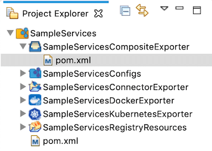
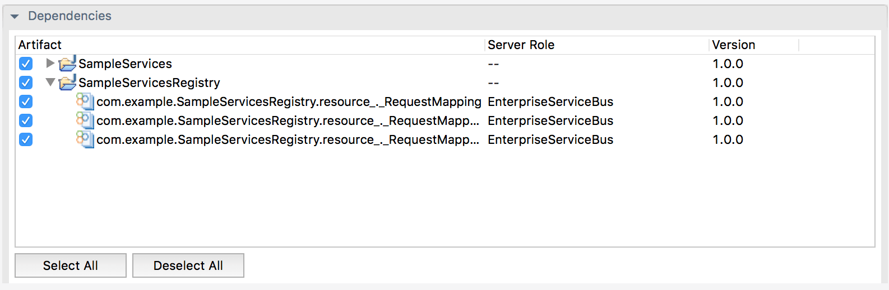
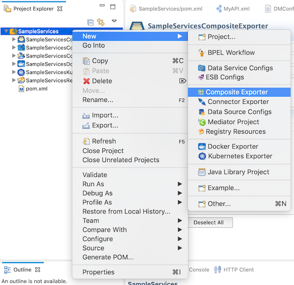
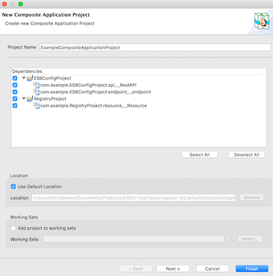
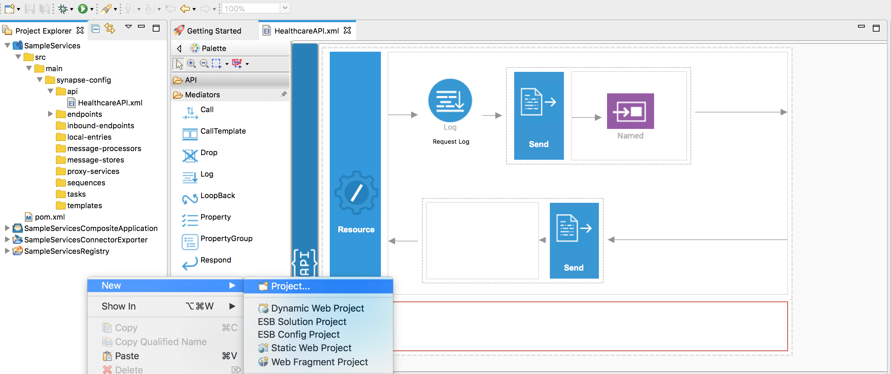
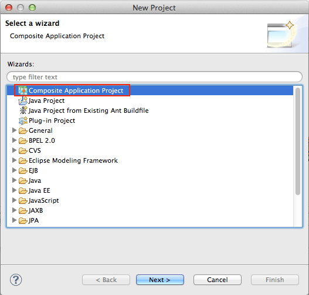
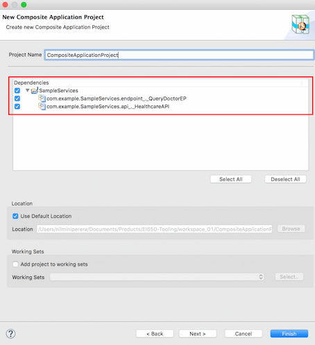
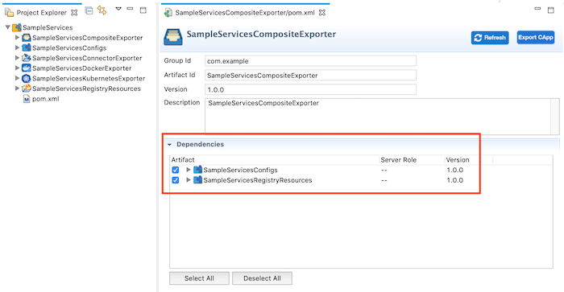

# Packaging Synapse Artifacts

To package Synapse artifacts, you need to create a Composite Application Project. Use one of the following methods:

## Using an existing composite application

If you have an already created composite application project, do the following to package the Synapse artifacts into the composite application:

1.  Select the `pom.xml` file that is under the composite application project in the project explorer.  
    
2.  In the **Dependencies** section, select the artifacts from each of
    the projects.

    !!! Note 
        If you have created a custom mediator artifact, it should be packaged in the same composite application along with the other artifacts that uses the mediator.
    
    

3.  Save the artifacts.

## Creating a new composite application

If you have not previously created a composite application project, do the following to package the artifacts in your ESB Config project.

1.  Right click on the ESB project and go to **New** and then click **Composite Exporter**. 
     
2.  In the **New Composite Application Project** dialog that opens, select the artifacts from the relevant ESB projects and click
    **Finish** .  
    

Alternatively,

1.  Right-click the project explorer and click **New -> Project** .  
    
2.  In the **New Project** dialog that opens, select **Composite
    Application Project** from the list and click **Next** .  
    
3.  Give a name for the **Composite Application** project and select the
    artifacts that you want to package.  
    
4.  In the **Composite Application Project POM Editor** that opens,
    under **Dependencies** , note the information for each of the
    projects you selected earlier.  
    