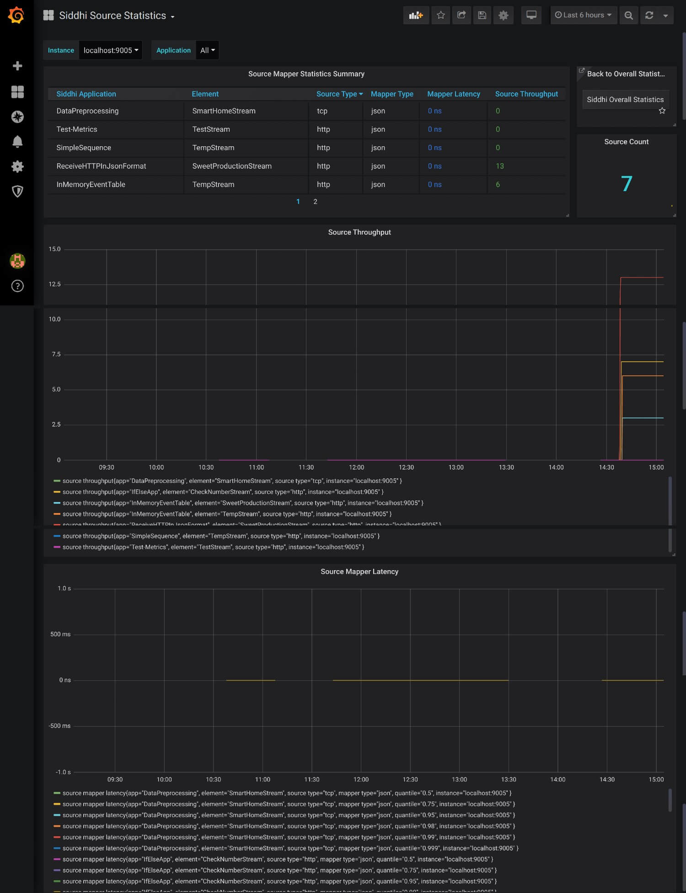
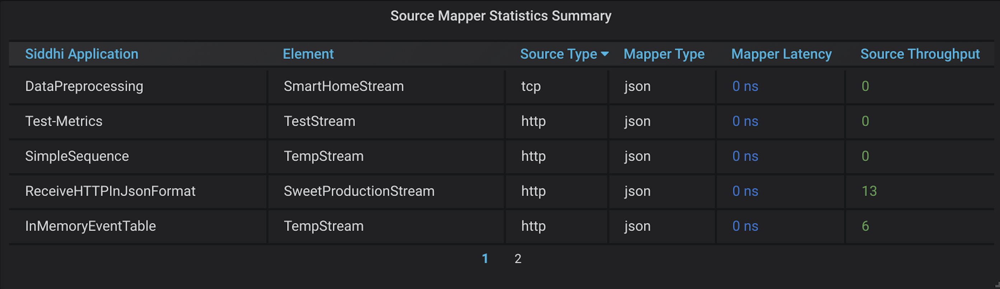
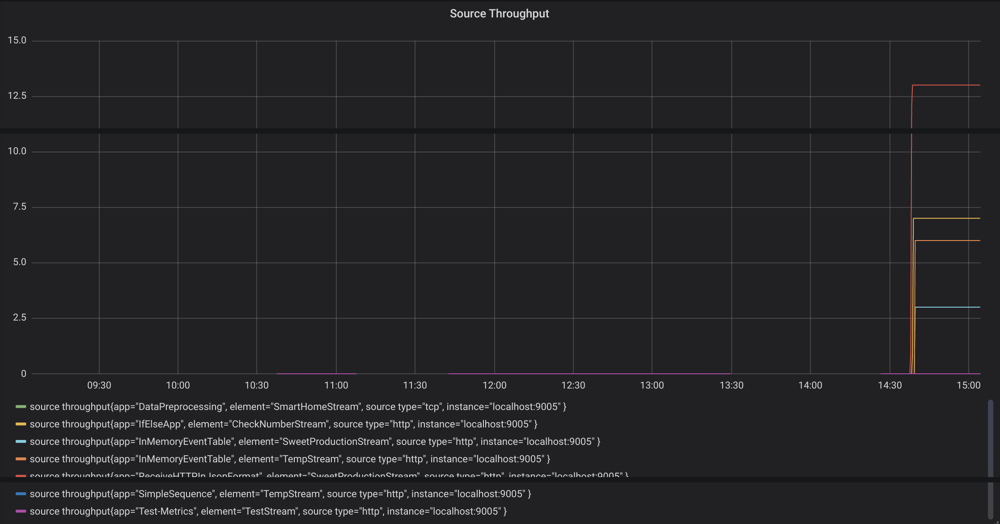
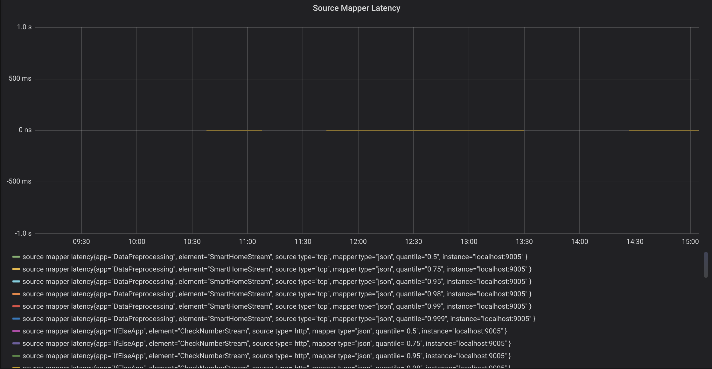

# Viewing Source Statistics

This dashboard displays the following information for your Streaming Integrator deployment:

## Source Mapper Statistics Summary Table

This lists all the source mappers from all the Siddhi applications in your Streaming Integrator server. The table displays the following for each source mapper:

- The Siddhi application in which the source mapper is included

- The stream to which the source mapper is connected

- The type of the source to which the mapper is connected

- The type of the mapper

- Latency of events in the mapper

- The throughput of events to the source to which the mapper is connected
   
## Source Throughput

This shows the throughput of each source mapper in your Streaming Integrator server.

## Source Mapper Latency

This shows the latency of each source mapper in your Streaming Integrator server.