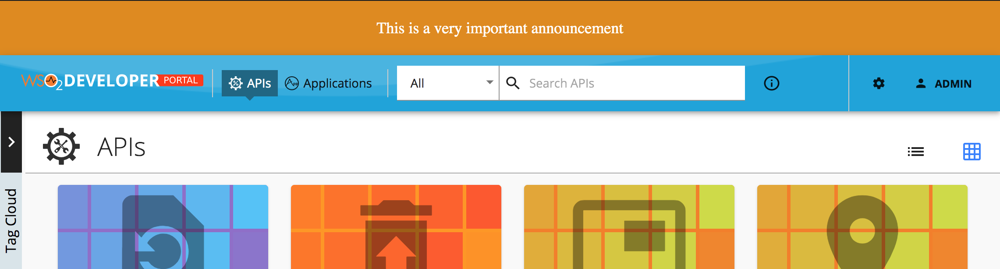

# Enable or Disable Banner

The banner section is hidden by default. The banner section can be used to show an announcement to the developer portal users as follows. 

  

You can show a banner by configuring the `defaultTheme.js` file.

The `defaultTheme.js` file has all the parameters defining the look and feel of the developer portal. To learn more about `defaultTheme.js` refer [here](overriding-developer-portal-theme.md#global-theming).

1. Open the `<API-M_HOME>/repository/deployment/server/jaggeryapps/devportal/site/public/theme/defaultTheme.js` file in a text editor and set the `themes.light.custom.banner.active` attribute as `true` to show the banner.

2. Refresh the Developer Portal to view the changes.

### The following attributes available for the banner

```js
const Configurations = {
    custom: {
        banner: {
            active: true,
            style: 'text',
            image: '/site/public/images/landing/01.jpg',
            text: 'This is a very important announcement',
            color: '#ffffff',
            background: '#e08a00',
            padding: 20,
            margin: 0,
            fontSize: 18,
            textAlign: 'center',
        },
    },
};
```

| Option | type | Description |
| ------ | -- | ----------- |
| active | boolean | Banner is visible if true. Hidden if false (default). |
| style | string | Style value can be 'image' or 'text' (default). If text it will display the 'banner.text' value else it will display the 'banner.image'. |
| image | string | Path to banner image |
| text | string | Text to be shown |
| color | string | Color of the banner text |
| background | string | Background color of the banner |
| padding | integer | CSS padding of the banner |
| margin | integer | CSS margin of the banner |
| fontSize | integer | CSS font-size attribute of the banner text |
| textAlign | string | Text align direction |

