# Create and Publish a GraphQL API

Follow the instructions in this tutorial to design, publish, and invoke a GraphQL API.
<html>
<div class="admonition note">
<p class="admonition-title">Note</p>
<p>For more information on GraphQL APIs, see <a href="../../design/create-api/create-a-graphql-api.md">Create a GraphQL API</a>.</p>
</div> 
</html>
### Step 1 - Design a GraphQL API

1. Sign in to the API Publisher Portal.
   
    `https://<hostname>:9443/publisher` 
   
    Example: `https://localhost:9443/publisher`

    Let's use `admin` as your username and password to sign in.

2. Click **CREATE API** and then click **Import GraphQL SDL**.

     [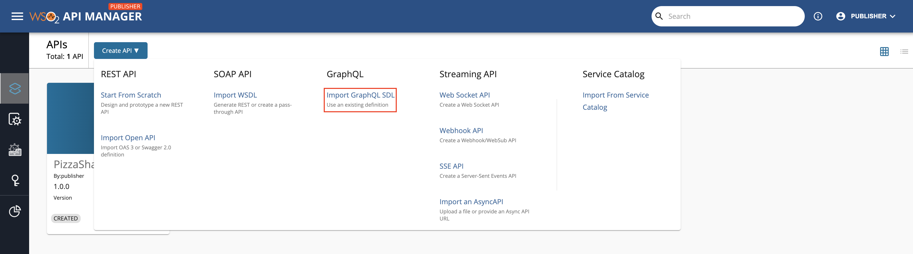](../assets/img/learn/create-graphql-schema-option.png)


3. Import the schema and click **Next**.  

     [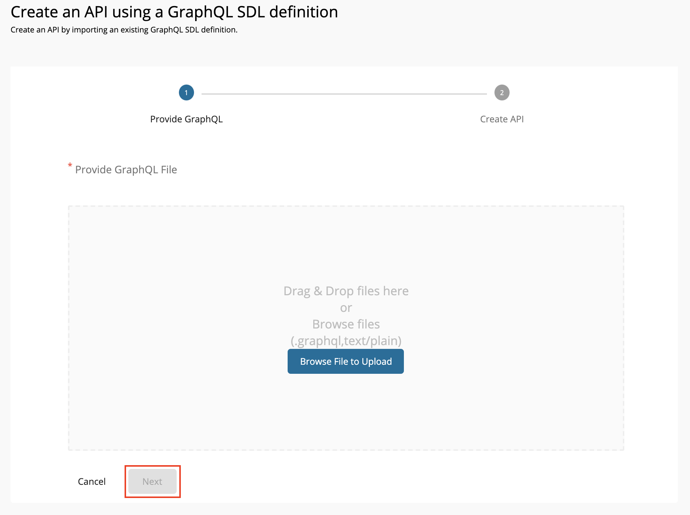](../assets/img/learn/import-graphql-schema.png)

     Let's use the [StarWarsAPI schema definition](../assets/attachments/learn/schema_graphql.graphql) to create the schema file. 
   
      <html>
      <div class="admonition note">
      <p class="admonition-title">Note</p>
      <ul><li>
      <p>You need to define the SDL Schema based on the [GraphQL schema design best practices](https://leapgraph.com/graphql-schema-design-best-practices).</p></li>
      <li>The file extension can be either `.graphql`, `.txt`, or `.json`. </li><li> The file name can be any name, which is based on your preference.</li></ul>
      </div> 
      </html>


      [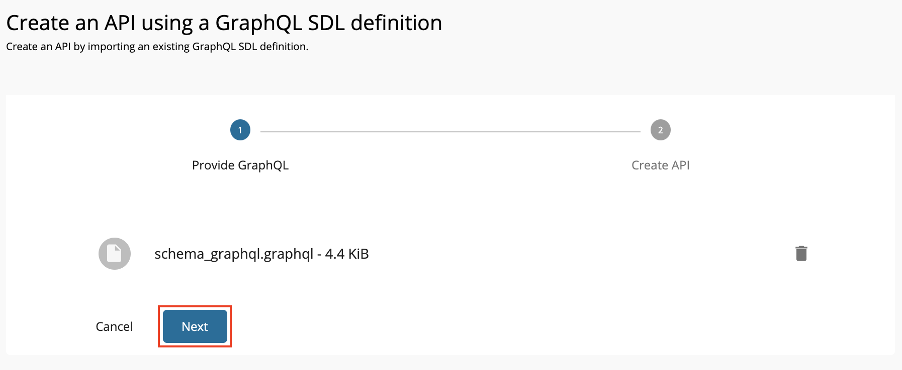](../assets/img/learn/import-graphql-schema-via-file.png)

4. Enter the GraphQL API related details and click **Create**.

    !!! important

        Let's use the Star Wars sample backend server as the backend for our GraphQL API.

        - Clone the [WSO2 API Manager Samples](https://github.com/wso2/samples-apim) repository.
            ```
            git clone https://github.com/wso2/samples-apim
            ```
        - Navigate to `graphql-backend` directory.
        - Run `npm install` to install the necessary node modules.
        - Run `npm start` to start the server.

        Once the above steps are done, the Star Wars server will be running on `http://localhost:8080`. We can use
        `http://localhost:8080/graphql` as the endpoint when creating the API. 
    
    Let's create an API named "StarWarsAPI" using the following sample data.
      <html>
         <table>
            <thead>
            <tr class="header">
            <th><div>
            <div>
            Protocol State
            </div>
            </div></th>
            <th><div>
            <div>
            Description
            </div>
            </div></th>
            </tr>
            </thead>
            <td >
               <p>Name</p>
            </td>
            <td>
               <p>StarWarsAPI</p>
            </td>
            </tr>
            <tr>
            <td>
               <p>Context</p>
            </td>
            <td>
               <p>	
               /swapi</p>
            </td>
            </tr>
            <tr>
            <td>
               <p>Version</p>
            </td>
            <td>
               <p>1.0.0</p>
            </td>
            </tr>
            <tr>
            <td>
               <p>Endpoint</p>
            </td>
            <td>
               <a href="http://localhost:8080/graphql" target="_blank">http://localhost:8080/graphql</a>
            </td>
            </tr>
         </table>
      </html>

      [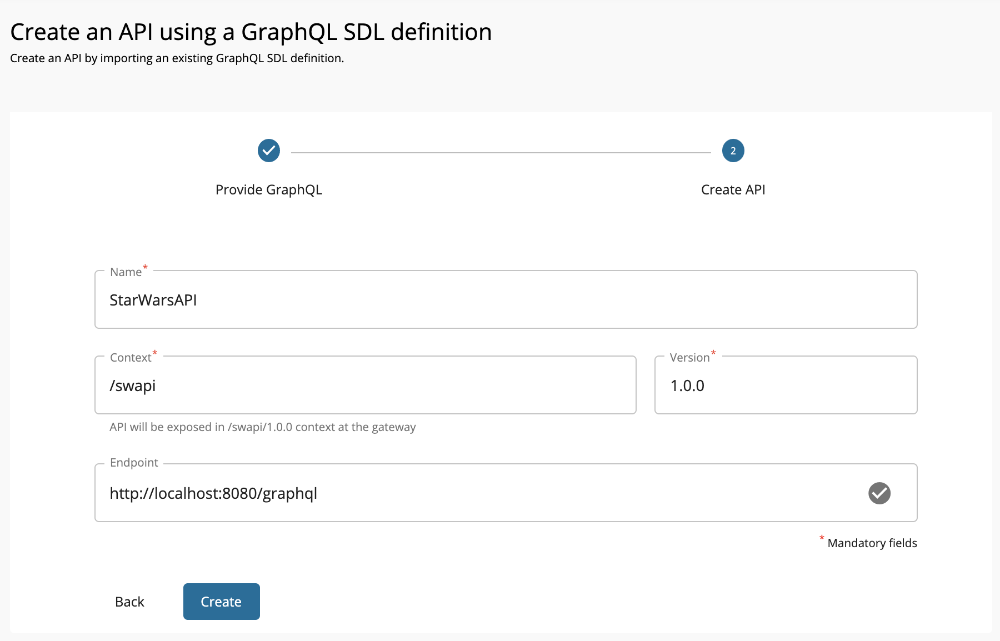](../assets/img/learn/create-graphql-api-details.png)

5. Optionally, modify the existing GraphQL schema definition.

    1. Click **Schema Definition**.

    2. Click **DOWNLOAD DEFINITION**.

         The existing GraphQL API schema gets downloaded.

         [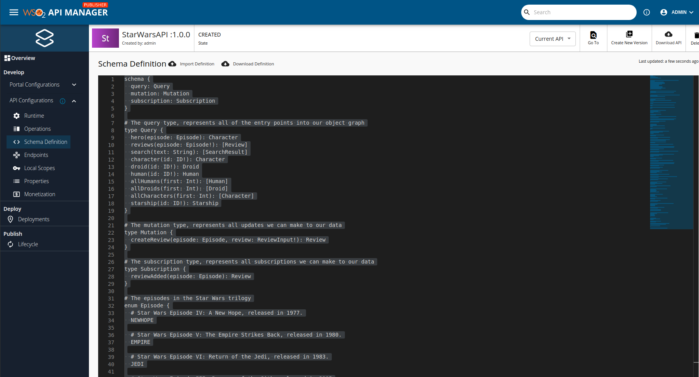](../assets/img/learn/download-schema-definition.png)

    3. Update the schema definition as required.

    4. Click **IMPORT DEFINITION** to import the updated schema definition.

6. Update the GraphQL API operations as required.

    Instead of resources, which get populated for REST APIs, operations get populated for GraphQL APIs.

    1. Click **Show More** under the **Operations** section in the **OVERVIEW** page to navigate to the operations page.

         [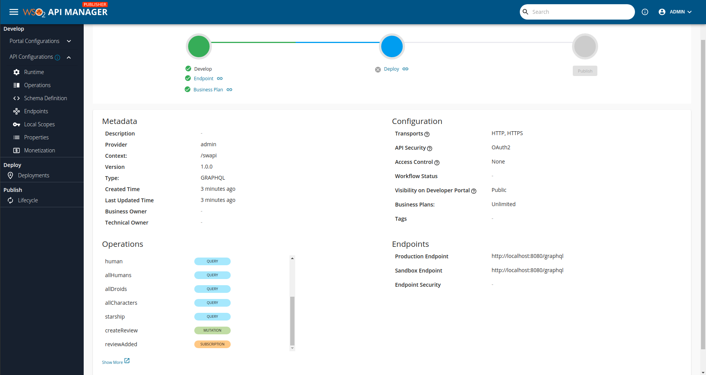](../assets/img/learn/operations.png)  
     
    2. Update the operations as required.
         
        The Publisher can add rate limiting policies, scopes, and enable/disable security for each of the GraphQL API operations.

        1. Create scopes.

            Repeat the following sub-steps to create two scopes named `adminScope` and `FilmSubscriberScope`.

            1. Click **Scopes** > **ADD NEW SCOPE**.

                  [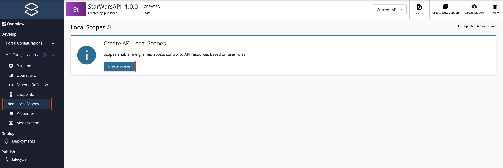](../assets/img/learn/add-scope.png)

            2. Enter the required details.

                  <div class="admonition note">
                  <p class="admonition-title">Note</p>
                  <p> 
                  The role that you enter should be a valid role that already exists in WSO2 API Manager. Make sure to assign the role to the user.
                  </p>
                  </div>
                  
                  Create a role named `FilmSubscriber` and assign it to the `admin` user for this example scenario. For more information, see [Adding Users]({{ base_path }}/administer/product-administration/managing-users-and-roles/adding-users/) and [Adding User Roles]({{ base_path }}/administer/product-administration/managing-users-and-roles/adding-user-roles/).

                  [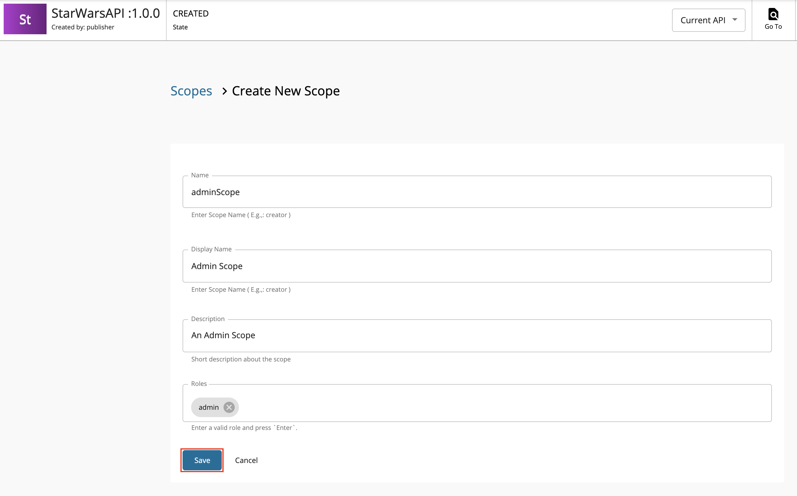](../assets/img/learn/create-scope.png)

            3. Press `Enter` to add each role. 

            4. Click **SAVE**.

                 [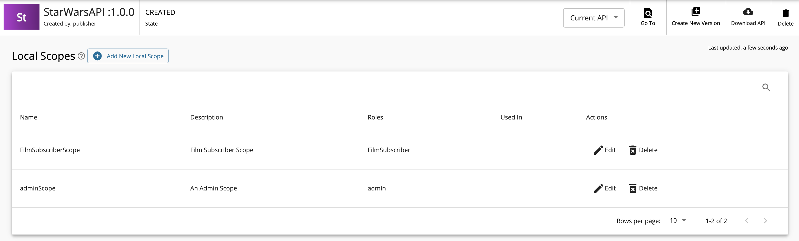](../assets/img/learn/starwars-scope-list.png)

         2. Define the operation level configurations.

            1. Click **Operations**.
            
            2. Click **Operation Level** to apply rate limiting for operations.

                 [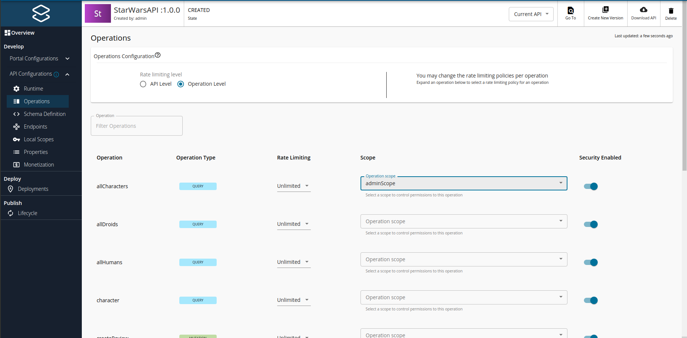](../assets/img/learn/update-operations.png) 

            3. Select a throttling policy, scope, and enable or disable security for each of the operations. 

                 Apply the `adminScope` and `FilmSubscriberScope` scopes to the `allCharacters` and `allDroids` operations, respectively.
            
            4. Click **Save**.

                 If you check the list of scopes, it should appear as follows:

                 [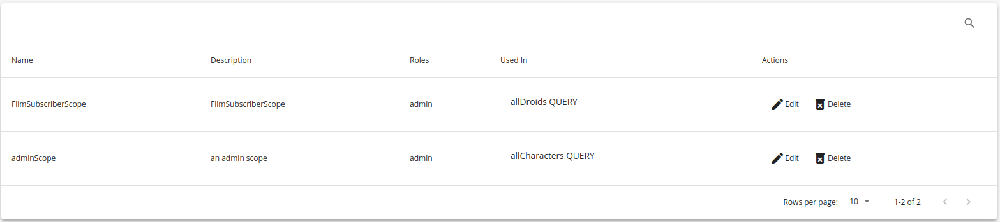](../assets/img/learn/scope-list.png)

Now, you have created and configured the GraphQL API successfully. 

### Step 2 - Deploy and Publish the GraphQL API

1. Click **DEPLOYMENTS** to navigate to the API deployments and click **Deploy** to deploy the API to the default gateway.

     [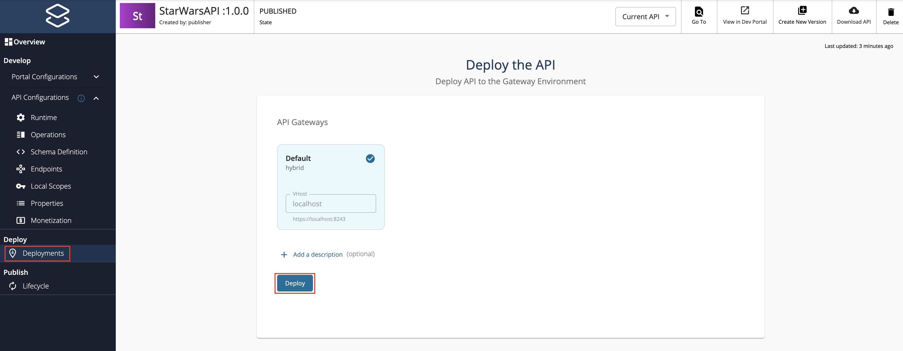](../assets/img/learn/deploy-graphql-api.png)

2. Click **LIFECYCLE** to navigate to the API lifecycle and click **PUBLISH** to publish the API to the API Developer Portal.

     [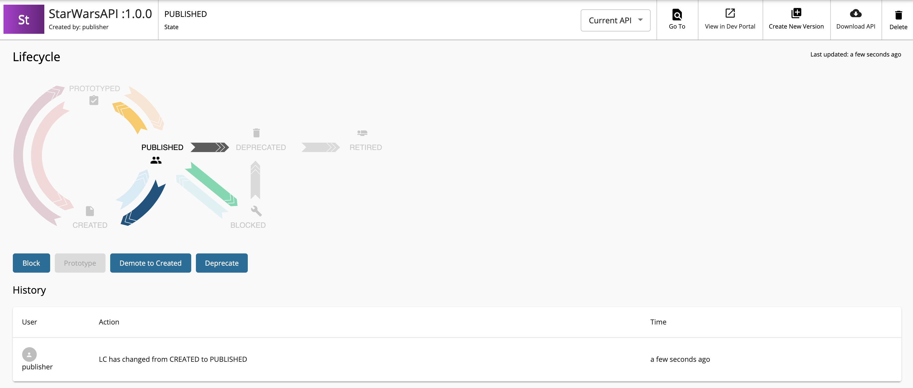](../assets/img/learn/publish-graphql-api.png)

### Step 3 - Invoke the GraphQL API

1. Sign in to the **DEVELOPER PORTAL**.
   
     `https://<hostname>:9443/devportal` 
   
      Example: `https://localhost:9443/devportal`

     [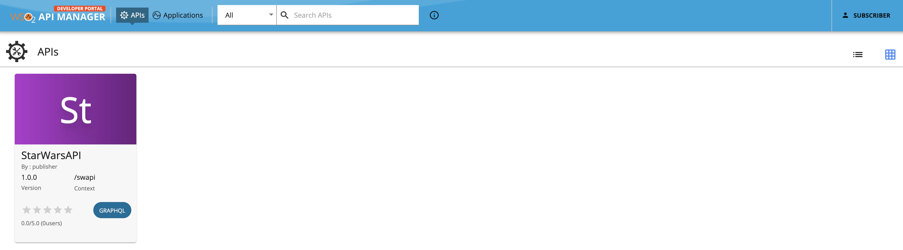](../assets/img/learn/starwars-in-dev-portal.png)
    
2. Click on the GraphQL API.
   
     The API overview appears.
 
     [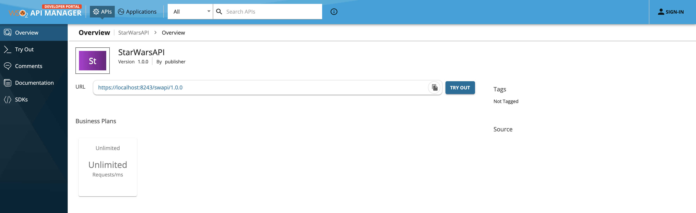](../assets/img/learn/api-overview.png)

3. Optionally, download the API schema if required.

      <html>
      <div class="admonition note">
      <p class="admonition-title">Note</p>
      <p> You can download the API schema even without signing in to the Developer Portal</p>
      </div> 
      </html>

     Click **More** on the API overview page and then click **GRAPHQL SCHEMA** to download the API schema.

     [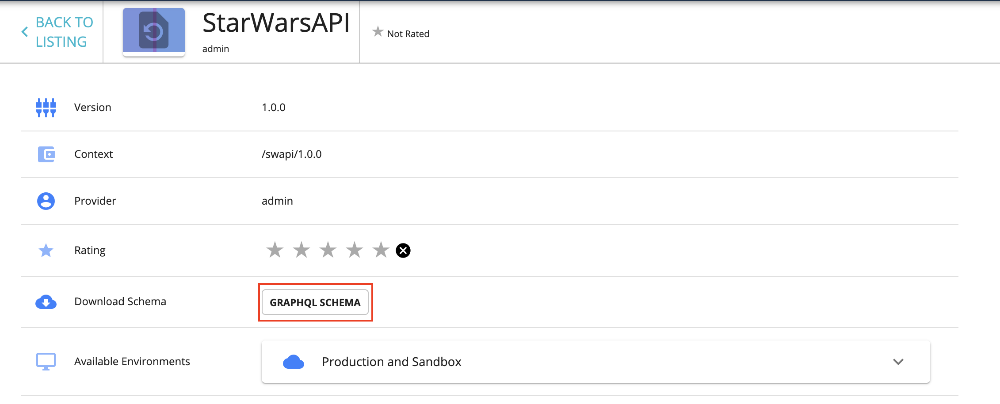](../assets/img/learn/download-schema.png)

4. Subscribe to the API.

    1. Click **TRY OUT**.
    
         [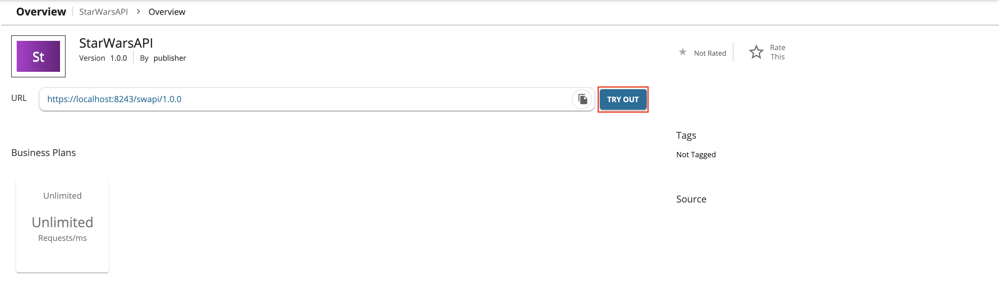](../assets/img/learn/try-out-graphql.png)
         
         This will create a subscription for DefaultApplication and generate consumer key, consumer secret pair for the DefaultApplication. Click **TRY OUT** on the pop-up window to navigate to the try-out console. 

         [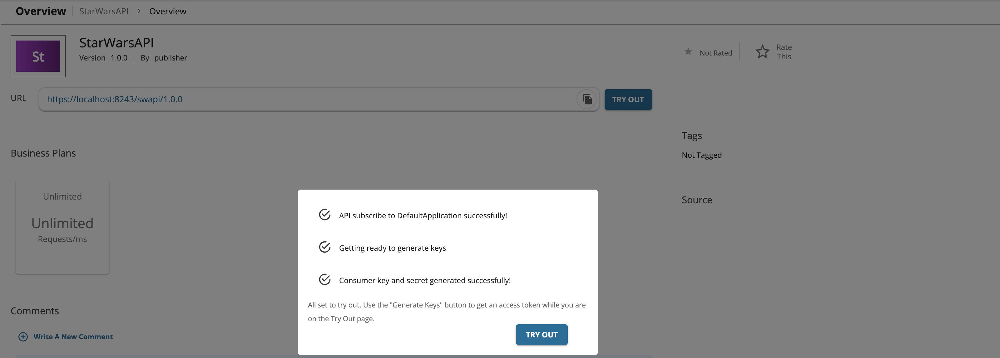](../assets/img/learn/try-out-graphql-popup.png)

5. Try out the operations.
    1. Click **GET TEST KEY**.

         [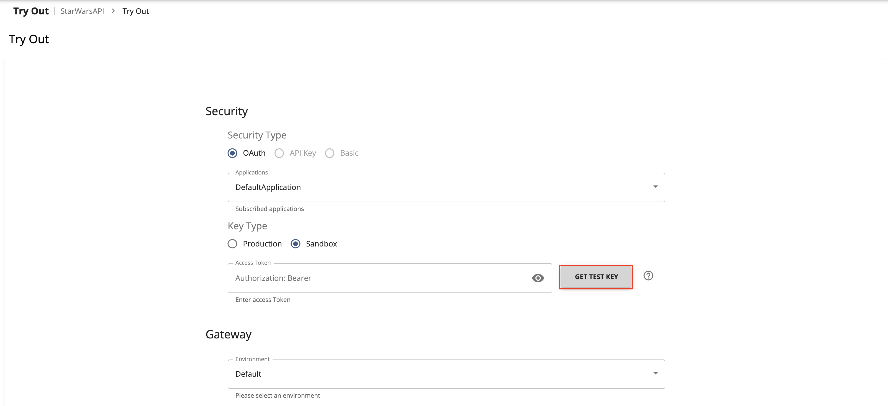](../assets/img/learn/get-test-key-starwars.png)
    
    2. Enter the following sample payload as the StarWarsAPI request. Then click on execute button as follows.
    
         ```
         query{
            human(id:1000){
               id
               name
            }
            droid(id:2000){
               name
               friends{
                   name
                   appearsIn
               }
            }
         }

         ```

         [](../assets/img/learn/graphql-console-execute-query.png)

         <html>
         <div class="admonition note">
         <p class="admonition-title">Note</p>
         <p>If you are going to invoke QUERY Operation, payload should be started with 'query' keyword.</p>
         <p>If you are going to invoke MUTATION Operation, payload should be started with 'mutation' keyword.</p>
         </div> 
         </html>

    4. Click **Execute**.

        [](../assets/img/learn/graphql-response-query.png)

You have successfully created and published your first GraphQL API, subscribed to it, obtained an access token for testing and tested your API with the access token.