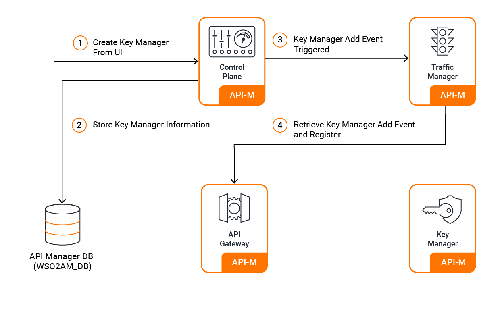
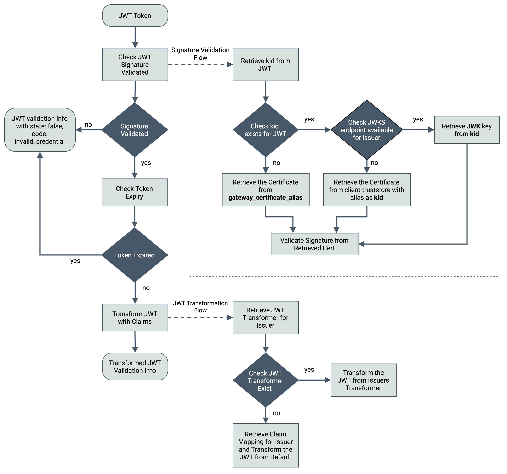

# Multiple Key Manager Support in WSO2 API Manager

WSO2 API Manager provides an admin functionality for admins/tenant admins to configure different authorization servers as Key Managers.
This brings the capability of supporting multiple Key Managers for a given API.

When a Key Manager is added via the Admin Portal, it is persisted in the APIM DB as well as an event is triggered to the Traffic Manager. As a result, the Gateway will receive the event and register the Key Manager in the Gateway.
Therefore, the Key Manager will be registered as another Key Manager and it will be available for the APIs that are created within the tenant.

[{: style="width:80%"}](../../assets/img/administer/add-km-overview.png)

The Key Manager configuration initialization at server startup takes place through an internal API. However, the UI components in Publisher, developer Portal, and Admin Portals populate Key Manager details from the database.

When generating keys for a selected Key Manager, it checks if the Key Manager configurations have the consumer app creation enabled. If it is enabled, it generates the consumer App upon validation of the required parameters.

## Token validation

[{: style="width:80%"}](../../assets/img/administer/multiple-km-token-validation.png)

If the token is a JWT token, it retrieves the Issuer details from the JWT and obtains the relevant Key Manager. If the Key Manager is not enabled for the API, token validation fails.
If the Key Manager is enabled, the token is validated through the JWT validator.

For non JWT tokens, the token is validated based on the token handling options provided in the Key Manager configurations of the intended Key Manager.

After token validation takes place by retrieving the consumer key, subscription validation takes place at the Gateway.

If the subscription validation is successful, the scope validation takes place.

Finally if the backend JWT generation is enabled, it generates the JWT.

## Configuring Key Managers with WSO2 API-M

- [Configure WSO2 IS as a Key Manager](configure-wso2is-connector.md)

- [Configure Keycloak as a Key Manager](configure-keycloak-connector.md)

- [Configure Okta as a Key Manager](configure-okta-connector.md)

- [Configure Auth0 as a Key Manager](configure-auth0-connector.md)

- [Configure PingFederate as a Key Manager](configure-pingfederate-connector.md)

- [Configure ForgeRock as a Key Manager](configure-forgerock-connector.md)