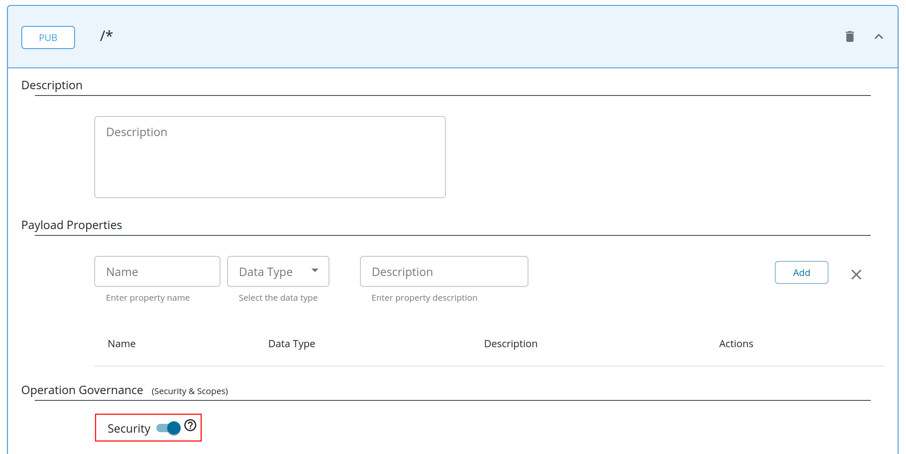

# Deploying a WebSocket API in Choreo Connect

You can deploy a WebSocket API in the following ways depending on the Choreo Connect **mode** you have chosen.


|**Mode**         | **Method**    |
|--------------|-----------|
|[Choreo Connect with WSO2 API Manager as a Control Plane](../concepts/apim-as-control-plane.md)   | [Via WSO2 API Manager Publisher Portal](#via-wso2-api-manager-publisher-portal)  |
|[Choreo Connect as a Standalone Gateway](../concepts/as-a-standalone-gateway.md)  |[Via apictl for Standalone Mode](#via-apictl-for-standalone-mode) |


!!! tip "Characteristics of WebSocket APIs Deployed in Choreo Connect"
    - The API is created based on the **Channels** defined in the AsyncAPI definition. They are also known as **Topics** in WSO2 API Manager, and have a slight similarity to **Resources** in a REST API.
    - Once the API is exposed, although the Gateway endpoint includes a basepath (with topic paths if defined), the **Connection Request** will be sent to the original backend endpoint you provided without any appended paths.
    - If you have a requirement to append different **paths** to the backend URL for different **Channels** (**Topics**), a URL-mapping can be added. The **Topics** that do not include a URL-mapping will have the usual behavior as mentioned above.
    - WebSocket APIs support OAuth 2.0 Security and each **Topic** can have its own local scope.         
    - If configured, Choreo Connect is also capable of publishing analytics for WebSocket frames sent and received by the client.         
    - **Pub** is prioritized over **Sub**. Currently, properties such as URL Mapping and Security are supported at Pub/Sub level rather than per topic (similar to REST APIs). Therefore, in WebSocket APIs, these must be defined under **Publish** or **Subscribe**. Yet, from a Gateway point of view, both Publish and Subscribe are initiated with a GET request that appears the same. Hence, if a **Topic** has both Publish and Subscribe, the properties for **Publish** will be prioritized.

## Via WSO2 API Manager Publisher Portal

Follow the instructions below to deploy a WebSocket type Streaming API to Choreo Connect via the Publisher Portal in WSO2 API Manager. The Publisher Portal provides the capability to conveniently add and update the following.

- The AsyncAPI definition
- Rate limiting policies
- Security scopes
- URL mappings

!!! info "Before you begin"

    This guide assumes that you already have a Choreo Connect instance configured to run with API Manager. If not, checkout the [Quick Start Guide](../getting-started/quick-start-guide-docker-with-apim.md) on how to install and run Choreo Connect. To learn more about Choreo Connect, have a look at the [Overview of Choreo Connect](../getting-started/choreo-connect-overview.md).


### Step 1 - Create a WebSocket API in API Manager

1. Create a WebSocket API by following the steps in [Create a WebSocket API](../../../../design/create-api/create-streaming-api/create-a-websocket-streaming-api.md).

2. By default, a WebSocket API is protected by OAuth2 in Choreo Connect. Make sure to switch on security for the API via Publisher and **Save**.

    [](../../../../assets/img/design/create-api/streaming-api/streaming-api-security-on.png)

### Step 2 - Deploy and publish the API

1. Deploy the API in Choreo Connect by navigating to the **Deployments** page from the left menu. For more information, see [Deploy API](../../deploy-api/deploy-an-api.md).
2. Publish the API from the **Lifecycle** page.

### Step 3 - Generate an Access Token to invoke the API

!!! tip 
    To generate a temporary test key to invoke the API, follow the steps [here](../security/generate-a-test-jwt.md)

1. Click **View in Dev Portal** at the top right corner to open Developer Portal in another browser tab.

2. Open **Applications** from the top menu and select **DefaultApplication** from the list.

3. Open the **Subscriptions** tab and subscribe your API to the **DefaultApplication**.

4. Open **APIs** from the top menu and select your API.

5. Open the **Subscriptions** tab from the left menu bar, click on **PROD KEYS**, and generate keys.

6. Open the **Try Out** tab and click **GET TEST KEY**. This will include the access token in the cURL command you generate in the section below.

### Step 4 - Invoke the API using a WebSocket client

The WebSocket API exposed via Choreo Connect can be invoked using a WebSocket client.

1. Install wscat client.

2. From Developer Portal resource tab open the topic `/notifications` and generate the cURL command.

3. Open a command-line interface and run the cURL command.

4. Once connected, type anything you want. The websocket server you are connected to must echo back what you type.

!!! note
    Choreo Connect handles websocket connections via the same ports used for HTTP (9090) and HTTPS (9095).

## Via apictl for Standalone Mode

The CLI tool ([**apictl**](../../../../install-and-setup/setup/api-controller/getting-started-with-wso2-api-controller.md#download-and-initialize-the-apictl)) does not support initializing projects for Streaming APIs yet. However, you can download the sample WebSocket API project from [here](https://github.com/wso2/product-microgateway/tree/main/samples/apiProjects/SampleWebsocketApi) and try it out by deploying it to Choreo Connect. When you are using your own WebSocket API with Choreo Connect, you can change the relevant attribute values in `api.yaml` and `definitions/asyncapi.yaml` files. There is an explanation regarding those attribute values [here](https://github.com/wso2/product-microgateway/tree/main/samples/apiProjects/apiProjects/SampleWebsocketApi/README.md).

Below steps explain how to try out WebSocket API in Choreo Connect standalone mode using the above project.

### Step 1 - Download the API

Download the sample WebSocket API in [here](https://github.com/wso2/product-microgateway/tree/main/samples/apiProjects/SampleWebsocketApi). The WebSocket API project should adhere to the below file structure.

```bash
.
├── Definitions
│   └── asyncapi.yaml
└── api.yaml
```

### Step 2 - Add a Choreo Connect Environment to apictl

1. Start the Choreo Connect in stand alone mode.

2. Download the CLI tool ([**apictl**](../../../../install-and-setup/setup/api-controller/getting-started-with-wso2-api-controller.md#download-and-initialize-the-apictl)) and add Choreo Connect environment to it using the below command. This environment will hold the adapter URL for further commands

    !!! info

        Note `mg` in the below command. The apictl commands that starts as `apictl mg` are Choreo Connect specific. If a command does not have `mg` after `apictl` then the command could probably be common to both Choreo Connect and API Manager, but it could also be API Manager specific. 

    !!! tip

        The apictl commands here onwards are executed with the -k flag to avoid SSL verification with the Choreo Connect.

        To communicate via HTTPS without skipping SSL verification (without -k flag), add the cert in the Choreo Connect truststore into the `<USER_HOME>/.wso2apictl/certs` folder.


    ``` bash
     apictl mg add env dev --adapter https://localhost:9843
    ```

### Step 3 - Log in to the Choreo Connect Environment in apictl

Use the following command to log in to the above Choreo Connect cluster (in other words log in to the Choreo Connect adapter). When you log in, an access token will be retrieved from Choreo Connect and it will be saved in the apictl.

``` bash tab="Format"
apictl mg login dev -u <username> -p <password> -k
```

``` bash tab="Example"
apictl mg login dev -u admin -p admin -k
```


### Step 5 - Deploy the API

Deploy the above WebSocket API to Choreo Connect by executing the following command.     

``` bash
apictl mg deploy api -f <path_to_the_WebSocket_API_project> -e dev -k
```  

### Step 5 - Generate an access token

The following command generates a JWT to test the API, and sets it to the variable called `TOKEN`. 

``` tab="Format"
TOKEN=$(curl -X POST "https://<hostname>:<port>/testkey" -d "scope=<scope values>" -H "Authorization: Basic base64(username:password)" -k -v)
```

``` tab="Example"
TOKEN=$(curl -X POST "https://localhost:9095/testkey" -d "" -H "Authorization: Basic YWRtaW46YWRtaW4=" -k -v)
```

### Step 6 - Invoke the API

1. Install wscat client.

2. Invoke the API using the following command.

    ```
    wscat -c 'ws://localhost:9090/websocket/1.0.0/notifications' -H "Authorization:Bearer $TOKEN"
    ```
    
3. Once connected, type anything you want. The websocket server will echo back what you type.
