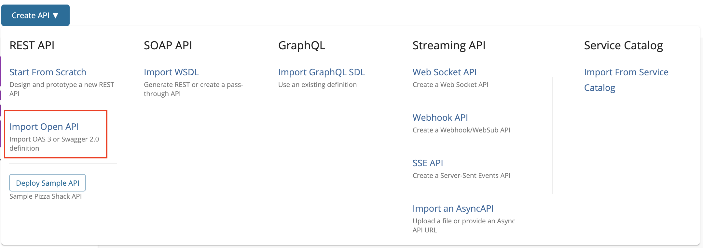
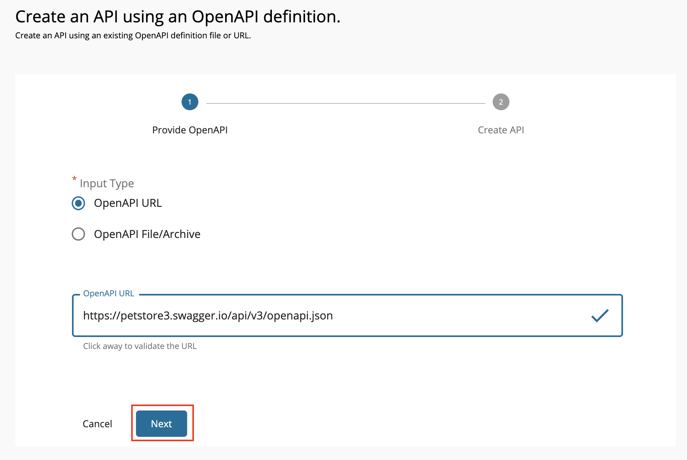
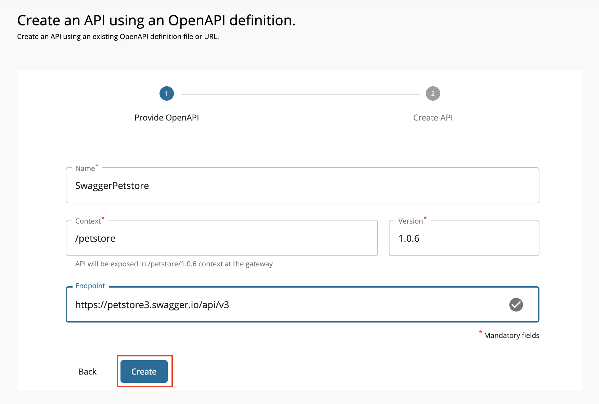
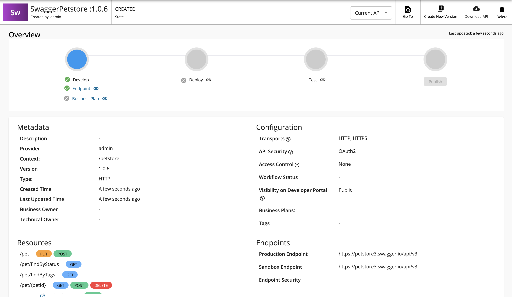
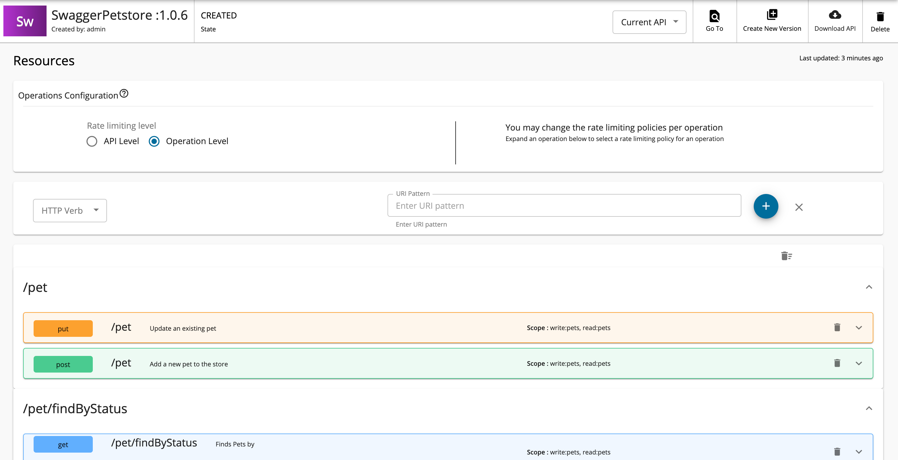
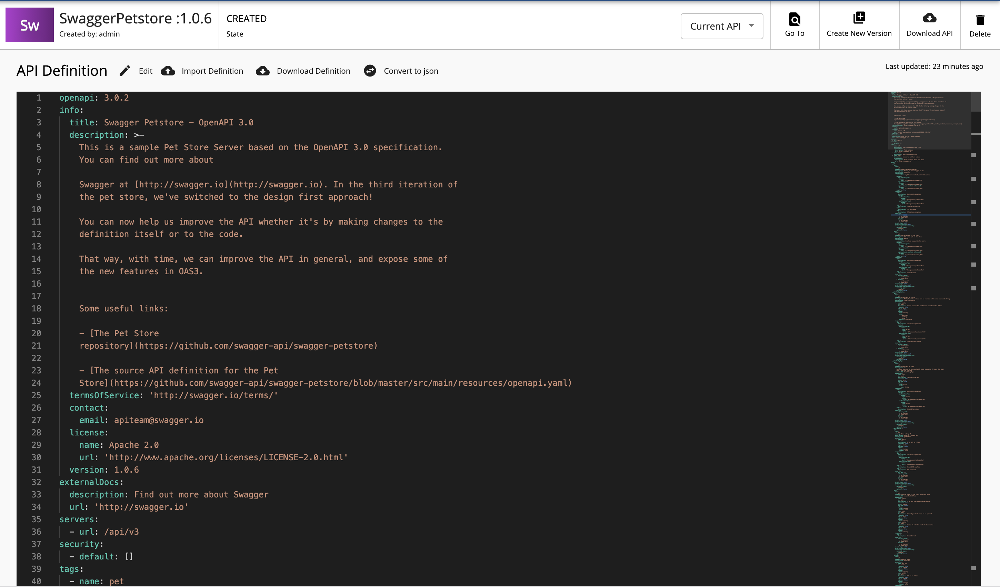
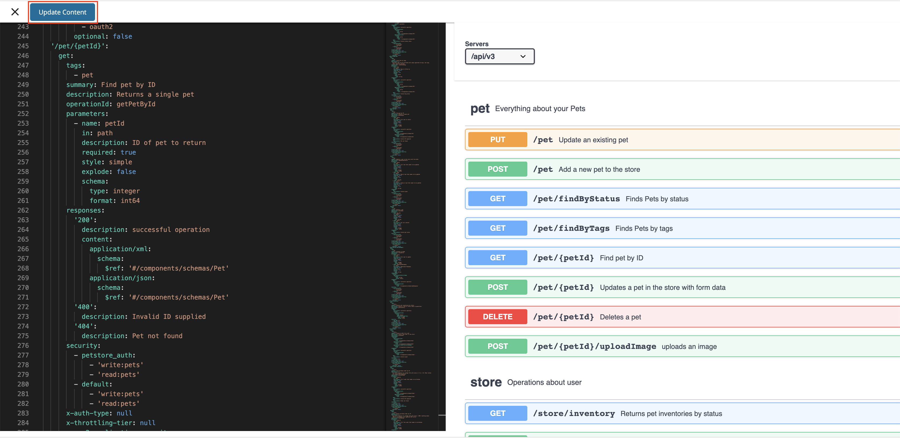
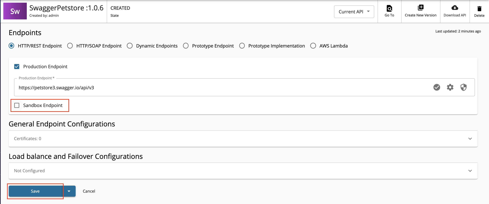
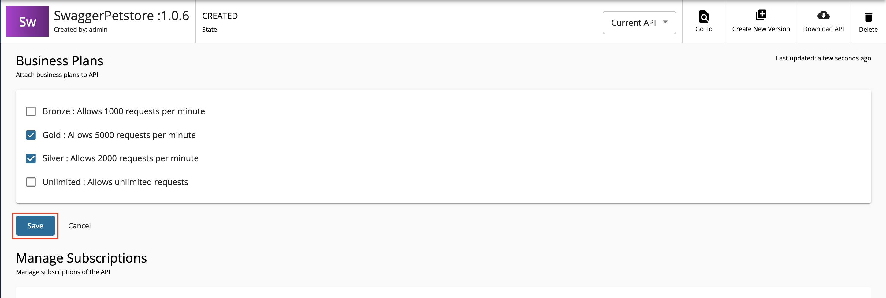

# Create an API from an OpenAPI Definition

An OpenAPI definition is a format that describes REST APIs. 

Follow the instructions below to create a REST API using an OpenAPI definition for an existing API.

## Create an API using the basic flow

1. Sign in to the WSO2 API Publisher.

     `https://<hostname>:9443/publisher` (e.g., `https://localhost:9443/publisher`).

    <html><div class="admonition note">
      <p class="admonition-title">Note</p>
      <p>The <b>Create API</b> button will only appear if you have the "creator" role permission.</p>
      </div>
    </html>

2. Click **Create API** and then click **Import OpenAPI**.

    [](../../../assets/img/learn/import-open-api.png)

3. Select one of the following options:

	* **OpenAPI URL** - If you select this option, you need to provide an endpoint URL.
	* **OpenAPI Archive/File** - If you select this option, drag and drop or click **Browse File to Upload** to upload either an individual OpenAPI definition or an archive that has an OpenAPI definition with external <a href="https://Swagger.io/docs/specification/using-ref/" target="_blank">file references</a>.

    <html><div class="admonition note">
    <p class="admonition-title">Note</p>
    <p>
    <ul><li>You need to upload an archive if you have remote references in your API definition. - <a href="../../../../assets/attachments/design/sample-archive.zip">Sample OpenAPI archive</a></li><li>If it is a single Swagger file without remote references, it can be imported directly, without zipping.</li><li> 
    When uploading an OpenAPI archive, the master Swagger file should be named as <b>swagger.yaml</b>/<b>swagger.json</b>. 
    </br>If not, the validation will fail at the point of API creation.</li> <li>Referenced files can be named independently.</li>
    <li>When archiving the Swagger files, make sure that it does not have any hidden folders (e.g., <code>__MACOSX</code>).</li></ul>
    </p>
    </div>
    </html>
    
    !!! tip
        The Swagger definitions should be placed under one root folder and zipped.    
   
        **Sample folder structures**
    
        ```
            -masterFolder
              ---Swagger.json
              ---reference.json
              ---add.json
        ```
        ```
            -masterFolder
              ---Swagger.json
              ---schemes
                 ---pet.json
              ---add.json
        ```

        In the above sample, every Swagger definition is placed inside one root folder namely `masterFolder`.

4.  Select **OpenAPI URL** and provide `https://petstore3.swagger.io/api/v3/openapi.json` as the URL. Click **Next**.
    
    ??? tip "If you want to work with the Swagger 2.0 definition instead of the OpenAPI 3.0 definition"
        If you want to work with a Swagger 2.0 definition, use `http://petstore.swagger.io/v2/swagger.json` as the OpenAPI URL.

     [{: style="width:70%"}](../../../assets/img/learn/create-rest-api-using-swagger-def-form1.png)

5.  Edit the information as given below and click **Create**.
    
    !!! note
        Make sure to provide the correct endpoint at this step.

    ??? tip "If you want to work with the Swagger 2.0 definition instead of the OpenAPI 3.0 definition"
        | Field    | Sample value                   |
        |----------|--------------------------------|
        | Name     | SwaggerPetstore                |
        | Context  | /petstore                      |
        | Version  | 1.0.5                          |
        | Endpoint | https://petstore.swagger.io/v2 |


     | Field    | Sample value                        |
     |----------|-------------------------------------|
     | Name     | SwaggerPetstore                     |
     | Context  | /petstore                            |
     | Version  | 1.0.6                               |
     | Endpoint | https://petstore3.swagger.io/api/v3 |
 
     [{: style="width:70%"}](../../../assets/img/learn/create-rest-api-using-swagger-def-form2.png)

     The Petstore API overview page appears.

     [](../../../assets/img/learn/overviewpage-rest-api-creating-by-swagger-def.png)

### Resources
   
Click **API Configurations** and then click **Resources** to navigate to the Resources page. 

You will notice that all the API resources are created automatically when the OpenAPI URL is specified.
   
[](../../../assets/img/learn/resource-of-pet-store-api.png)

### API Definition

1. Click **API Configurations**, **API Definition**, and then click **Edit** to remove the security headers. 

     This is required to invoke the API in the Developer Portal using the OpenAPI UI.
    
     [](../../../assets/img/learn/edit-api-definition-pet-store.png)


2. Remove the `petstore_auth` tag related configuration that appears under the `security` tag from the `/pet` POST resource given below. 

    !!! note
        Do not remove the `default` tag related configuration that appears under the `security` tag.

     **OpenAPI - Post resource**

    ``` java
    security:
        - petstore_auth:
            - 'write:pets'
            - 'read:pets'
        - default:
            - 'write:pets'
            - 'read:pets'
    ```

3.  Remove the security `pet/{petId}` GET resource given below:

     **OpenAPI - Get resource**

    ``` java
    //remove the following code snippet
    security:
            - api_key: []
    ```

4.  After removing the security tags, click **Update Content**.
     
     [](../../../assets/img/learn/update-content-pet-store.png)

5. Click **Save** to save the changes.
   
    !!! note
        If you have already deployed your API, click on the dropdown option, and click **Save and deploy** so that your API will be redeployed, and your changes will appear in the API Gateway.

### Endpoints

1. Click **API Configurations** and click **Endpoints** to navigate to the Endpoints page.

2. Enter the information shown below.

     | Field               | Sample value                                          |
     |---------------------|-------------------------------------------------------|
     | Endpoint type       | HTTP/REST Endpoint                                    |
     | Production endpoint | https://petstore3.swagger.io/api/v3                     |
     | Sandbox endpoint    | Let's only work with the production endpoint for this sample. Therefore, deselect the sandbox endpoint option. |

     <html>
     
     </html>

3. Click **Save** to save the changes.
   
    !!! note
        If you have already deployed your API, click on the dropdown option, and click **Save and deploy** so that your API will be redeployed, and your changes will appear in the API Gateway.

     [](../../../assets/img/learn/add-endpoint-configuration-for-pet-store-api.png)

### Runtime Configuration

Click **API Configurations** and click **Runtime** to navigate to the Runtime Configurations page.
     
The Transport Level Security defines the transport protocol on which the API is exposed.

<a href="../../../../assets/img/learn/runtime-config-menu.png"></a>

<a href="../../../../assets/img/learn/transport-level-security-pet-store.png">
</a>

<html><div class="admonition note">
    <p class="admonition-title">Note</p>
    <p> Both HTTP and HTTPS transports are selected by default. It is able to limit the API availability to only one transport (e.g., HTTPS) by clearing the checkbox of the other transport.</p>
    </div>
    </html>

<html><div class="admonition note">
    <p class="admonition-title">Note</p>
    <p> Transport Level Security defines the transport protocol on which the API is exposed. When creating a new API by using a Swagger or OpenAPI definition, these transport security schemes can be defined using  <b>“x-wso2- transports”</b>and <b>"x-wso2-mutual-ssl”</b>extensions.</p>
        ```yaml
        x-wso2-mutual-ssl: "optional"
        x-wso2-transports: 
            - "https"
            - “http”
        ```
</div></html>

## Subscriptions

1. Click **Portal Configurations** and click **Subscriptions** to navigate to the Business Plans page.

     <a href="../../../../assets/img/learn/subscriptions-menu.png">
     
     </a>

2. Select **Gold** and **Silver** as the Business Plans.

     <html><div class="admonition note">
     <p class="admonition-title">Note</p>
     <p> The API can be available at different levels of the service. The Business Plans allow you to limit the number of successful hits to an API during a given period of time.</p>
     </div>
     </html>

3. Click **Save**

    [](../../../assets/img/learn/add-bussiness-plans-for-pet-store-api.png)


Now, a REST API from an OpenAPI Definition has been created and configured successfully. 

Next, [deploy the API](../../../deploy-and-publish/deploy-on-gateway/deploy-api/deploy-an-api.md), [test the API](test-a-rest-api.md), and finally [publish the API](../../../deploy-and-publish/publish-on-dev-portal/publish-an-api.md).

## See Also

Learn more on the concepts that you need to know when creating a REST API:

-   [Endpoints](../../endpoints/endpoint-types.md)
-   [API Security](../../api-security/api-authentication/secure-apis-using-oauth2-tokens.md)
-   [Rate Limiting](../../rate-limiting/introducing-throttling-use-cases.md)
-   [Life Cycle Management](../../lifecycle-management/api-lifecycle.md)
-   [API Monetization](../../api-monetization/monetizing-an-api.md)
-   [API Visibility](../../advanced-topics/control-api-visibility-and-subscription-availability-in-developer-portal.md)
-   [API Documentation](../../api-documentation/add-api-documentation.md)
-   [Custom Properties](../adding-custom-properties-to-apis.md)
-   [Template Patterns](../../../deploy-and-publish/deploy-on-gateway/choreo-connect/concepts/template-patterns-for-choreo-connect.md) - You can use these template patterns when defining OpenAPI (Swagger) definitions for APIs deployed on Choreo Connect.