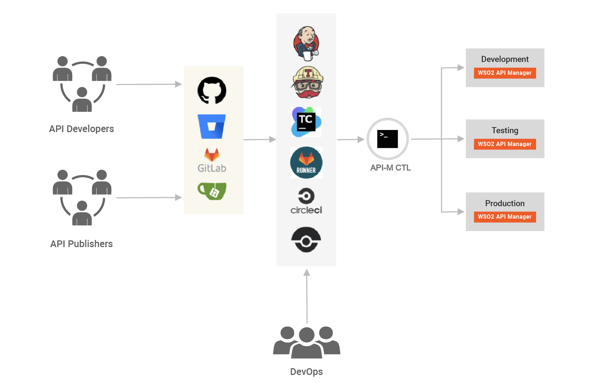

# CI/CD for APIs - Overview

APIs have become a norm for connecting apps, services, and data. An organization can have multiple environments, such as development, testing, QA, staging, and production, each with its own instance of API Managers. Therefore, the APIs need to be available in each environment after developers specify the required conditions. Manually promoting APIs between environments is a tedious, error-prone, and time-consuming task. This drastically reduces an organization’s productivity.

WSO2 API Manager (WSO2 API-M) addresses the issue of API automation by providing a platform-agnostic, developer-centric solution. **WSO2 API Controller (apictl)** tool plays a key role in the automation pipeline. It can seamlessly integrate 
environment-related configurations and also create API Projects from OpenAPI specifications, opening a gate to fully automated API deployment with only a few steps. With the power of flexible tooling, WSO2 API-M is ready to address modern requirements for automating API deployments.

Continuous integration and continuous deployment for APIs is an open-ended scenario; different organizations have 
different ways of addressing the problem. The above diagram depicts a generic solution that involves a minimum number of parties in an organization for API automation. Although the diagram shows three parties, there could be more or less depending on the organization’s structure.

-   API Developers: Develop APIs and related services
-   API Publishers: Publish APIs to users
-   DevOps: Control the deployment process

API Developers and Publishers work with a version control system, which acts as a single source of truth for the pipeline.

See the following topics for instructions:

-   [Building a CI/CD Pipeline for APIs using the CLI](cicd-using-cli.md)
-   [Building a CI/CD Pipeline for APIs using Jenkins](building-jenkins-ci-cd-pipeline.md)