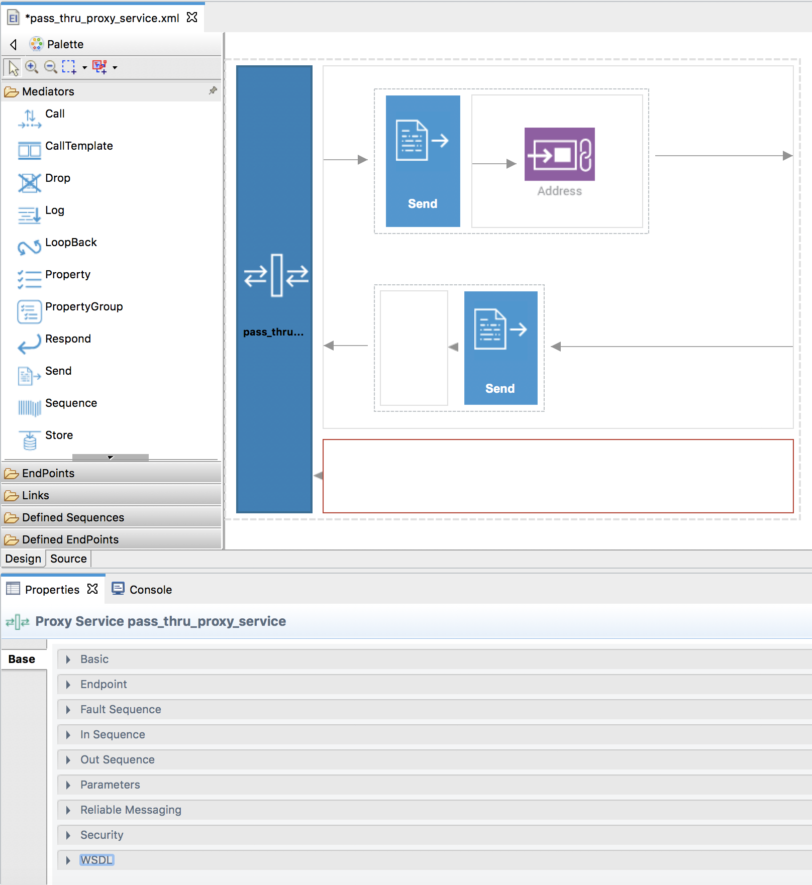
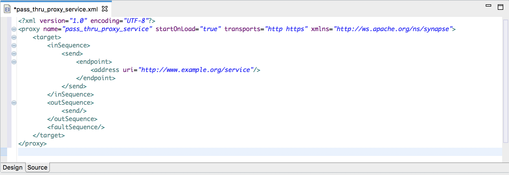

# Working with WSO2 Integration Studio

Once you have created a [REST API](creating-artifacts/creating-an-api.md) or a [Proxy Service](creating-artifacts/creating-a-proxy-service.md) in WSO2 Integration Studio, you can update the mediation flow by adding new mediation artifacts and changing the existing artifacts.

Follow the steps given below.

1.  First, open the proxy service or REST API from the project explorer.
2.  You can use either the **design view** or the **source view** to update the mediation flow. Shown below is an example of a PassThrough proxy service:
    -   **Design View**:
        You can select any of the mediation artifacts from the design view shown below and update its parameters from the **Properties** tab in the bottom pane. You can also drag and drop new mediation artifacts to the design view from the artifact **Palette** to modify the mediation flow.

        

    -   **Source View**:
        If you have a sample proxy service configuration, you can simply copy it to the source view shown below.

        