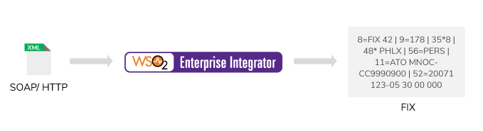

# Protocol Switching

The Micro Integrator offers a wide range of integration capabilities from simple message routing to complicated systems that use integrated solutions. Different applications typically use different protocols for communication. Therefore, for two systems to successfully communicate, it is necessary to switch the protocol (that passes from one system) to the protocol compatible with the receiving application.
<!--

-->

For example, messages that are received via HTTP may need to be sent to a JMS queue. Further, you can couple the protocol switching feature with the message transformation feature to handle use cases where the content of messages received via one protocol (such as HTTP) are first processed, and then sent out in a completely different message format and protocol.

<table>
	<tr>
		<td>
			<b>Examples</b>
			<ul>
				<li>
					<a href="../../examples/protocol-switching/switching_from_jms_to_http/">Switching from JMS to HTTP/S</a>
				</li>
				<li>
					<a href="../../examples/protocol-switching/switching_from_https_to_jms/">Switching from HTTP/S to JMS</a>
				</li>
				<li>
					<a href="../../examples/protocol-switching/switching_from_ftp_listener_to_mail_sender/">Switching from FTP Listener to Mail Sender</a>
				</li>
				<li>
					<a href="../../examples/protocol-switching/switching_from_http_to_fix/">Switching from HTTP to FIX</a>
				</li>
				<li>
					<a href="../../examples/protocol-switching/switching_from_fix_to_http/">Switching from FIX to HTTP</a>
				</li>
				<li>
					<a href="../../examples/protocol-switching/switching_from_fix_to_amqp/">Switching from FIX to AMQP</a>
				</li>
				<li>
					<a href="../../examples/protocol-switching/switching_between_fix_versions/">Switching between FIX Versions</a>
				</li>
				<li>
					<a href="../../examples/protocol-switching/switching_from_tcp_to_https/">Switching from TCP to HTTP/S</a>
				</li>
				<li>
					<a href="../../examples/protocol-switching/switching_from_udp_to_https/">Switching from UDP to HTTP/S</a>
				</li>
				<li>
					<a href="../../examples/protocol-switching/switching_between_http_and_msmq/">Switching between HTTP to MSMQ</a>
				</li>
			</ul>
		</td>
	</tr>
</table>