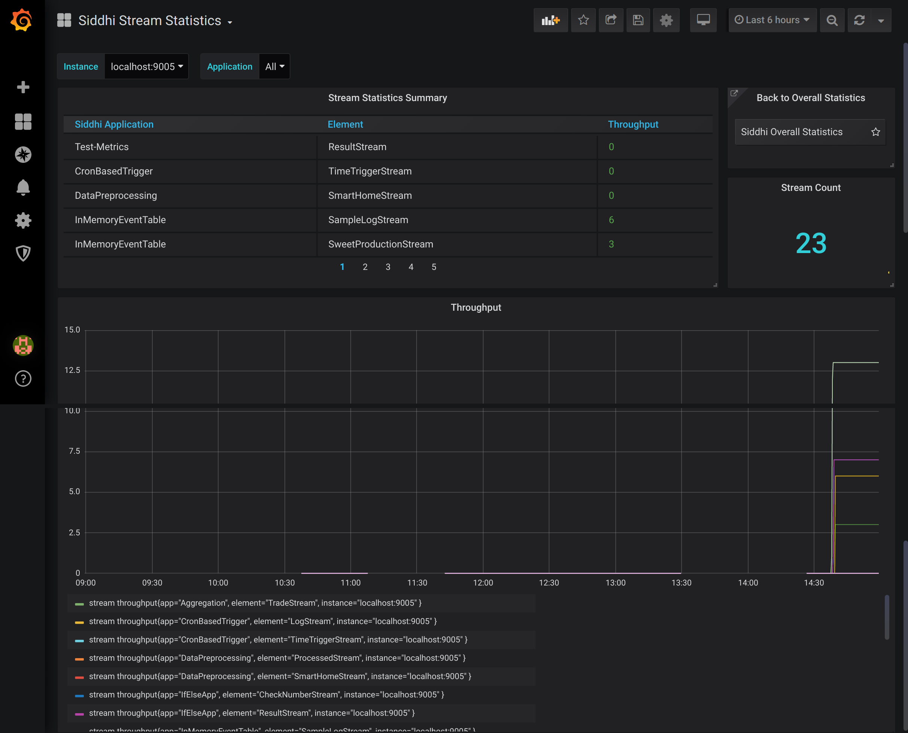

!!! note
    **This page is still a work in progress!**
    
# Viewing Stream Statistics

This dashboard displays statistics related to streams in the Siddhi applications currently deployed in your WSO2 Streaming Integrator server.

This dashboard displays the following information for your Streaming Integrator deployment:

- The throughput of each stream

- The total stream count

- A graphical representation of the throughput of each stream over time.

## Filtering stream statistics

- If you want to view stream statistics only for a specific time interval, you can select a predefined time interval or define a custom time interval in the following field. This field is is located in the top right of the dashboard.

    

- If you want to view statistics relating to streams in a one or more selected Streaming Integrator servers in your Streaming Integrator deployment, expand the **Instance** field and select the required instance(s).

    The stream statistics of all the servers 

- If you want to view statistics relating to streams in one or more selected Siddhi application

## Purpose

To identify the active streams 